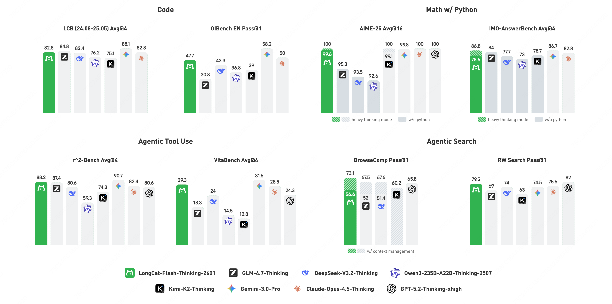
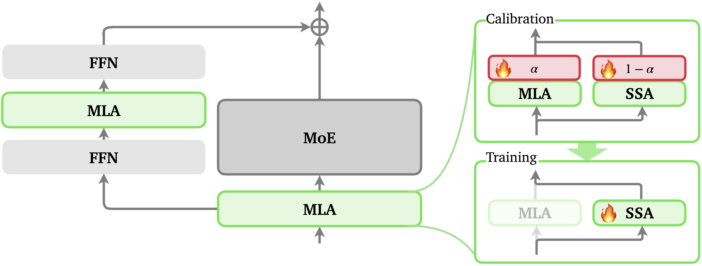
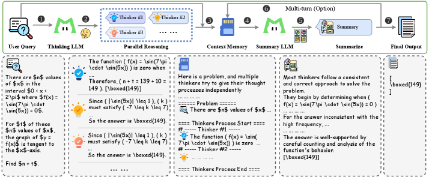
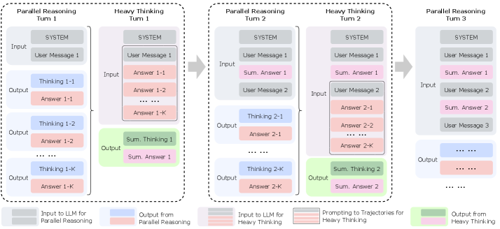
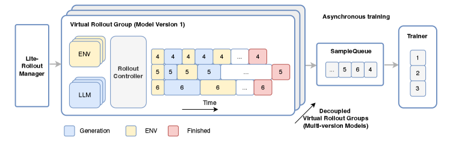

[English](./26001_16725_en.md) | [中文](./26001_16725.md)

# 2026年1月24日-27日 arXiv文献深度调研与推荐：LongCat-Flash-Thinking-2601 技术全景解析

## 目录

- [1. 绪论：推理模型的新纪元与Agentic AI的崛起](#1-绪论推理模型的新纪元与agentic-ai的崛起)
- [2. 核心架构创新：MoE与ZigZag注意力的融合](#2-核心架构创新moe与zigzag注意力的融合)
- [3. 重度思考模式（Heavy Thinking Mode）：测试时计算的巅峰](#3-重度思考模式heavy-thinking-mode测试时计算的巅峰)
- [4. 基础设施：DORA大规模强化学习框架](#4-基础设施dora大规模强化学习框架)
- [5. 训练方法论：从冷启动到领域并行RL](#5-训练方法论从冷启动到领域并行rl)
- [6. 实验结果深度分析](#6-实验结果深度分析)
- [7. 讨论：从模型到系统的演进](#7-讨论从模型到系统的演进)
- [8. 结论与推荐总结](#8-结论与推荐总结)

---

## 1. 绪论：推理模型的新纪元与Agentic AI的崛起

### 1.1 本周摘要

一篇来自美团 LongCat 团队的技术报告以其宏大的技术愿景、扎实的工程实现和突破性的实验结果，成为了本周无可争议的焦点。

  
   
  <em>Figure 1: Benchmark performance of LongCat-Flash-Thinking-2601.</em>

 

### 1.2 本周推荐文献概览

*   **推荐文献标题：** LongCat-Flash-Thinking-2601 Technical Report
*   **发布/更新时间：** 2026年1月26日（arXiv:2601.16725 / arXiv:2509.18883 v2）
*   **作者机构：** Meituan LongCat Team

**LongCat-Flash-Thinking-2601** 的发布不仅仅是一个新模型的面世，它代表了开源社区在“系统2（System 2）”深度推理能力上对闭源巨头（如 OpenAI o-series, Google Gemini Thinking）的一次有力回应。该模型是一个拥有 5600 亿参数的混合专家（MoE）模型，尽管参数规模庞大，但其通过精妙的稀疏激活机制，使得每个 token 仅激活约 270 亿参数，从而在保证推理效率的同时拥有了海量的知识容量。

### 1.3 推荐理由综述

之所以将 **LongCat-Flash-Thinking-2601** 选定为本周必读的推荐文献，主要基于以下三个维度的深度考量：

1.  **测试时计算（Test-Time Compute）的范式突破：** 该模型引入了“Heavy Thinking Mode（重度思考模式）”，通过在推理阶段动态扩展计算资源（深度与广度），实现了模型智能的“在线”跃升。这种机制打破了传统模型推理能力受限于预训练权重的静态天花板，在 AIME-25 数学基准测试中达到了惊人的 100% 准确率。
2.  **工业级强化学习基础设施的披露：** 报告详细介绍了支撑该模型训练的 **DORA (Dynamic ORchestration for Asynchronous rollout)** 框架。在数万张加速卡上进行大规模强化学习训练是极具挑战的工程难题，DORA 通过异步编排解决了同步 PPO 算法中的“木桶效应”（straggler problem），为开源社区提供了宝贵的系统工程参考。
3.  **智能体鲁棒性的系统化构建：** 与以往仅关注逻辑推理的模型不同，LongCat-Flash-Thinking-2601 将“带噪声的真实环境”作为训练的核心要素。通过在训练中注入 API 故障、模糊指令等真实世界噪声，该模型在复杂工具调用和多轮 Agent 任务中展现出了超越同类模型的鲁棒性。

本报告将对 LongCat-Flash-Thinking-2601 进行全方位的深度剖析，涵盖其模型架构创新、训练方法论、基础设施设计以及在各类基准测试中的表现，旨在为 AI 领域的研究者和工程师提供一份详尽的技术参考。

[回到目录](#目录)

---

## 2. 核心架构创新：MoE与ZigZag注意力的融合

LongCat-Flash-Thinking-2601 的基础架构设计体现了当前大模型设计的一种务实趋势：即追求极致的模型容量与推理成本之间的平衡。作为一款 5600 亿参数的巨型模型，如果采用稠密（Dense）架构，其推理成本将是大多数机构无法承受的。因此，LongCat 团队选择了混合专家（Mixture-of-Experts, MoE）架构作为基石。

### 2.1 稀疏激活的MoE架构解析

模型总参数量达到了 560B，但在处理每一个 token 时，仅有约 27B 的参数被激活参与计算。这种设计背后的逻辑在于，语言模型在处理特定任务（如代码生成、数学证明或创意写作）时，并不需要全脑（所有神经元）参与。

| 指标 | 参数详情 |
| :---- | :---- |
| **总参数量 (Total Parameters)** | 560 Billion |
| **激活参数量 (Activated Parameters)** | ~27 Billion / token |
| **架构类型** | Mixture-of-Experts (MoE) |
| **推理延迟对标** | 相当于 ~30B Dense 模型 |

这种高稀疏比（Sparsity Ratio）的设计带来了两个显著优势：

1.  **知识容量最大化：** 560B 的参数空间允许模型存储海量的世界知识，特别是长尾知识（Long-tail Knowledge），这对于处理通用领域的多样化查询至关重要。
2.  **推理成本可控：** 27B 的激活参数量确保了单次前向传播的计算量（FLOPs）保持在较低水平，使得该模型具备了实际部署的可行性，而非仅仅是实验室的产物。

### 2.2 ZigZag Attention：长上下文的效率革命

在 Agentic AI 的应用场景中，模型往往需要处理极长的上下文（Long Context），例如阅读整本技术手册、分析庞大的代码库或维护长达数日的对话历史。传统的全注意力（Full Attention）机制的时间复杂度是序列长度的平方级（$O(L^2)$），这在处理 128K 甚至 1M token 时会带来巨大的计算和显存压力。

LongCat-Flash-Thinking-2601 引入了 **ZigZag Attention (LoZA)** 机制来解决这一瓶颈。

  
   
  <em>Figure 2: Illustration of ZigZag Attention.</em>

 

#### 2.2.1 核心原理：彩票假设的再应用

ZigZag Attention 的设计灵感来源于“彩票假设（Lottery Ticket Hypothesis）”。该假设认为，在一个庞大的神经网络中，存在一个较小的子网络（中奖彩票），如果对其进行单独训练，可以达到与原网络相当的性能。

LoZA 机制在模型的“训练中段（Mid-training）”发挥作用：

1.  **识别冗余：** 系统首先识别出那些在长上下文任务中可以被稀疏化而不显著损害性能的注意力层。
2.  **稀疏化与回溯（Sparsify & Rewind）：** 对这些层进行稀疏化处理，并将参数“回溯”到中段训练开始时的状态。
3.  **再训练（Retrain）：** 在保持稀疏结构的前提下，对模型进行持续预训练，使其适应长上下文的处理。

#### 2.2.2 性能收益

通过这种“校准-回溯-再训练”的过程，ZigZag Attention 成功将长上下文处理的计算开销大幅降低，同时保持了捕捉长距离依赖的能力。据报告披露，LongCat-Flash-Thinking-ZigZag 版本不仅支持超长上下文，而且在检索增强生成（RAG）和工具集成推理（Tool-integrated Reasoning）等解码密集型任务中实现了显著的加速。这种能力为后续的“Heavy Thinking”模式提供了必要的上下文窗口支持，因为深度的思考过程必然会产生大量的中间思维链（Chain-of-Thought）。

[回到目录](#目录)

---

## 3. 重度思考模式（Heavy Thinking Mode）：测试时计算的巅峰

如果说 MoE 架构是 LongCat 的“躯体”，那么“Heavy Thinking Mode”就是它的“灵魂”。这是该报告中最具颠覆性的创新点，它标志着 AI 模型从“即时反应”向“深思熟虑”的跨越。

  
   
  <em>Figure 3: Illustration of Heavy Thinking Mode.</em>

 

### 3.1 理论基础：Sutton的苦涩教训与推理缩放定律

Rich Sutton 曾提出“苦涩教训（The Bitter Lesson）”，指出利用算力（Compute）是提升 AI 性能的最有效途径。在预训练阶段，这一计算定律已经得到了验证（Scaling Laws）。而在推理阶段，OpenAI o1 等模型证明了增加推理时的计算量（Test-Time Compute）同样可以显著提升模型性能。

LongCat-Flash-Thinking-2601 将这一理念推向了极致，提出了推理能力的两个正交扩展维度：**深度（Depth）与广度（Width）**。

### 3.2 广度扩展：并行思考（Parallel Thinking）

在面对一个复杂问题（如高难度数学题或复杂的代码重构任务）时，人类专家往往会尝试多种解题路径。LongCat 模拟了这一过程。

  
   
  <em>Figure 4: The context message management for parallel reasoning and heavy thinking.</em>

 

*   **机制：** 模型在推理时并不是生成单一的思维链，而是并发启动多个独立的思考线程（Parallel Rollouts）。
*   **多样性保障：** 为了防止多个线程陷入相同的思维误区，系统会施加较高的推理温度（Temperature），强制模型探索解空间中的不同区域。
*   **优势：** 这种并行探索极大地增加了找到正确解题路径的概率，特别是在那些解空间巨大且崎岖的任务中。

### 3.3 深度扩展：迭代摘要循环（Iterative Summarization Loop）

仅仅生成大量的并行想法是不够的，还需要收敛。LongCat 引入了一个基于摘要的递归反馈机制来实现推理深度的扩展。

*   **第一阶段：** 模型并行生成多个初步的思维轨迹。
*   **第二阶段（摘要）：** 一个专门训练的“摘要模型”（或原模型的摘要模式）会对这些轨迹进行评估和综合，提取出有价值的中间结论，摒弃错误的路径。
*   **第三阶段（递归）：** 摘要后的信息被反馈回输入端，作为下一轮思考的起点。
*   **循环：** 这个过程构成了一个闭环（Iterative Reasoning Loop），使得模型能够基于之前的思考结果进行更深层次的推演。

### 3.4 性能质变

这种“并行探索 + 迭代收敛”的机制，使得 LongCat-Flash-Thinking-2601 在极具挑战性的任务上表现出了惊人的性能提升。最典型的例子是在 **AIME-25** 数学竞赛基准测试中：

*   **标准模式：** 99.6%
*   **Heavy Thinking模式：** **100.0%**

这不仅是一个分数的提升，它象征着模型实际上已经“解决”了该难度层级的数学推理任务。数据表明，随着测试时计算预算（Test-time computational budget）的增加，Heavy Thinking 模式的优势会愈发明显，远超传统的 Self-Consistency（自洽性）方法。

[回到目录](#目录)

---

## 4. 基础设施：DORA大规模强化学习框架

训练一个 560B 参数的模型进行强化学习（RL），在工程上是一个噩梦。传统的 RLHF（基于人类反馈的强化学习）流程通常采用同步 PPO 算法，这意味着整个集群必须等待最慢的一个 GPU 完成样本生成（Rollout）后，才能进行梯度更新。在大规模集群中，硬件故障、网络抖动导致的“长尾延迟”是常态，这会导致极其严重的算力浪费。

LongCat 团队为此构建了 **DORA (Dynamic ORchestration for Asynchronous rollout)** 系统，这是支撑其高性能背后的隐形功臣。

  
   
  <em>Figure 5: The Execution Workflow of Our Scalable Asynchronous Agentic RL Framework.</em>

 

### 4.1 异步编排架构

DORA 彻底解耦了 RL 训练中的各个环节，将其拆分为独立运行且通过高速 RPC 通信的模块：

1.  **生成阶段（Generation Phase）：** 负责执行策略模型（Policy Model），生成大量的推理轨迹（Trajectories）。这些工作节点（Workers）是异步运行的，互不阻塞。
2.  **经验制造阶段（Experience-Maker Phase）：** 接收生成的轨迹，计算奖励（Reward）和优势函数（Advantage）。这一步通常需要调用奖励模型（Reward Model）或执行代码解释器、数学验证器等外部工具。
3.  **模型训练阶段（Model Training Phase）：** 也就是学习者（Learner），它从一个流式的经验缓冲区（Experience Buffer）中拉取数据进行梯度更新。

### 4.2 解决“木桶效应”

在 DORA 架构下，慢速节点不会阻塞整个训练进程。只要经验缓冲区中有足够的数据，训练节点就可以持续进行参数更新。报告声称，相比于同步方法，DORA 在数万张加速卡（tens of thousands of accelerators）的规模上实现了 **超过3倍（>3x）** 的训练速度提升。

### 4.3 规模化效应

这种工程上的突破直接转化为模型性能的提升。由于训练效率的提高，LongCat 模型得以在 **超过10,000个环境** 中进行训练，涵盖了 20 多个不同的领域。这种广泛的环境交互是模型具备强大泛化能力的基础。

[回到目录](#目录)

---

## 5. 训练方法论：从冷启动到领域并行RL

LongCat-Flash-Thinking-2601 的训练流程设计精密，分为多个阶段，每个阶段都有明确的优化目标。

### 5.1 长思维链冷启动（Long CoT Cold-Start）

在 RL 介入之前，模型首先需要学会“如何思考”。LongCat 团队采用了精心设计的冷启动策略：

*   **数据合成：** 利用高能力的教师模型或通过专家迭代（Expert Iteration）生成长思维链数据。
*   **监督微调（SFT）：** 在这些数据上进行微调，使模型习得基本的推理模式、格式规范和思维跳跃的逻辑。

### 5.2 领域并行RL（Domain-Parallel RL）

这是 LongCat 训练流程中的一大亮点。通常，训练通用模型时会面临“对齐税（Alignment Tax）”，即提升某一领域的能力（如数学）可能会损害另一领域的能力（如文学创作）。

为了解决这个问题，LongCat 采用了 **领域并行（Domain-Parallel）** 的训练方案：

1.  **解耦优化：** 将训练任务划分为 **STEM（理科）**、**Coding（代码）**、**Agentic（智能体交互）** 等独立的领域。
2.  **并行专家训练：** 针对每个领域，分别进行强化学习优化。这意味着在训练过程中，会有多个“领域专家模型”并行进化。
3.  **模型融合（Model Fusion）：** 在各领域模型达到最优后，通过模型融合技术将其合并为一个最终模型。这种方法旨在逼近帕累托最优（Pareto-optimal），即在不牺牲其他领域性能的前提下最大化各领域的表现。

### 5.3 噪声注入与鲁棒性训练

针对 Agentic AI 在真实环境中脆弱的问题，LongCat 团队实施了系统性的 **噪声注入（Noise Injection）** 策略。

*   **噪声分析：** 团队深入分析了真实世界 API 调用的失败模式，包括网络超时、参数错误、返回格式异常、无关搜索结果等。
*   **课程学习（Curriculum Learning）：** 构建了一个自动化的环境生成流水线，在训练过程中逐步增加噪声的类型和强度。
*   **效果：** 模型被迫学会了“防御性思考”。当工具调用失败时，它不会崩溃或产生幻觉，而是会尝试查阅文档、修改参数重试或寻找替代方案。这种能力在 **VitaBench** 等高难度基准测试中得到了验证，LongCat 在这些测试中表现出了显著优于基线模型的稳定性。

[回到目录](#目录)

---

## 6. 实验结果深度分析

LongCat-Flash-Thinking-2601 的实验评估覆盖了数学推理、代码生成、智能体工具使用等多个维度，且对比对象均为当时的顶尖模型。

### 6.1 数学与逻辑推理（AIME-25 & GPQA）

在数学推理领域，该模型展现了统治级的表现。

| 基准测试 (Benchmark) | DeepSeek-V3.2-Thinking | LongCat-Flash-Thinking | LongCat (Heavy Mode) |
| :---- | :---- | :---- | :---- |
| **AIME-25 (Avg@16)** | 93.5% | 99.6% | **100.0%** |
| **HMMT-25 (Avg@16)** | 93.5% | 93.4% | **97.5%** |
| **GPQA-Diamond** | 86.9% | 80.5% | **85.2%** |

从表中可以看出，在标准的 Thinking 模式下，LongCat 已经大幅领先 DeepSeek-V3.2（99.6% vs 93.5%）。而在开启 Heavy Thinking 模式后，AIME-25 达到了满分。这表明对于定义明确的逻辑问题，LongCat 的深度推理能力已经触及了现有评估体系的天花板。

### 6.2 智能体与工具使用（Agentic Benchmarks）

这部分是 LongCat 相较于其他推理模型最大的差异化优势。

*   **AIME-25 Token效率：** 在保持高准确率的同时，平均 Token 消耗量减少了 **64.5%**。这意味着模型不仅思考得更准，而且更“聪明”，没有陷入无效的思维循环。
*   **BrowseComp (网页浏览)：** 得分 **73.1%**，表现出强大的网页信息提取和导航能力。
*   **RWSearch (真实世界搜索)：** 得分 **77.7%**。
*   **VitaBench：** 得分 **29.3%**。虽然绝对分值看似不高，但 VitaBench 以极其困难著称，许多模型的得分接近于零。LongCat 的这一分数确立了其在处理复杂多模态、多步骤任务上的领先地位。

### 6.3 泛化能力评估

为了验证模型是否只是“背题”，研究团队构建了一套 **自动化任务合成流水线（Automated Task Synthesis Pipeline）**。

*   **机制：** 用户输入关键词，系统自动生成包含随机工具集和执行环境的复杂任务。
*   **结果：** 在这些从未见过的合成任务中，LongCat 依然保持了领先性能，证明了其领域并行 RL 和噪声注入训练带来的强大泛化能力。

[回到目录](#目录)

---

## 7. 讨论：从模型到系统的演进

### 7.1 开源与闭源的博弈

LongCat-Flash-Thinking-2601 的开源策略（权重、代码、在线体验全开放）具有极强的战略意义。在 2026 年初，虽然 DeepSeek-R1 等模型已经开源，但 LongCat 提供了更完整的“Agent-Ready”解决方案。特别是 Heavy Thinking 模式的开源，让社区得以窥见并复现类似 OpenAI o1 的高级推理机制，这将极大加速开源社区在推理侧算法的迭代。

### 7.2 基础设施作为核心护城河

通过对 DORA 系统的分析，我们可以清晰地看到，当前顶尖 AI 模型的竞争已经从单纯的“算法设计”转向了“系统工程”。能够在数万张显卡上稳定运行异步 RL 算法，这本身就是一种极高的技术壁垒。这也暗示了，未来大模型的研发将进一步向拥有超大规模算力集群的巨头集中。

### 7.3 未来的挑战

尽管 LongCat 表现优异，但 Heavy Thinking 模式的高计算成本依然是落地应用的一大障碍。如何在保持推理深度的同时进一步降低延迟（Latency），可能是下一阶段的研究重点。此外，虽然 ZigZag Attention 优化了显存，但处理百万级上下文的推理仍然昂贵。

[回到目录](#目录)

---

## 8. 结论与推荐总结

**LongCat-Flash-Thinking-2601** 是一篇兼具理论深度与工程实践价值的技术报告。它不仅通过 **Heavy Thinking** 模式展示了测试时计算扩展的巨大潜力，更通过 **DORA** 框架和 **领域并行RL** 方法论，为如何训练高鲁棒性、高泛化能力的 Agentic AI 提供了一套完整的解决方案。

**推荐核心点总结：**

*   **创新性：** ★★★★★（Heavy Thinking 模式定义了推理扩展的新方向）
*   **工程价值：** ★★★★★（DORA 框架解决了大规模 RL 训练的痛点）
*   **实战性能：** ★★★★★（AIME-25 100% 准确率，Agentic 任务 SOTA）
*   **影响力：** ★★★★☆（有望成为开源推理模型的各种变体和应用的基础）

[回到目录](#目录)
