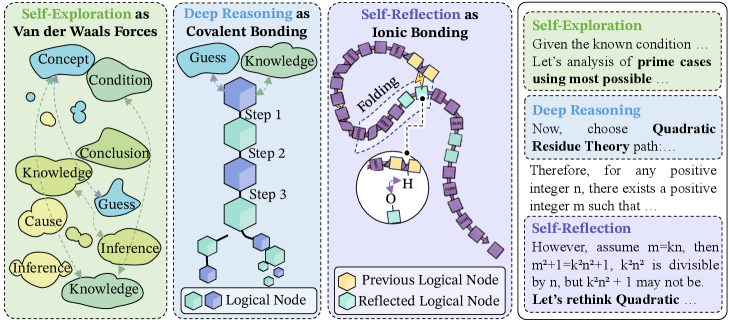
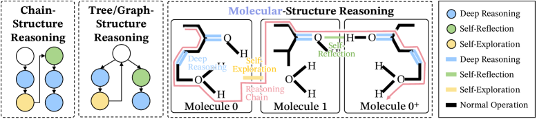
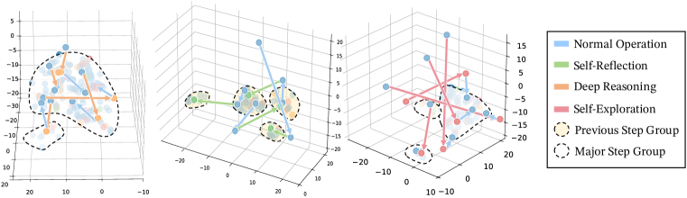
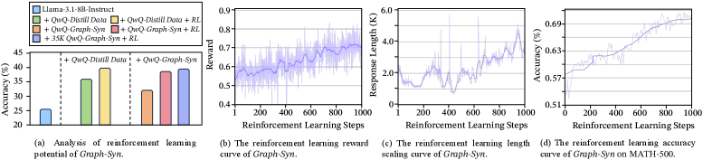
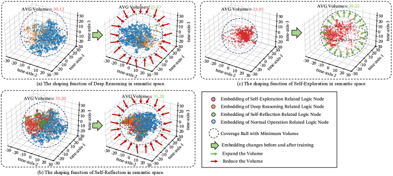

# **2026年1月AI前沿研究综述与深度报告：思维的分子结构与智能的新形态**

---

**文献标题**：The Molecular Structure of Thought: Mapping the Topology of Long Chain-of-Thought Reasoning

**中文标题**：思维的分子结构：长思维链推理的拓扑映射

**作者团队**：Qiguang Chen, Yantao Du, Ziniu Li 等（来自字节跳动、清华大学等机构）

**发表时间**：2026年1月（arXiv:2601.06002）

**原文pdf**：[https://arxiv.org/pdf/2601.06002.pdf](https://arxiv.org/pdf/2601.06002.pdf)
**PDF文件**: [2601_06002.pdf](../../Resource/第二期/2601.06002v1.pdf)

### **1 推理机制的理论反思：脆弱的链条**

研究发现，模型在面对推理僵局时，容易陷入一种自强化的注意力陷阱，导致内容不断重复（循环推理）。更糟糕的是，即便模型能够检测到错误，其自我修正的成功率也往往低于预期，存在“准确率-修正悖论”。这些现象表明，单纯依靠“让模型多想一步”并不能解决根本问题，我们需要一种更结构化、更稳健的思维拓扑。

- The hypothesis that stable molecular structure in Long CoT arises from three key “chemical” bonds.
---

### **2.1 核心问题：为什么“模仿”无法学会“思考”？**

在过去的一年中，大模型推理能力的提升主要依赖于\*\*思维链（Chain-of-Thought, CoT）\*\*技术。通过让模型输出“让我们一步步思考”的中间过程，模型的数学和逻辑能力得到了显著增强。然而，该论文的作者发现了一个令人不安的现象：**较弱的模型（学生）无法通过简单的监督微调（SFT）从强模型（老师，如GPT-4或DeepSeek-R1）那里学会真正的长程推理。**

即使学生模型完美地模仿了老师的口头禅（如“等等，让我再检查一下”、“这似乎不对”），它们生成的推理链条依然脆弱不堪。这种现象被称为“货船崇拜”（Cargo Cult）式的推理——徒有其表，未得其神。作者指出，主要原因在于：

1. **关键词模仿**：模型只是学会了生成特定的连接词，而没有学会这些词背后的认知操作。  
2. **结构坍塌**：真正的长程推理不是线性的链条，而是一个复杂的、折叠的结构。简单的序列模仿丢失了这种拓扑结构。  
3. **异构体冲突**：同一个问题可能存在多种正确的推理路径（语义异构体）。如果在训练数据中混合了结构迥异的推理路径，学生模型就会陷入“结构混乱”，导致性能下降。

为了解决这一问题，作者提出了一种极其新颖且具有解释力的隐喻框架：**认知化学（Cognitive Chemistry）**。

### **2.2 理论框架：思维的化学键理论**

该论文的核心创新在于将思维过程建模为分子的构建过程。在这个视角下，每一个推理步骤（Token或短语）是原子，而连接这些步骤的**注意力机制**则构成了化学键。作者定义了三种关键的“思维化学键”，它们共同维持了长思维链的稳定性。

#### **2.2.1 深度推理（Deep Reasoning）——共价键（Covalent Bond）**

在化学中，共价键是原子间共享电子对形成的强键，构成了分子的骨架。  
在思维模型中，深度推理对应于共价键。

* **定义**：这是推理的主干，代表了从前提到结论的直接、紧密的逻辑推导（如 $A \\rightarrow B \\rightarrow C$）。  
* **特征**：在语义空间中，这些步骤形成了致密的局部簇（Local Clusters）。数据显示，经过深度推理的步骤，72.56%的情况下依然停留在语义距离小于3的范围内 16。  
* **功能**：构建逻辑的“骨架”。如果共价键断裂，整个推理链条就会崩解，导致逻辑中断。
 
- Comparison of prior chain- or tree-like structures and our molecular structure. Reasoning starts from Mole. 0, uses deep reasoning on strongly related structures, then employs self-exploration for new logic in Mole. 1. When meet errors, reasoning utilize self-reflection to guide chain to optimized Mole. 0+.
#### **2.2.2 自我反思（Self-Reflection）——氢键（Hydrogen Bond）**

在化学中，氢键是分子内部或分子间较弱的相互作用，它负责维持蛋白质和DNA的二级结构（如折叠、螺旋）。  
在思维模型中，自我反思对应于氢键。

* **定义**：这是思维的回溯机制。当模型进行到第10步时，回头检查第2步的假设是否成立。  
* **特征**：这种连接跨越了较长的时间步，但在语义上却高度相似。数据表明，81.72%的反思步骤会“折叠”回之前形成的语义簇 16。  
* **功能**：**逻辑折叠（Logical Folding）**。这是论文最精彩的洞见之一。就像蛋白质必须折叠才能具有生物活性一样，长思维链必须通过“反思”进行折叠，才能保持稳健。线性的、无限延伸的推理极易“脱轨”（Derailment），而氢键将思维拉回原本的逻辑锚点，防止了幻觉的级联放大。
 
- Verification of the “logical folding” structure on embeddings from Qwen2.5-32B-Instruct and t-SNE-based low-dimensional representations from the OpenAI-OSS-120B-generated reasoning process.
#### **2.2.3 自我探索（Self-Exploration）——范德华力（Van der Waals Forces）**

在化学中，范德华力是分子间微弱的吸引力，影响物质的物理性质（如沸点、溶解度）。  
在思维模型中，自我探索对应于范德华力。

* **定义**：这是思维的侧向跳跃或发散。当当前路径受阻时，模型尝试寻找新的视角或方法。  
* **特征**：连接松散，跨越较大的语义距离（在3D t-SNE投影中平均轨迹长度为5.32）16。  
* **功能**：扩展搜索空间。虽然微弱，但它允许思维跳出局部最优解，探索潜在的“异构体”路径。

### **2.3 数学形式化：注意力的热力学解释**

作者并没有止步于定性类比，而是利用热力学公式对Attention机制进行了重新诠释。  
Transformer中的注意力公式为：

$$Attention(Q, K, V) = Softmax\left(\frac{QK^T}{\sqrt{d_k}}\right)V$$

而统计力学中的玻尔兹曼分布（Boltzmann Distribution）描述了系统处于某一能量状态 $i$ 的概率：

$$p_i = \frac{1}{Z} e^{-\frac{E_i}{k_B T}}$$

作者指出，注意力分数（Attention Scores）实际上对应了思维能量分布。高注意力权重意味着该步骤之间的“结合能”极高（共价键），而低权重则对应弱相互作用。  
基于此，作者提出了\*\*熵收敛（Entropy Convergence）\*\*作为衡量思维质量的标准。一个有效的长思维链，随着推导的进行，其系统的熵（不确定性）应当迅速且单调地下降。相比之下，模仿得来的伪CoT往往表现为熵的震荡或发散——话说得越多，结论越模糊。

### **2.4 关键发现：语义异构体（Semantic Isomers）**

论文提出了**有效语义异构体**的概念。对于同一个数学问题（如GSM8K中的难题），可能存在多种解法（代数法、几何法、枚举法）。这些解法虽然终点相同，但其微观的“分子结构”（键的分布）完全不同。

* **结构冲突**：如果强行让学生模型同时学习多种异构体（例如，一半数据来自擅长代数的模型，一半来自擅长几何的模型），学生模型会产生“结构精神分裂”，无法形成稳定的思维拓扑。  
* **结论**：数据多样性并非总是好事。高效的蒸馏需要**结构纯化**，即只让学生学习一种稳定的异构体结构。

### **2.5 方法论：Mole-Syn 框架**

基于上述理论，作者提出了\*\*Mole-Syn（Molecular Synthesis，分子合成）\*\*框架，旨在从零合成高质量的CoT数据。  
该框架包含两个阶段：

1. **行为转移图（Behavioral Transfer Graph）估计**：  
   * 不直接复制老师的具体文本。  
   * 而是分析老师（如DeepSeek-R1）的“思维拓扑”，统计其在何时使用深度推理，何时触发反思（氢键），何时进行探索。  
   * 提取出一个抽象的“思维骨架”。  
2. **结构感知合成（Structure-Aware Synthesis）**：  
   * 利用这个骨架作为模板，引导一个基础指令模型（Instruct LLM）生成全新的内容。  
   * 这相当于给了学生一个“思维大纲”，要求它在特定的步骤必须进行反思，在特定的步骤必须进行推导，但具体内容由学生自己填充。

这一方法实现了**结构与内容的解耦**。学生学会的是“如何思考的结构”，而不是“思考的具体内容”。
 
- The continual improvement of RL performance with Mole-Syn-initialized models.

- Roles of individual bonds in reasoning, inferred from semantic-space comparisons between Llama-3.1-8B-Instruct and Llama-3.1-8B-Instruct + QwQ-Mole-Syn.

### **2.6 实验结果与分析**

实验在GSM8K（小学数学）、MATH（竞赛数学）、GPQA（研究生级问答）等高难度基准上进行。

#### **2.6.1 性能对比**

| 方法 | 描述 | 结果特征 |
| :---- | :---- | :---- |
| **Standard Distillation** | 直接微调原始数据 | 随着CoT长度增加，准确率下降（脱轨效应） |
| **Human-Annotated** | 使用人类标注数据 | 性能一般，因人类概括破坏了微观结构 |
| **Mole-Syn (SyncThink)** | 基于分子结构的合成 | **平均Top-1准确率 62.00%** 17；在长链推理中保持高稳定性 |

在与DeepSeek-R1的蒸馏对比中，Mole-Syn生成的模型展现出了惊人的稳定性。特别是在GSM8K上，传统方法在推理步骤超过一定数量后，错误率飙升；而Mole-Syn模型由于具备“氢键”般的自我修正能力，能够随着思考时间的延长而持续提升准确率。

#### **2.6.2 强化学习（RL）的助推剂**

更令人兴奋的是，Mole-Syn生成的模型为后续的强化学习提供了极佳的初始化。由于初始结构已经是“稳态分子”，RL过程（如PPO）不再需要从随机游走中探索逻辑，而是可以直接优化现有的结构。实验显示，Mole-Syn初始化的模型在RL训练中收敛更快，且具有更高的性能上限（Headroom）。

### **2.7 深度洞察与启示**

#### **2.7.1 从“生成”到“折叠”**

这篇论文最重要的启示在于：**智能不仅仅是生成下一个词，更是对过往思维的折叠与压缩。** 未来的LLM架构可能需要针对“逻辑折叠”进行优化，设计专门的注意力头来处理长距离的自我反思（氢键），而不仅仅是关注局部的流畅性。

#### **2.7.2 系统2的工程化落地**

丹尼尔·卡尼曼提出的“系统2”（慢思考）在AI中一直是一个模糊的概念。Mole-Syn将其具象化为一种**拓扑结构**。这意味着我们可以通过工程手段（如强制插入反思节点、优化注意力熵）来人为地诱导模型进入“慢思考”状态，而不是被动等待其涌现。