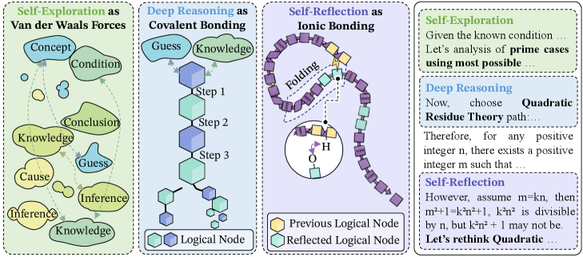
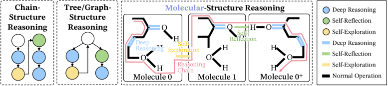
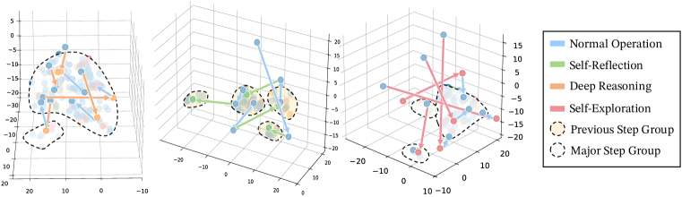
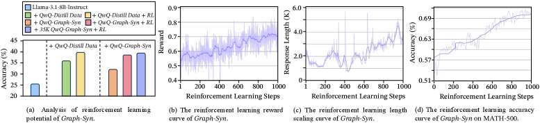
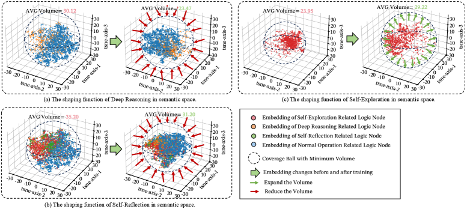

# The Molecular Structure of Thought: Mapping the Topology of Long Chain-of-Thought Reasoning

[English](./2601_06002_en.md) | [中文](./2601_06002.md)

**Title**: The Molecular Structure of Thought: Mapping the Topology of Long Chain-of-Thought Reasoning

**Authors**: Qiguang Chen, Yantao Du, Ziniu Li, et al. (ByteDance, Tsinghua University, etc.)

**Published**: January 2026 (arXiv:2601.06002)

**Original PDF**: [https://arxiv.org/pdf/2601.06002.pdf](https://arxiv.org/pdf/2601.06002.pdf)
**PDF File**: [2601_06002.pdf](../../Resource/第二期/2601.06002v1.pdf)

### **1. Theoretical Reflection on Reasoning Mechanisms: Fragile Chains**

Research has found that when models face reasoning deadlocks, they tend to fall into a self-reinforcing attention trap, leading to continuous repetition of content (circular reasoning). Even worse, even if the model can detect errors, its success rate of self-correction is often lower than expected, presenting an "Accuracy-Correction Paradox." These phenomena indicate that simply relying on "letting the model think one more step" cannot solve the fundamental problem; we need a more structured and robust thinking topology.

- The hypothesis that stable molecular structure in Long CoT arises from three key “chemical” bonds.

---

### **2.1 Core Question: Why Can't "Imitation" Learn "Thinking"?**

In the past year, the improvement of large model reasoning capabilities has mainly relied on **Chain-of-Thought (CoT)** technology. By letting the model output intermediate processes like "let's think step by step," the model's mathematical and logical abilities have been significantly enhanced. However, the authors of this paper discovered a disturbing phenomenon: **Weaker models (students) cannot learn true long-range reasoning from strong models (teachers, such as GPT-4 or DeepSeek-R1) through simple Supervised Fine-Tuning (SFT).**

Even if student models perfectly imitate the teacher's catchphrases (such as "Wait, let me check again," "This seems wrong"), the reasoning chains they generate remain fragile. This phenomenon is called "Cargo Cult" reasoning—superficial imitation without grasping the essence. The authors point out that the main reasons are:

1.  **Keyword Imitation**: The model only learns to generate specific connective words, without learning the cognitive operations behind these words.
2.  **Structural Collapse**: True long-range reasoning is not a linear chain, but a complex, folded structure. Simple sequence imitation loses this topological structure.
3.  **Isomer Conflict**: The same problem may have multiple correct reasoning paths (semantic isomers). If reasoning paths with vastly different structures are mixed in the training data, the student model will fall into "structural confusion," leading to performance degradation.

To solve this problem, the authors propose an extremely novel and explanatory metaphorical framework: **Cognitive Chemistry**.

### **2.2 Theoretical Framework: Chemical Bond Theory of Thought**

The core innovation of this paper lies in modeling the thinking process as a molecular construction process. In this perspective, each reasoning step (Token or phrase) is an atom, and the **attention mechanism** connecting these steps constitutes chemical bonds. The authors define three key "Thinking Chemical Bonds," which together maintain the stability of the long chain of thought.

#### **2.2.1 Deep Reasoning — Covalent Bond**

In chemistry, a covalent bond is a strong bond formed by the sharing of electron pairs between atoms, constituting the backbone of a molecule.
In the thinking model, deep reasoning corresponds to the covalent bond.

*   **Definition**: This is the backbone of reasoning, representing direct, tight logical deduction from premises to conclusions (e.g., $A \rightarrow B \rightarrow C$).
*   **Characteristics**: In semantic space, these steps form dense Local Clusters. Data shows that after deep reasoning steps, in 72.56% of cases, they still remain within a semantic distance of less than 3.
*   **Function**: Constructs the "skeleton" of logic. If the covalent bond breaks, the entire reasoning chain will collapse, leading to logical interruption.

- Comparison of prior chain- or tree-like structures and our molecular structure. Reasoning starts from Mole. 0, uses deep reasoning on strongly related structures, then employs self-exploration for new logic in Mole. 1. When meet errors, reasoning utilize self-reflection to guide chain to optimized Mole. 0+.

#### **2.2.2 Self-Reflection — Hydrogen Bond**

In chemistry, a hydrogen bond is a weaker interaction within or between molecules, responsible for maintaining the secondary structure of proteins and DNA (such as folding, helix).
In the thinking model, self-reflection corresponds to the hydrogen bond.

*   **Definition**: This is the backtracking mechanism of thinking. When the model proceeds to step 10, it looks back to check if the assumption in step 2 holds.
*   **Characteristics**: This connection spans a longer time step, but is highly similar semantically. Data shows that 81.72% of reflection steps will "fold" back to previously formed semantic clusters.
*   **Function**: **Logical Folding**. This is one of the most brilliant insights of the paper. Just as proteins must fold to have biological activity, long chains of thought must fold through "reflection" to remain robust. Linear, infinitely extending reasoning is extremely prone to "Derailment," while hydrogen bonds pull thoughts back to the original logical anchor, preventing the cascading amplification of hallucinations.

- Verification of the “logical folding” structure on embeddings from Qwen2.5-32B-Instruct and t-SNE-based low-dimensional representations from the OpenAI-OSS-120B-generated reasoning process.

#### **2.2.3 Self-Exploration — Van der Waals Forces**

In chemistry, Van der Waals forces are weak attractive forces between molecules, affecting physical properties of matter (such as boiling point, solubility).
In the thinking model, self-exploration corresponds to Van der Waals forces.

*   **Definition**: This is the lateral jump or divergence of thinking. When the current path is blocked, the model tries to find new perspectives or methods.
*   **Characteristics**: Loose connections, spanning large semantic distances (average trajectory length of 5.32 in 3D t-SNE projection).
*   **Function**: Expands the search space. Although weak, it allows thinking to jump out of local optima and explore potential "isomer" paths.

### **2.3 Mathematical Formalization: Thermodynamic Interpretation of Attention**

The authors did not stop at qualitative analogies but reinterpreted the Attention mechanism using thermodynamic formulas.
The attention formula in Transformer is:

$$Attention(Q, K, V) = Softmax\left(\frac{QK^T}{\sqrt{d_k}}\right)V$$

The Boltzmann Distribution in statistical mechanics describes the probability of a system being in a certain energy state $i$:

$$p_i = \frac{1}{Z} e^{-\frac{E_i}{k_B T}}$$

The authors point out that Attention Scores actually correspond to the distribution of thinking energy. High attention weights mean that the "binding energy" between the steps is extremely high (covalent bond), while low weights correspond to weak interactions.
Based on this, the authors propose **Entropy Convergence** as a criterion for measuring the quality of thinking. An effective long chain of thought should see the system's entropy (uncertainty) drop rapidly and monotonically as the derivation proceeds. In contrast, pseudo-CoT derived from imitation often exhibits entropy oscillation or divergence—the more it talks, the vaguer the conclusion.

### **2.4 Key Findings: Semantic Isomers**

The paper proposes the concept of **Effective Semantic Isomers**. For the same mathematical problem (such as difficult problems in GSM8K), there may be multiple solutions (algebraic method, geometric method, enumeration method). Although these solutions have the same endpoint, their microscopic "molecular structure" (distribution of bonds) is completely different.

*   **Structural Conflict**: If a student model is forced to learn multiple isomers simultaneously (for example, half of the data comes from a model good at algebra, and half from a model good at geometry), the student model will develop "structural schizophrenia" and cannot form a stable thinking topology.
*   **Conclusion**: Data diversity is not always a good thing. Efficient distillation requires **Structural Purification**, that is, only letting students learn one stable isomer structure.

### **2.5 Methodology: Mole-Syn Framework**

Based on the above theory, the authors propose the **Mole-Syn (Molecular Synthesis)** framework, aiming to synthesize high-quality CoT data from scratch.
The framework consists of two stages:

1.  **Behavioral Transfer Graph Estimation**:
    *   Does not directly copy the teacher's specific text.
    *   Instead, it analyzes the "thinking topology" of the teacher (such as DeepSeek-R1), statistically analyzing when it uses deep reasoning, when it triggers reflection (hydrogen bond), and when it conducts exploration.
    *   Extracts an abstract "thinking skeleton."
2.  **Structure-Aware Synthesis**:
    *   Uses this skeleton as a template to guide a base instruction model (Instruct LLM) to generate completely new content.
    *   This is equivalent to giving the student a "thinking outline," requiring it to reflect at specific steps and deduce at specific steps, but the specific content is filled in by the student itself.

This method achieves the **decoupling of structure and content**. What the student learns is "the structure of how to think," not "the specific content of thinking."

- The continual improvement of RL performance with Mole-Syn-initialized models.

- Roles of individual bonds in reasoning, inferred from semantic-space comparisons between Llama-3.1-8B-Instruct and Llama-3.1-8B-Instruct + QwQ-Mole-Syn.

### **2.6 Experimental Results and Analysis**

Experiments were conducted on high-difficulty benchmarks such as GSM8K (elementary school math), MATH (competition math), and GPQA (graduate-level QA).

#### **2.6.1 Performance Comparison**

| Method | Description | Result Characteristics |
| :---- | :---- | :---- |
| **Standard Distillation** | Directly fine-tune original data | Accuracy drops as CoT length increases (Derailment Effect) |
| **Human-Annotated** | Use human-annotated data | Average performance, as human summarization destroys microscopic structure |
| **Mole-Syn (SyncThink)** | Synthesis based on molecular structure | **Average Top-1 Accuracy 62.00%**; Maintains high stability in long chain reasoning |

In the distillation comparison with DeepSeek-R1, the model generated by Mole-Syn showed amazing stability. Especially on GSM8K, the error rate of traditional methods soared after the number of reasoning steps exceeded a certain amount; while the Mole-Syn model, due to its "hydrogen bond"-like self-correction ability, can continuously improve accuracy as the thinking time extends.

#### **2.6.2 Booster for Reinforcement Learning (RL)**

What is even more exciting is that the model generated by Mole-Syn provides an excellent initialization for subsequent reinforcement learning. Since the initial structure is already a "stable molecule," the RL process (such as PPO) no longer needs to explore logic from a random walk, but can directly optimize the existing structure. Experiments show that models initialized with Mole-Syn converge faster in RL training and have a higher performance ceiling (Headroom).

### **2.7 Deep Insights and Implications**

#### **2.7.1 From "Generation" to "Folding"**

The most important revelation of this paper is: **Intelligence is not just generating the next word, but the folding and compression of past thoughts.** Future LLM architectures may need to be optimized for "logical folding," designing specialized attention heads to handle long-distance self-reflection (hydrogen bonds), rather than just focusing on local fluency.

#### **2.7.2 Engineering Implementation of System 2**

"System 2" (slow thinking) proposed by Daniel Kahneman has always been a vague concept in AI. Mole-Syn concretizes it as a **topological structure**. This means we can use engineering means (such as forcibly inserting reflection nodes, optimizing attention entropy) to artificially induce the model to enter a "slow thinking" state, rather than passively waiting for it to emerge.
