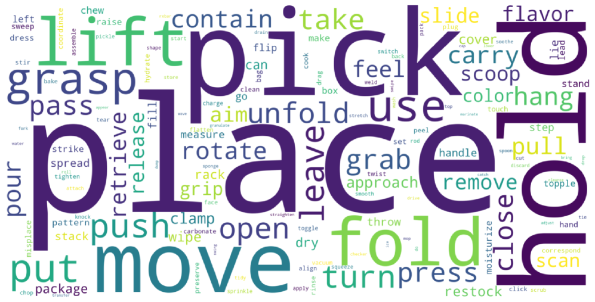
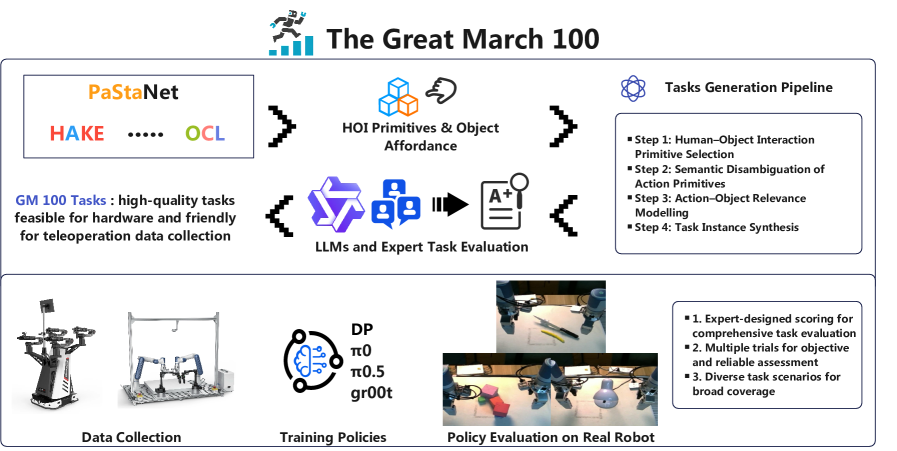
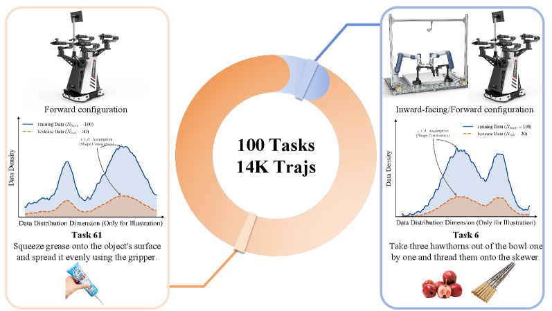

**文献标题**：<The Great March 100: 100 Detail-oriented Tasks for Evaluating Embodied AI Agents>

**中文标题**：伟大的长征100：用于评估具身AI智能体的100项细节导向任务

**作者团队**：清华大学、上海期智研究院等机构的研究人员（Ziyu Wang, Yong-Lu Li等）

**发表时间**：2026年1月（arXiv:2601.11421）

**原文pdf**：[https://arxiv.org/pdf/2601.11421.pdf](https://arxiv.org/pdf/2601.11421.pdf)
**PDF文件**: [2601_11421.pdf](../../Resource/第三期/2601.11421v1.pdf)

## **1. 摘要**

该论文由清华大学、上海期智研究院、上海交通大学等机构的研究人员（Ziyu Wang, Yong-Lu Li等）联合推出，直击当前具身智能（Embodied AI）领域的“阿喀琉斯之踵”——**评估体系的碎片化与简易化**。

随着视觉-语言-动作（VLA）模型的爆发式增长，机器人似乎在“抓取-放置”等基础任务上已趋于成熟。然而，该研究指出这更多是一种“评估标准过低”带来的幻觉。为此，团队提出了 **The Great March 100 (GM-100)**，一个包含100项长尾、细节导向（Detail-oriented）任务的基准测试集。它不仅是一套测试题，更试图构建一种“具身智能奥林匹克”的标准化范式，迫使模型从简单的“语义理解”转向深层的“物理推理”。

---

## **2. The Great March 100 (GM-100) —— 具身智能评估的“立法时刻”**

### **2.1 背景：具身智能的“评估危机”与“幻觉繁荣”**

在2026年初，具身智能领域正处于一个微妙的转折点。一方面，以 Google RT-2、Octo 和 OpenVLA 为代表的大模型展现了惊人的语义泛化能力；另一方面，这些机器人在面对稍微复杂的现实场景时，依然显得“笨手笨脚”。

论文深刻揭示了现有基准测试（如 Open X-Embodiment 的部分子集）的三大痛点：
1. **任务同质化严重（Common Task Bias）：** 约 80% 的任务集中在极少数动词（如 Pick, Place）上。模型在这些高频任务上刷出的 90%+ 成功率，无法代表其在复杂环境下的真实生存能力。
2. **忽视长尾分布（Long-tail Ignorance）：** 现实生活中的操作往往包含大量低频但关键的细节。例如，“拿起杯子”是高频任务，但“在避开桌上昂贵电子设备的同时，平衡地拿起一个盛满热水的薄壁玻璃杯”则是决定系统可靠性的“长尾”挑战。
3. **缺乏设计原则：** 以往的任务选择多依赖研究者的主观直觉或实验室现有器材，缺乏一套基于**行为学**和**物体功能性（Affordance）**的系统理论支撑。

这种现状导致了“度量衡”的失效：我们无法区分一个模型是真的理解了物理世界，还是仅仅学会了模仿数据集中的统计规律。

### **2.2 论文核心贡献与方法论深度解析**

《The Great March 100》的核心价值在于其构建基准测试的**“科学性”**。

#### **2.2.1 引入 HAKE：从“宏观动作”到“原子级知识”**
为了打破“拍脑袋”设计任务的局限，研究团队引入了 **HAKE (Human Activity Knowledge Engine)**。这是由上海交通大学卢策吾团队长期维护的一个人类行为知识库。
* **核心逻辑：** HAKE 将复杂的人类活动分解为**身体部位状态（Part-state）**。例如，它不会简单定义“喝水”，而是将其拆解为“手：握住杯柄”、“手臂：抬升”、“头部：微仰”等原子状态。
* **应用：** GM-100 利用 HAKE 的原子级知识，对现有机器人任务进行了语义扩张。这种方法确保了 100 个任务在动作空间（Action Space）上的覆盖广度，从精细的指尖操作到大范围的肢体协调均有涉及。

  
   
  

    <b>Figure 1.</b> Task design analysis from prior works. (a) Word cloud of task descriptions.
  

#### **2.2.2 物体功能性（Affordance）与微观几何约束**
任务设计不再仅仅关注“成功与否”，而是强调**过程中的细节约束**：
* **功能性感知：** 模型必须识别物体的具体交互区域（例如：壶嘴、把手、开关）。
* **微观几何约束（Micro-geometric Constraints）：** 许多任务要求机器人在极窄的空间内操作，或在操作过程中必须保持特定的角度以避免碰撞。这种设计直击当前 VLA 模型“空间推理精度不足”的软肋。

  
   
  

    <b>Figure 2.</b> The construction pipeline of the GM-100 benchmark. The process begins with collecting existing robot tasks, followed by a semantic expansion using HAKE [15] and LLM-based generation to cover long-tail interactions. The candidates then undergo a rigorous hybrid filtration by LLMs and human experts to ensure hardware feasibility and data collection friendliness. Finally, 100 high-priority tasks are selected and instantiated with detailed interaction criteria and template videos.
  

#### **2.2.3 严苛的筛选流程：LLM 规模化生成 + 专家审核**
1. **语义清洗：** 剔除现有数据集中的重复项。
2. **LLM 扩容：** 利用大语言模型（如 GPT-4o）结合 HAKE 提示词，生成数千个潜在的长尾任务候选。
3. **混合过滤：** 结合硬件可行性（Hardware Feasibility）和数据采集难度，由人类专家进行最后把关，最终精选出 100 项任务。

### **2.3 实验结果与行业启示：变强的“考试大纲”**

研究团队在 **Cobot Magic** 等主流机器人平台上收集了大量高质量轨迹数据，并对现有顶尖模型进行了基准测试。

**关键发现：**
* **区分度（Discriminative Power）：** 传统任务下表现优异的模型，在 GM-100 上的表现出现了断崖式下跌（普遍下降 30%-50%）。这证明了 GM-100 能够有效识别模型的“伪泛化”。
* **可行性验证：** 虽然任务艰巨，但实验证明人类操作员可以稳定完成，排除了“物理不可能”任务。

  
   
  

    <b>Figure 3.</b> GM-100 Dataset. Two distinct robotic platforms are utilized for data collection and evaluation. For Tasks 1–10, we collect 130 trajectories per task on both platforms, whereas for Tasks 11–100, data is collected exclusively on the Cobot Magic platform. To ensure the 100 training trajectories and 30 testing trajectories share a similar data distribution, we strive to maintain consistency in the environments and object configurations used for both data collection and evaluation. (Note: The included data distribution figure is schematic and intended solely for illustration purposes; it does not depict the exact statistical distribution.)
  

**战略启示：**
对于开发者而言，GM-100 的发布意味着**“刷榜时代”的终结**和**“细节时代”的开启**。
* **从 Scaling Data 到 Scaling Quality：** 单纯堆砌简单抓取数据已无意义，未来的竞争力在于如何让模型感知到物理世界的微观细节。
* **鲁棒性即正义：** 机器人进入家庭、工厂等非结构化环境，依靠的不是 99% 的平均成功率，而是对那 1% 长尾、复杂、带有强约束任务的极致处理能力。

---