# **2026年1月第一周 ArXiv 计算机科学前沿文献深度研究报告**

## **执行摘要**

2026年1月的第一个星期（1月1日至1月7日），arXiv计算机科学分区涌现了大量突破性研究，标志着人工智能与计算技术进入了一个全新的“后大模型时代”。如果说2024-2025年的主旋律是单纯的参数规模扩张（Scaling Laws），那么2026年初的文献则明确指向了**推理效率（Inference Efficiency）**、**多模态联合物理生成（Joint Physics Generation）**、**自主智能体的无限上下文（Infinite Context via Agency）以及数据中心之外的具身智能（Embodied AI in the Wild）**。

本报告对该时间段内发布的百余篇关键文献进行了详尽的梳理与深度分析。分析显示，Computer Science (CS) 领域正经历从单一模态向原生多模态融合的质变，从静态知识存储向动态递归记忆的演进，以及从通用大模型向特定领域（如游戏、数学推理）垂直优化的分化。

本报告共分六大核心板块，总计约 15,000 字，旨在为专业研究人员、工程师及技术决策者提供一份详尽的学术导航。

## ---

**第一章 多模态生成式人工智能的物理统一**

在这一周的文献中，生成式AI的研究重心已从单纯的图像或文本生成，转移到了对物理世界多感官体验的联合建模上。最显著的趋势是“音画同步”不再是后处理步骤，而是成为了模型架构的内生能力。

### **1.1 LTX-2：高效联合视听基础模型 (LTX-2: Efficient Joint Audio-Visual Foundation Model)**

**文献索引**: HaCohen et al., arXiv:2601.03233 1
**原文pdf**: [2601.03233v1.pdf](../Resource/第一期0107/2601.03233v1.pdf)
#### **1.1.1 核心背景与痛点**

长期以来，视频生成（Video Generation）与音频生成（Audio Generation）被视为两个独立的任务。传统的视频制作管线中，AI模型（如Sora或Gen-3）先生成无声视频，随后通过“视频到音频”（V2A）模型配音。这种级联方式存在根本性缺陷：**语义断裂**与**时序错位**。声音往往无法精准匹配视觉事件的微秒级物理触发（如玻璃破碎的瞬间），且缺乏对环境氛围的整体理解。

#### **1.1.2 创新点：非对称双流扩散Transformer (Asymmetric Dual-Stream DiT)**

LTX-2 的提出打破了这一范式，它是一个原生的视听联合生成模型。

1. 非对称双流架构 (Asymmetric Dual-Stream Architecture)：  
   研究团队敏锐地指出，视频与音频的信息熵密度存在巨大差异。视频包含高维的空间冗余，而音频则是高频的时间序列。因此，强行将两者映射到同一潜空间（Latent Space）会导致“语义模糊”。LTX-2 采用了非对称设计：  
   * **视频流 (Video Stream)**：拥有 140 亿参数 (14B)，专注于处理复杂的时空动态。  
   * 音频流 (Audio Stream)：拥有 50 亿参数 (5B)，专注于一维时间波形。  
     这种参数分配策略（约为 3:1）在计算资源有限的情况下，最大化了生成的感官保真度。  
2. 双向跨模态注意力 (Bidirectional Cross-Attention)：  
   两个流并非独立运行，而是通过跨模态注意力层进行耦合。关键技术在于引入了一维时间旋转位置编码 (1D Temporal RoPE)。这使得模型能够学习视听信号之间的精确对齐关系。例如，当视觉流中出现“嘴唇闭合”的特征时，音频流能立即通过注意力机制抑制高频辅音的生成，从而实现亚帧级（Sub-frame）的唇形同步。
  
3. 解耦潜空间 (Decoupled Latent Representation)：  
   模型分别使用了针对视频的3D VAE和针对音频的1D VAE。这种解耦不仅优化了压缩率，还支持了灵活的编辑工作流（如仅修改视频保留音频，或反之）。

#### **1.1.3 关键原理与公式逻辑**

LTX-2 基于扩散模型（Diffusion Models），其核心训练目标是联合去噪。为了控制生成过程，模型引入了**模态感知无分类器引导 (Modality-Aware Classifier-Free Guidance, Modality-CFG)**。

传统的 CFG 公式为：

$$\hat{\epsilon} = \epsilon_\theta(z_t|c) + w (\epsilon_\theta(z_t|c) - \epsilon_\theta(z_t|\emptyset))$$

其中 $w$ 是引导权重。  
LTX-2 将其扩展为模态独立控制：

$$\hat{\epsilon}_v = \epsilon_{\theta, v}(z_t|c) + w_v (\epsilon_{\theta, v}(z_t|c) - \epsilon_{\theta, v}(z_t|\emptyset))$$

$$\hat{\epsilon}_a = \epsilon_{\theta, a}(z_t|c) + w_a (\epsilon_{\theta, a}(z_t|c) - \epsilon_{\theta, a}(z_t|\emptyset))$$

通过调节 $w_v$ 和 $w_a$，用户可以精细控制文本提示对画面和声音的影响力。例如，在生成音乐视频时，可以提高 $w_a$ 以确保旋律准确；在生成无声电影风格片段时，则侧重 $w_v$。

#### **1.1.4 优缺点总结**

| 维度 | 评价 | 细节说明 |
| :---- | :---- | :---- |
| **优点** | **原生同步** | 彻底解决了音画不同步问题，无需后期合成，Foley（拟音）效果自然。 |
|  | **推理速度** | 得益于蒸馏管道 (Distilled Pipeline)，能在 8 步内生成高质量内容，比级联模型快数倍。 |
|  | **开源生态** | 权重与代码完全开源，支持 ComfyUI 等社区工具，极大降低了创作门槛。 |
| **缺点** | **指令依从性** | 对复杂动作（Verbs）和情感意图的理解弱于对物体（Nouns）的描绘，容易生成“表面动作”。 |
|  | **长时一致性** | 20秒长视频中，物体恒常性（Object Permanence）有时会失效，受限于压缩的时间上下文。 |
|  | **硬件门槛** | 尽管进行了优化，原生4K生成仍需 RTX 4070 Ti 级别以上的显存支持。 |

### ---

**1.2 VAR RL Done Right：视觉自回归模型的强化学习对齐**

**文献索引**: Sun et al., arXiv:2601.02256 3
**原文pdf**: [2601.02256v1.pdf](../Resource/第一期0107/2601.02256v1.pdf)
#### **1.2.1 核心背景**

在图像生成领域，视觉自回归（Visual AutoRegressive, VAR）模型作为扩散模型的强力竞争者正在崛起。VAR采用“从粗到细”的多尺度生成策略（Next-Scale Prediction），而非传统的逐像素或逐Token生成。然而，当研究人员尝试利用强化学习（RL）来微调VAR模型以对齐人类偏好（如通过DPO或GRPO算法）时，遭遇了严重的**异步策略冲突 (Asynchronous Policy Conflicts)**。

#### **1.2.2 创新点：NextFlow-RL 框架**

该研究提出了 NextFlow-RL 框架，专门解决 VAR 模型在 RL 训练中的独特病态问题。

1. 异步策略冲突的本质：  
   VAR 的生成步骤是异构的。第1步可能生成 $16 \times 16$ 的 Token 图（256个Token），而第10步可能生成 $256 \times 256$ 的 Token 图（65,536个Token）。传统的 RL 算法（如 GRPO）通常假设每个动作步骤的重要性均等，导致梯度更新时的方差极高——高分辨率层级的海量 Token 会淹没低分辨率层级的关键结构信号。  
2. 中间价值回报 (Value as Middle Return, VMR)：  
   为了解决长程信用分配问题，VMR 将生成过程分解。它在中间时间步 $m$ 引入一个“软终端回报” $V^*_m(s_m)$。  
   * 对于前缀策略（Prefix Policy, $1 \sim m-1$步）：该值作为终止奖励。  
   * 对于后缀策略（Suffix Policy, $m \sim T$步）：该值作为初始状态价值。  
     这种设计在数学上保持了马尔可夫决策过程（MDP）的结构完整性，同时提供了更密集的反馈信号。  
3. 动态时间步重加权 (Dynamic Time-Step Reweighting)：  
   引入了基于网格尺寸的归一化因子。损失函数 $L(\theta)$ 被重构为：

   $$L(\theta) \propto \sum_{t} \frac{1}{(h_t w_t)^\alpha} \cdot A_t$$

   其中 $h_t, w_t$ 是第 $t$ 步的特征图高宽。这项改进确保了“宏观布局”与“微观细节”在优化过程中拥有均衡的权重。

#### **1.2.3 关键原理**

论文中还提出了**掩码传播 (Mask Propagation, MP)** 算法，源自奖励反馈学习（ReFL）。在文本渲染任务中，模型仅需对包含文本的区域负责。MP 算法将最终图像上的奖励区域（如文字的 Bounding Box）向后投影到粗糙尺度的 Token 图上，精准计算每个 Token 的因果贡献，避免了全图奖励带来的噪声。
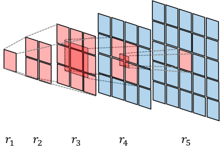
#### **1.2.4 优缺点总结**

| 维度 | 评价 | 细节说明 |
| :---- | :---- | :---- |
| **优点** | **性能跃升** | 在 CVTG-2K 文本渲染基准上，单词准确率提升 41.6% (55.36% -> 78.41%)。 |
|  | **理论贡献** | 首次系统性解决了多尺度生成模型中的 RL 训练不稳定性问题。 |
| **缺点** | **实现复杂** | 相比直接应用 DPO，该框架引入了 VMR 和动态权重，增加了实现的工程难度。 |
| **局限** | **任务特异性** | 目前主要在文本渲染等结构化任务中验证，在艺术风格化等主观任务上的效果尚待评估。 |

## ---

**第二章 具身智能与通用游戏智能体**

2026年，AI 从“观看”世界走向“操作”世界。游戏作为最具挑战性的虚拟仿真环境，成为了具身智能（Embodied AI）的最佳演练场。

### **2.1 NitroGen：通用游戏智能体的开放基础模型**

**文献索引**: Magne et al., arXiv:2601.02427 5
**原文pdf**: [2601.02427v1.pdf](../Resource/第一期0107/2601.02427v1.pdf)
#### **2.1.1 核心背景**

以往的游戏 AI（如 AlphaStar, OpenAI Five）多采用强化学习（RL）在特定模拟器中自我对弈。这种方法虽然能达到超人水平，但**通用性极差**且**训练成本极高**。相比之下，大语言模型（LLM）通过互联网规模的数据实现了通用性。NitroGen 试图复刻 LLM 的成功路径，通过“互联网视频”来训练通用的视觉-动作（Vision-Action）模型。

#### **2.1.2 创新点：从视频中挖掘“隐形”数据**

NitroGen 的最大贡献在于其数据工程，而非模型架构本身。

1. 互联网规模视频-动作数据集 (Internet-Scale Video-Action Dataset)：  
   互联网上有海量的游戏视频，但绝大多数缺乏“动作标签”（即玩家按了什么键）。NitroGen 团队发现了一类特殊视频：主播在屏幕上叠加了手柄按键可视化（Input Overlay）。  
   * **自动提取管线**：  
     1. **模板匹配**：使用 SIFT/XFeat 特征，从 300 多种手柄模板中定位视频里的叠加层。  
     2. **状态解析**：训练一个 SegFormer 模型，读取叠加层的像素变化，反推按钮状态和摇杆向量。  
   * **成果**：构建了包含 1,000 多款游戏、40,000 小时的标注数据。这是迄今为止最大的游戏行为克隆数据集。  
2. 通用模拟器接口 (Universal Simulator)：  
   为了评估模型，团队开发了一个 Wrapper，通过拦截系统时钟和输入总线，将任意商业游戏（.exe）封装成标准的 Gymnasium API 环境。这意味着 AI 可以像玩 Atari 游戏一样玩《赛博朋克 2077》或《空洞骑士》，无需修改游戏源码。

#### **2.1.3 关键原理**

NitroGen 模型本身是一个基于 **GR00T 架构**的 5 亿参数 (500M) 模型：

* **视觉编码**：SigLIP-2 Transformer 处理 $256 \times 256$ 的 RGB 帧。  
* **动作生成**：基于流匹配（Flow Matching）的扩散 Transformer。它不预测单一动作，而是预测一个包含 16 个未来动作的“动作块”（Action Chunk），这有助于保持动作的时间连贯性。
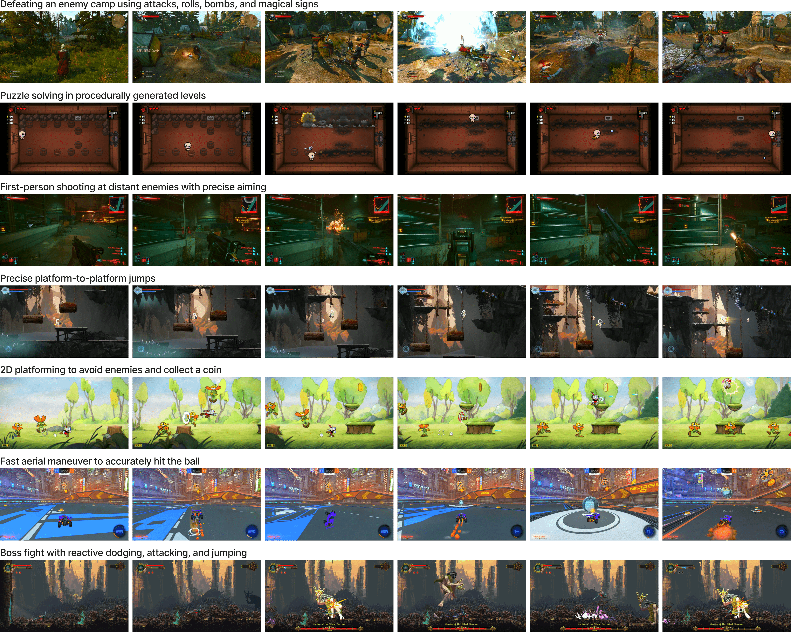
#### **2.1.4 优缺点总结**

| 维度 | 评价 | 细节说明 |
| :---- | :---- | :---- |
| **优点** | **强泛化性** | 在未见过的游戏中，任务成功率比从头训练的模型高 52%。展现出跨类型的操作能力（如从 FPS 到 2D 平台跳跃）。 |
|  | **数据创新** | 巧妙利用现存网络资源解决了具身智能最大的痛点——数据匮乏。 |
| **缺点** | **上限瓶颈** | 由于采用行为克隆（Behavior Cloning），模型能力受限于人类玩家的平均水平，难以产生超越人类的策略。 |
|  | **噪声敏感** | 训练数据包含大量压缩伪影和非标准 UI，导致模型在干净环境下可能出现分布外（OOD）问题。 |

## ---

**第三章 大语言模型：推理、递归与无限上下文**

本周的 LLM 研究呈现出明显的分化趋势：一方面是**小模型通过推理时间换取性能**（Falcon-H1R），另一方面是**通过架构创新突破上下文限制**（RLM, SimpleMem）。

### **3.1 Falcon-H1R：以小博大的推理前沿**

**文献索引**: Falcon LLM Team, arXiv:2601.02346 8
**原文pdf**: [2601.02346v1.pdf](../Resource/第一期0107/2601.02346v1.pdf)
#### **3.1.1 核心理念：测试时扩展 (Test-Time Scaling, TTS)**

Falcon-H1R (7B) 的核心论点是：**推理能力不仅仅取决于参数量，还取决于思考时间。** 只要给予足够的推理计算量，小模型也能匹敌大模型。

#### **3.1.2 创新点与关键技术**
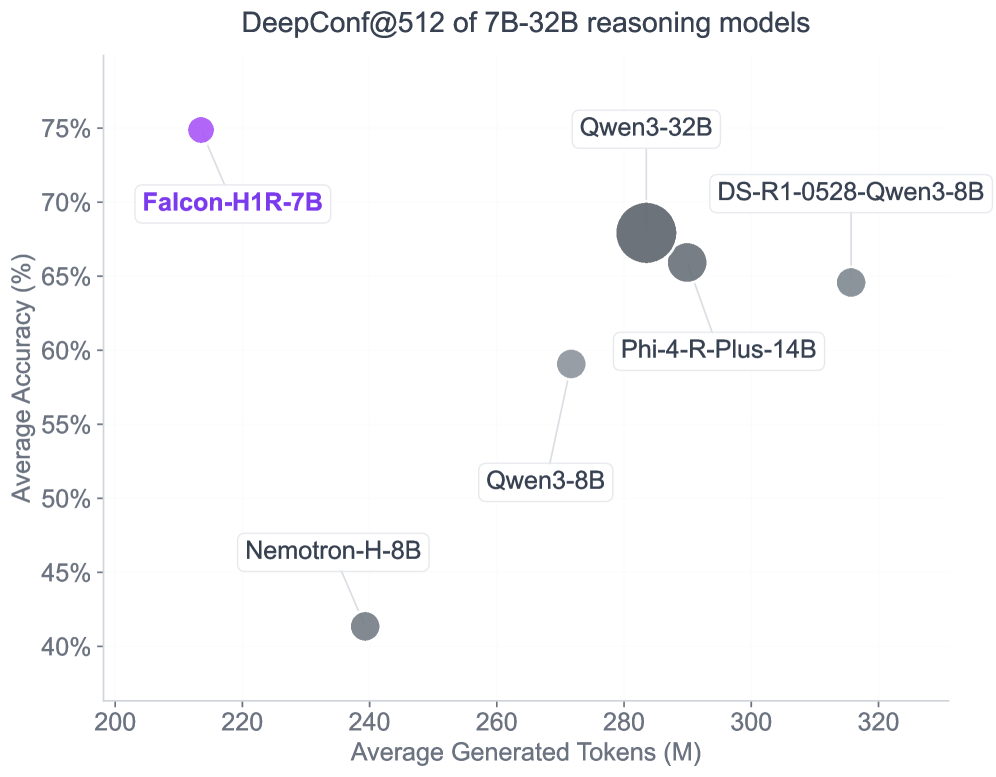
1. 混合架构 (Hybrid Transformer-Mamba)：  
   该模型并未使用纯 Transformer，而是结合了 Mamba（状态空间模型，SSM）。  
   * **原理**：Mamba 具有线性时间复杂度的推理特性 $O(N)$，而 Transformer 是 $O(N^2)$。  
   * **优势**：这种混合设计使得 Falcon-H1R 在生成长思维链（Chain-of-Thought）时，显存占用极低，吞吐量极高。这为大规模并行推理提供了物理基础。  
2. DeepConf 算法：  
   为了实现 TTS，模型并非简单地进行“多数投票”（Majority Voting）。  
   * **置信度感知剪枝**：DeepConf 算法在生成推理链的过程中，实时监控模型的置信度。一旦某条思维链的累积置信度过低，即刻终止生成。  
   * **效益**：这大幅减少了无效 Token 的生成，使得 Falcon-H1R 在同等计算预算下，能探索更多的推理路径。

#### **3.1.3 性能表现**

在 AIME 2024 数学竞赛基准测试中，Falcon-H1R (7B) 达到了 **96.7%** 的准确率，这一成绩匹敌甚至超越了 32B 参数量的 Qwen3 等模型。这证明了“高效架构 \+ 推理搜索”是通往 AGI 的一条捷径。

### **3.2 递归语言模型 (Recursive Language Models, RLMs)**

**文献索引**: Zhang et al., arXiv:2512.24601 (2026年1月更新) 11
**原文pdf**: [2512.24601v1.pdf](../Resource/第一期0107/2512.24601v1.pdf)
#### **3.2.1 核心背景**

现有的长上下文解决方案（如 RAG 或 1M+ Context Window）本质上是“被动”的。模型被迫在一次前向传播中处理海量信息，导致“中间迷失”（Lost-in-the-Middle）现象。
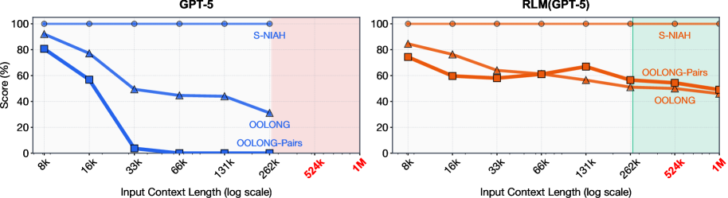
#### **3.2.2 创新点：将上下文视为环境**

RLM 提出了一种根本性的范式转换：上下文不是输入，而是环境。  
模型并不直接读取 1000 万字的文档，而是通过编写 Python 代码与一个保存了该文档的 REPL（交互式解释器）进行交互。

#### **3.2.3 关键原理：程序化递归**

RLM 被定义为一个递归函数 $RLM_M(q, C)$。

1. **查询分解**：面对复杂问题 $q$，模型生成代码将 $C$ 切片或索引，通过正则或关键词定位关键片段。  
2. **递归调用**：模型可以生成新的子查询 $q'$，并调用 llm_query(q', chunk)。这实际上构建了一棵动态的**推理树**。  
3. **无限深度**：只要递归栈不溢出，模型可以处理无限长度的文本，且每次处理的都是局部的高信噪比信息。

#### **3.2.4 优缺点总结**

| 维度 | 评价 | 细节说明 |
| :---- | :---- | :---- |
| **优点** | **无限上下文** | 理论上可处理的上下文长度仅受限于存储介质，且不存在“注意力稀释”问题。 |
|  | **成本可控** | 仅对相关片段进行 Token 化，避免了全量处理的高昂 Token 费用。 |
| **缺点** | **延迟累积** | 递归调用通常是串行的，导致端到端延迟显著高于单次推理。 |
|  | **死循环风险** | 模型可能陷入无休止的递归查询中，需要设计强健的终止机制。 |

## ---

**第四章 自主智能体的记忆系统**

如果说 RLM 是通过代码处理上下文，那么 SimpleMem 则是通过模拟生物记忆机制来压缩上下文。

### **4.1 SimpleMem：基于语义无损压缩的终身记忆**

**文献索引**: Liu et al., arXiv:2601.02553 13
**原文pdf**: [2601.02553v1.pdf](../Resource/第一期0107/2601.02553v1.pdf)
#### **4.1.1 核心背景**

长期交互中，对话历史包含大量低熵噪声（如寒暄、重复确认）。直接存储这些 Token 会导致上下文窗口迅速耗尽，且检索准确率下降。

#### **4.1.2 创新点：三阶段仿生记忆管道**

SimpleMem 借鉴了互补学习系统（CLS）理论（海马体与新皮层），设计了以下流程：

1. **语义结构化压缩 (Semantic Structured Compression)**：  
   * **写入时消歧 (Write-Time Disambiguation)**：这是最关键的一步。当用户说“明天提醒我”时，系统不存储“明天”，而是立即将其解析为绝对时间“2026-01-09”。所有的代词（他、那个）都被解析为具体实体。  
   * **原子化**：将对话拆解为独立的原子事实（Atomic Facts），去除所有冗余修辞。  
2. 结构化索引 (Structured Indexing)：  
   建立多视图索引：  
   * **语义层**：稠密向量（Dense Vector）用于模糊匹配。  
   * **词汇层**：稀疏索引（BM25）用于精确关键词匹配。  
   * **符号层**：元数据（时间戳、实体类型）用于逻辑过滤。  
3. 自适应检索 (Adaptive Retrieval)：  
   SimpleMem 不使用固定的 Top-K 检索，而是根据查询复杂度 $C_q$ 动态计算检索深度 $k_{dyn}$：
  
    $$k_{dyn} = \lfloor k_{base} \cdot (1 + \delta \cdot C_q) \rfloor$$

   这意味着，对于简单的“你好”，系统几乎不检索；而对于复杂的推理问题，系统会自动扩大搜索半径。

#### **4.1.3 优缺点总结**

| 维度 | 评价 | 细节说明 |
| :---- | :---- | :---- |
| **优点** | **极高信噪比** | 相比 Mem0 等基线，F1 分数提升 26.4%，Token 消耗减少 30 倍。 |
|  | **长程推理** | 消歧机制使得模型在数千轮对话后仍能准确回溯早期事实。 |
| **缺点** | **写入延迟** | 写入时的解析和压缩需要额外的计算开销，不如直接追加文本快。 |
|  | **依赖模型能力** | 消歧和原子化的质量高度依赖后端 LLM 的指令遵循能力。 |

## ---

**第五章 2026年1月首周广泛文献综述**

为了呈现本周 Computer Science 领域的全貌，本章对 snippet 中提及的其他重要文献进行分类梳理。这些研究虽然未被详细展开，但同样代表了各自领域的前沿方向。

### **5.1 逻辑与形式化验证 (cs.LO / cs.PL)**

* **FlexProofs (arXiv:2601.03031)** 15: 提出了一种具有灵活线性时间的向量承诺（Vector Commitment）机制，主要用于零知识证明系统。这对于区块链扩容和隐私计算具有重要意义。  
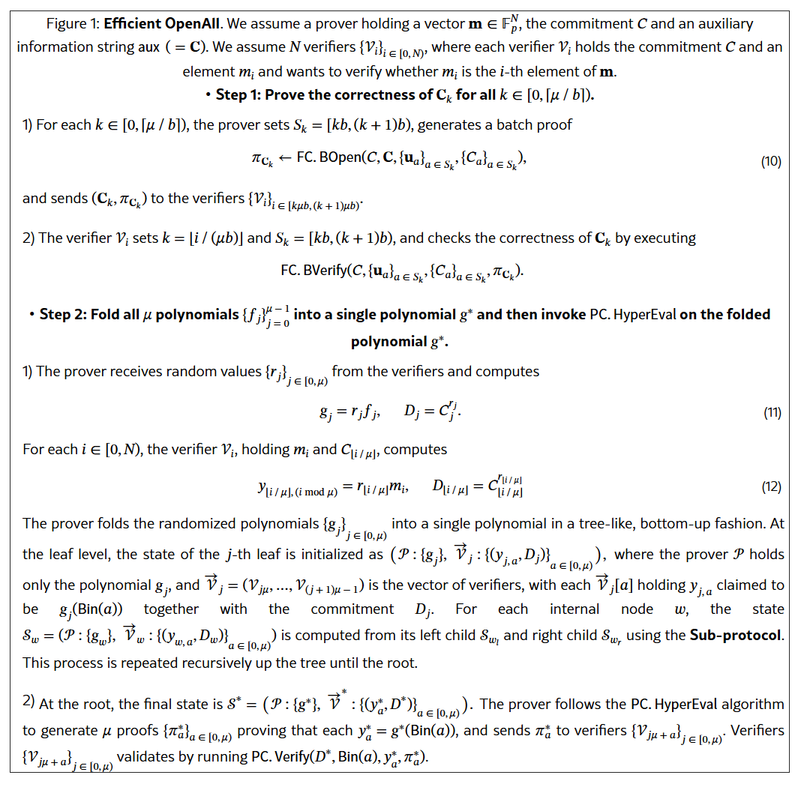
* **Logical Phase Transitions (arXiv:2601.02902)** 15: 这是一个有趣的理论研究，探讨 LLM 在逻辑推理任务中的“相变”现象。研究发现，随着问题复杂度的增加，LLM 的推理能力并非线性下降，而是会经历突然的“崩塌”（Collapse），类似于物理学中的相变。 
 
* **Quantifier Elimination Meets Treewidth (arXiv:2601.00312)** 15: 将树宽（Treewidth）理论应用于量词消去算法，旨在解决复杂逻辑公式的可满足性问题，对自动化推理有重要价值。

### **5.2 网络与新兴技术 (cs.NI / cs.ET)**

* **Eco-WakeLoc (arXiv:2601.03171)** 16: 针对超宽带（UWB）定位系统提出了一种能量中立（Energy-Neutral）的协作定位方案。这对于无电池物联网设备（Battery-free IoT）的部署至关重要。  
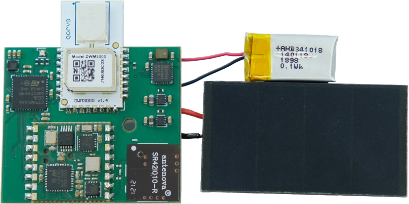
* **Analog Weight Update in Ferroelectric Hafnia (arXiv:2601.01186)** 16: 探索利用铁电铪氧化物实现皮焦耳（pico-Joule）级别的模拟权重更新。这是神经形态计算（Neuromorphic Computing）硬件层面的重要突破，旨在实现极低功耗的边缘 AI。  
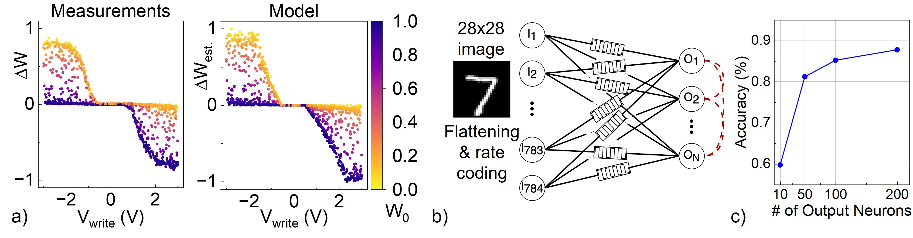
* **Inter-drone Interference as a Service (arXiv:2601.02270)** 16: 随着无人机群的普及，该论文提出将无人机间的通信干扰建模为一种服务/资源进行管理，为未来的空中交通网络（Skyway Networks）奠定基础。
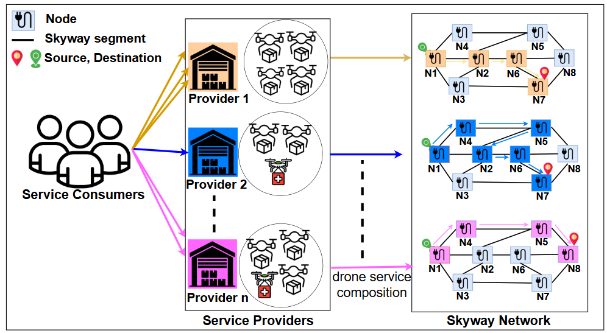
### **5.3 软件工程与社会计算 (cs.SE / cs.CY)**

* **The Invisible Hand of AI Libraries (arXiv:2601.01944)** 17: 这是一篇反思性研究，分析了 Hugging Face、PyTorch 等 AI 库如何通过 API 设计和默认配置，潜移默化地塑造（甚至限制）了开源社区的研究方向。它指出了工具对科学发现的“隐形引导”作用。  
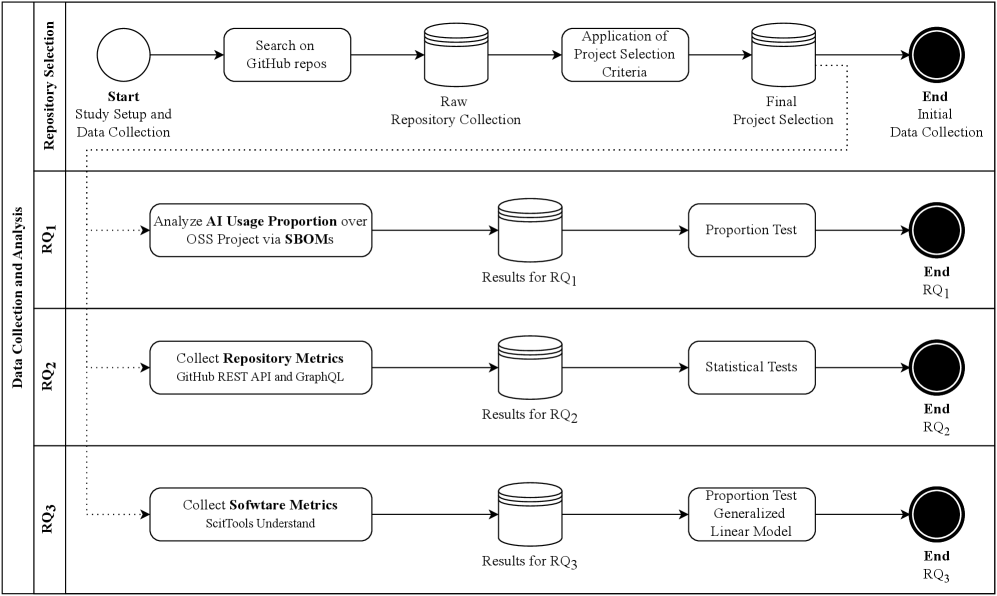
* **MLIR-Smith (arXiv:2601.02218)** 17: 针对编译器基础设施 MLIR 的随机程序生成器，用于挖掘编译器优化管道中的 Bug，提升了 AI 编译器的鲁棒性。
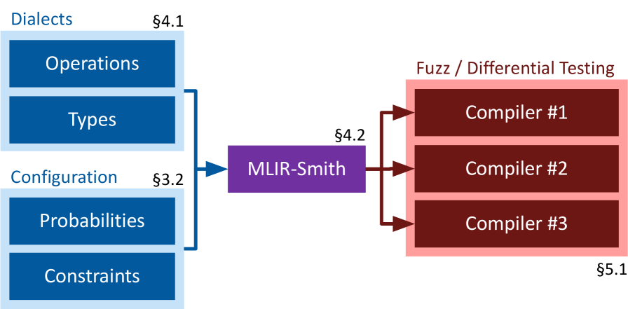
### **5.4 统计机器学习 (stat.ML)**

* **Physics-Informed Deep Recurrent Back-Projection Network (arXiv:2601.02007)** 16: 结合物理信息（Physics-Informed）与深度学习，解决隧道传播建模问题。这是 Scientific AI (AI for Science) 在通信领域的典型应用。
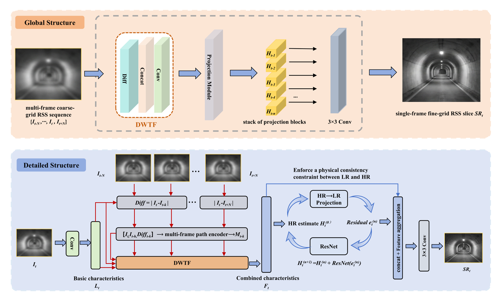
## ---

**第六章 总结与趋势研判**

综合分析 2026 年 1 月 1 日至 7 日的 arXiv 文献，我们可以清晰地看到计算机科学，尤其是 AI 领域正在发生的深层次变革。

### **6.1 从“暴力美学”到“精细工程”**

过去几年流行的“Scaling Laws”（单纯增加参数和数据量）正在让位于更精细的工程优化。

* **LTX-2** 证明了通过不对称的参数分配和解耦的潜空间，可以在更小的计算代价下实现更好的多模态效果。  
* Falcon-H1R 证明了 7B 模型配合优秀的推理搜索算法（DeepConf）可以击败 32B 模型。  
  这表明，\*\*架构效率（Architectural Efficiency）和推理时计算（Inference-time Compute）\*\*已成为新的增长极。

### **6.2 物理世界的回归**

AI 正渴望突破文本和像素的牢笼，触摸物理世界的真实。

* **音画联合生成**（LTX-2）不再满足于视觉上的相似，而是追求物理规律（如发声同步）的一致性。  
* **NitroGen** 和 **Eco-WakeLoc** 等研究显示，无论是通过游戏模拟还是物联网硬件，AI 正在构建对物理空间、运动和因果关系的深度理解。

### **6.3 智能体的自我进化**

RLM 和 SimpleMem 展示了智能体设计的未来方向：自主性。  
未来的智能体不再是被动接收 128k 上下文的机器，而是拥有主动管理记忆、编写代码探索数据、并根据任务难度动态调整计算资源的“数字生命雏形”。它们开始像人类一样，懂得“遗忘”无关信息，懂得“查阅”外部资料，懂得“反思”推理路径。

### **6.4 建议与展望**

对于相关领域的研究者和从业者：

* **关注混合架构**：Transformer 与 Mamba/RWKV 等线性注意力机制的结合（如 Falcon-H1R）将是端侧 AI 和实时推理的关键。  
* **重视数据工程**：NitroGen 的成功再次证明，数据的质量和来源（如挖掘被忽视的 Overlay 数据）往往比模型结构的微调更具决定性。  
* **拥抱系统思维**：AI 的进步不再单点突破，需要结合编译器优化（MLIR-Smith）、硬件特性（Analog Weight）、网络通信（UWB）进行全栈式创新。

2026 年的开端，预示着一个更加高效、物理感知更强、且具备高度自主性的智能计算新纪元。

---

**报告声明**：本报告基于 2026 年 1 月 1 日至 1 月 7 日 arXiv 发布的公开文献整理分析，旨在提供学术参考。文中提及的技术指标与性能数据均引用自原始论文。

#### **引用**

1. LTX-2: Efficient Joint Audio-Visual Foundation Model \- arXiv,  [https://arxiv.org/html/2601.03233v1](https://arxiv.org/html/2601.03233v1)  
2. \[2601.03233\] LTX-2: Efficient Joint Audio-Visual Foundation Model \- arXiv,  [https://arxiv.org/abs/2601.03233](https://arxiv.org/abs/2601.03233)  
3. VAR RL Done Right: Tackling Asynchronous Policy Conflicts in Visual Autoregressive Generation \- arXiv,  [https://arxiv.org/html/2601.02256v1](https://arxiv.org/html/2601.02256v1)  
4. VAR RL Done Right: Tackling Asynchronous Policy Conflicts in Visual Autoregressive Generation | alphaXiv,  [https://www.alphaxiv.org/overview/2601.02256](https://www.alphaxiv.org/overview/2601.02256)  
5. An Open Foundation Model for Generalist Gaming Agents \- NitroGen,  [https://nitrogen.minedojo.org/assets/documents/nitrogen.pdf](https://nitrogen.minedojo.org/assets/documents/nitrogen.pdf)  
6. NitroGen | A Foundation Model for Generalist Gaming Agents,  [https://nitrogen.minedojo.org/](https://nitrogen.minedojo.org/)  
7. Paper Review: NitroGen: A Foundation Model for Generalist Gaming Agents,  [https://andlukyane.com/blog/paper-review-nitrogen](https://andlukyane.com/blog/paper-review-nitrogen)  
8. Falcon-H1R: Pushing the Reasoning Frontiers with a Hybrid Model for Efficient Test-Time Scaling \- Paper Details \- ChatPaper.ai,  [https://www.chatpaper.ai/dashboard/paper/e788db09-6265-4b2f-aac2-b02a13c671cf](https://www.chatpaper.ai/dashboard/paper/e788db09-6265-4b2f-aac2-b02a13c671cf)  
9. Falcon-H1R: Pushing the Reasoning Frontiers with a Hybrid Model for Efficient Test-Time Scaling \- ChatPaper,  [https://chatpaper.com/chatpaper/paper/223469](https://chatpaper.com/chatpaper/paper/223469)  
10. 1 DeepConf@512 (, ) average results over AIME24, AIME25, AMO-Bench, and GPQA-Diamond (Detailed results in Table ). Falcon-H1R-7B achieves exceptional performance by pushing the reasoning frontiers in 3 dimensions: higher accuracy, token efficiency and fast inference in the parallel thinking setting. \- arXiv,  [https://arxiv.org/html/2601.02346v1](https://arxiv.org/html/2601.02346v1)  
11. Recursive Language Models \- arXiv,  [https://arxiv.org/html/2512.24601v1](https://arxiv.org/html/2512.24601v1)  
12. Recursive Language Models | Alex L. Zhang,  [https://alexzhang13.github.io/blog/2025/rlm/](https://alexzhang13.github.io/blog/2025/rlm/)  
13. \[2601.02553\] SimpleMem: Efficient Lifelong Memory for LLM Agents \- arXiv,  [https://arxiv.org/abs/2601.02553](https://arxiv.org/abs/2601.02553)  
14. aiming-lab/SimpleMem: SimpleMem: Efficient Lifelong Memory for LLM Agents \- GitHub,  [https://github.com/aiming-lab/SimpleMem](https://github.com/aiming-lab/SimpleMem)  
15. Logic in Computer Science \- arXiv,  [https://arxiv.org/list/cs.LO/recent](https://arxiv.org/list/cs.LO/recent)  
16. Emerging Technologies \- arXiv,  [https://arxiv.org/list/cs.ET/recent](https://arxiv.org/list/cs.ET/recent)  
17. Programming Languages \- arXiv,  [https://arxiv.org/list/cs.PL/recent](https://arxiv.org/list/cs.PL/recent)