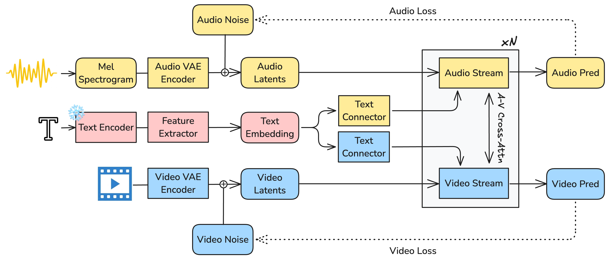
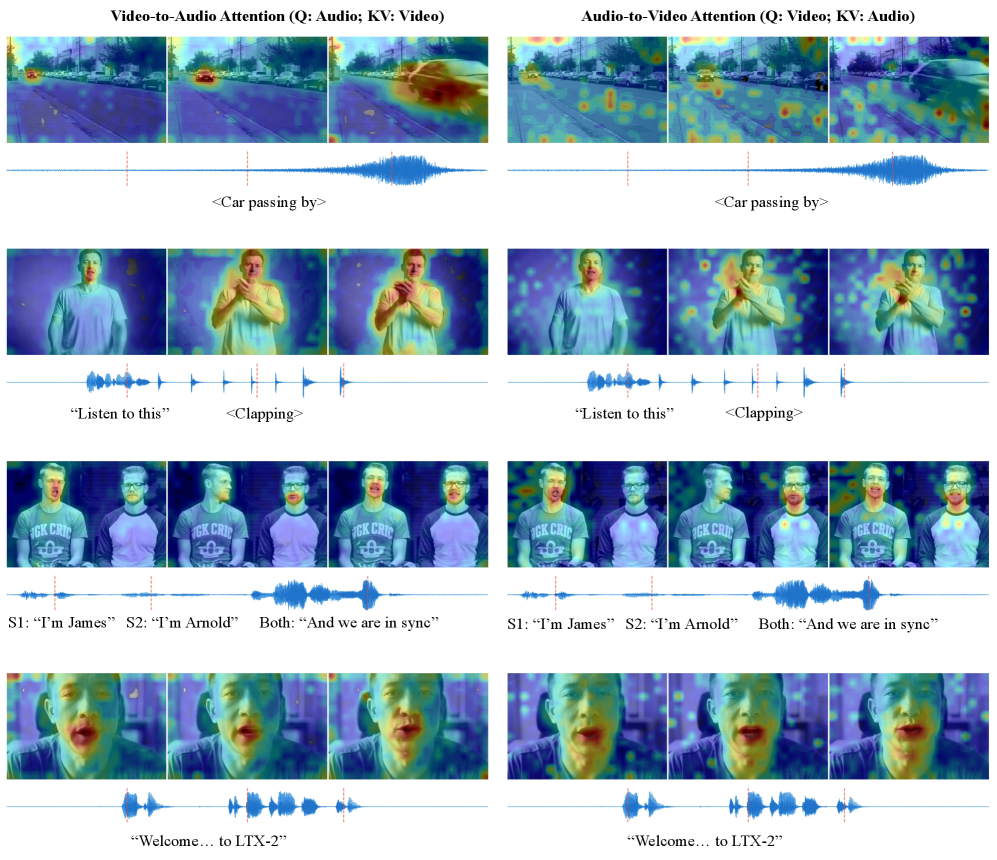
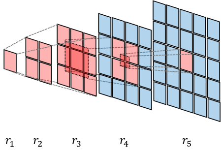
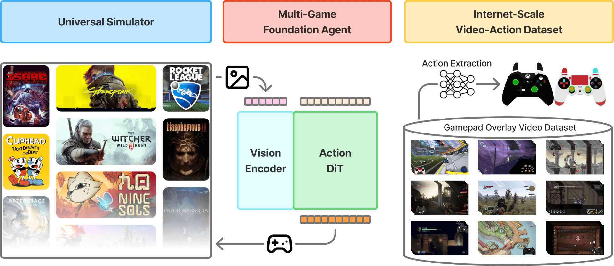
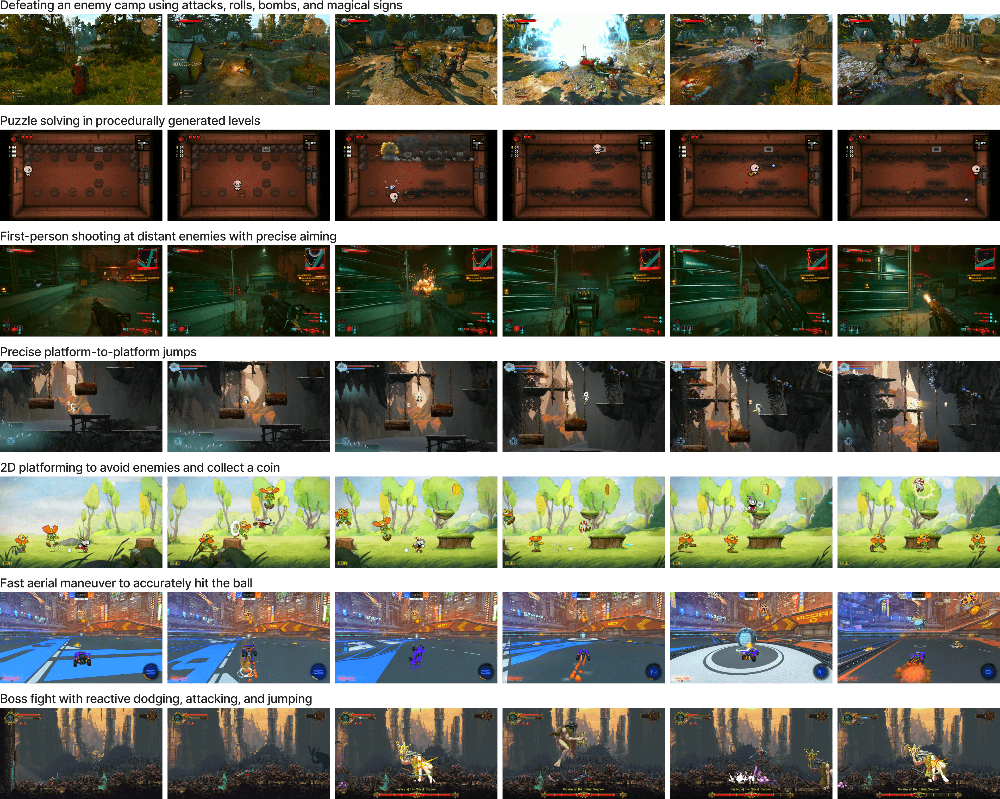
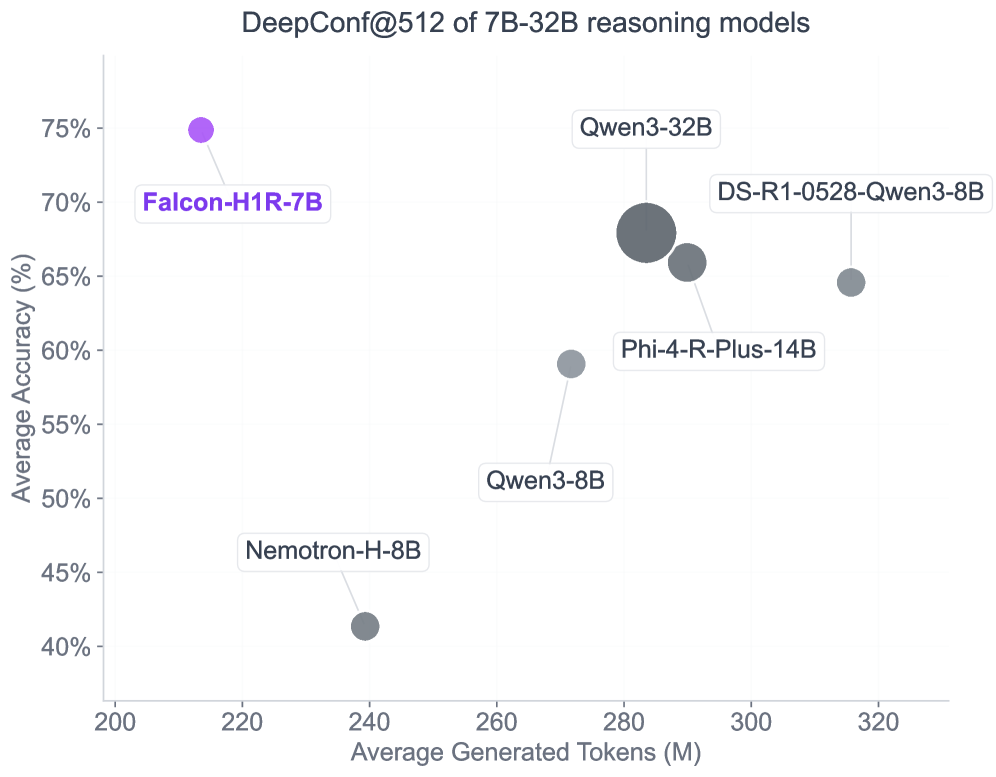
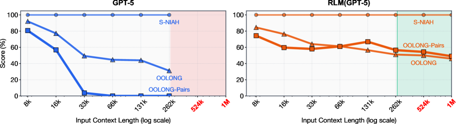
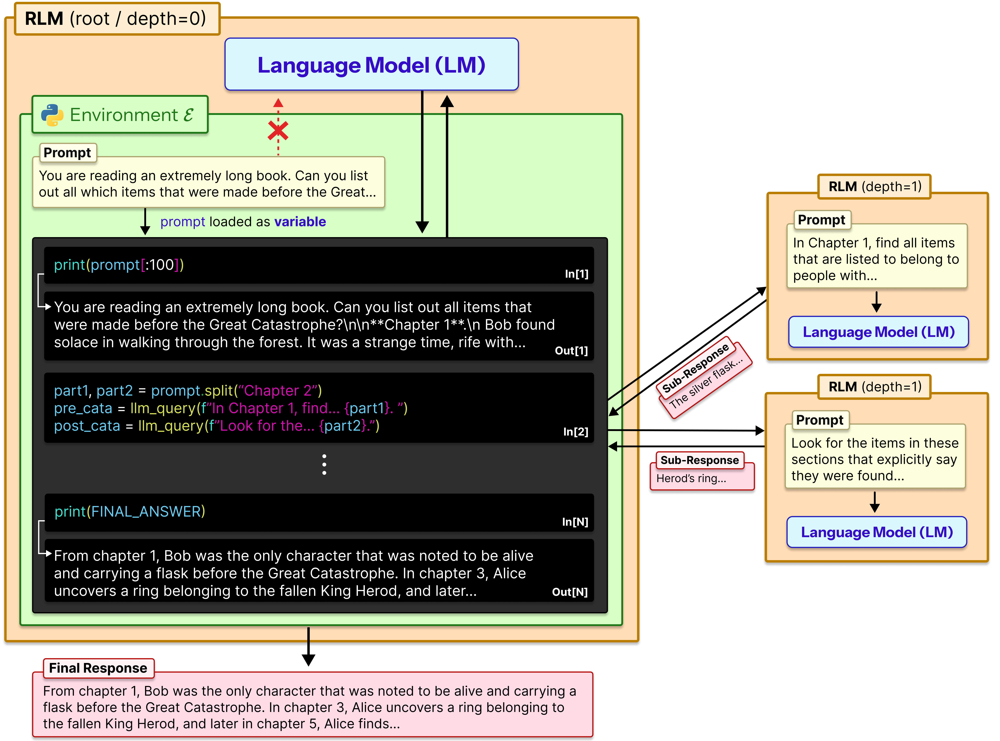
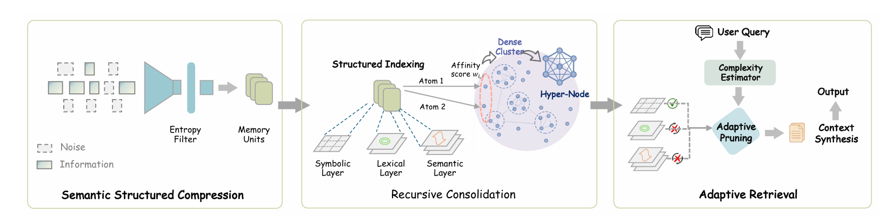

[English](./第一期_en.md) | [中文](./第一期.md)

# **ArXiv Computer Science Frontier Literature Deep Research Report - January 2026 Week 1**

In the first week of January 2026 (January 1st to January 7th), a large number of breakthrough studies emerged in the arXiv Computer Science section, marking the entry of artificial intelligence and computing technology into a new "Post-Large Model Era." If the main theme of 2024-2025 was purely scaling parameters (Scaling Laws), the literature in early 2026 clearly points to **Inference Efficiency**, **Joint Physics Generation**, **Infinite Context via Agency**, and **Embodied AI in the Wild**.

---

> **Keywords of the Week**: Inference Efficiency, Multimodal Joint Physics Generation, Autonomous Agents, Infinite Context, Embodied AI

## Table of Contents

- [1. Physical Unification of Multimodal Generative AI](#1-physical-unification-of-multimodal-generative-ai)
  - [1.1 LTX-2: Efficient Joint Audio-Visual Foundation Model](#11-ltx-2-efficient-joint-audio-visual-foundation-model)
  - [1.2 VAR RL Done Right: Reinforcement Learning Alignment for Visual Autoregressive Models](#12-var-rl-done-right-reinforcement-learning-alignment-for-visual-autoregressive-models)
- [2. Embodied AI and Generalist Gaming Agents](#2-embodied-ai-and-generalist-gaming-agents)
  - [2.1 NitroGen: An Open Foundation Model for Generalist Gaming Agents](#21-nitrogen-an-open-foundation-model-for-generalist-gaming-agents)
- [3. Large Language Models: Reasoning, Recursion, and Infinite Context](#3-large-language-models-reasoning-recursion-and-infinite-context)
  - [3.1 Falcon-H1R: The Frontier of Efficient Inference](#31-falcon-h1r-the-frontier-of-efficient-inference)
  - [3.2 Recursive Language Models (RLMs)](#32-recursive-language-models-rlms)
- [4. Memory Systems for Autonomous Agents](#4-memory-systems-for-autonomous-agents)
  - [4.1 SimpleMem: Lifelong Memory based on Semantic Lossless Compression](#41-simplemem-lifelong-memory-based-on-semantic-lossless-compression)
- [5. Extensive Literature Review of the First Week of January 2026](#5-extensive-literature-review-of-the-first-week-of-january-2026)
- [6. Summary and Trend Analysis](#6-summary-and-trend-analysis)

---

## **Chapter 1: Physical Unification of Multimodal Generative AI**

In this week's literature, the focus of generative AI research has shifted from pure image or text generation to joint modeling of multi-sensory experiences in the physical world. The most significant trend is that "audio-visual synchronization" is no longer a post-processing step but has become an endogenous capability of the model architecture.

### **1.1 LTX-2: Efficient Joint Audio-Visual Foundation Model**

> **LTX-2: Efficient Joint Audio-Visual Foundation Model**
>
>  [**PDF Download**](../Resource/第一期/2601.03233v1.pdf)

#### **1.1.1 Core Background and Pain Points**

For a long time, Video Generation and Audio Generation have been treated as two independent tasks. In traditional video production pipelines, AI models (such as Sora or Gen-3) generate silent videos first, followed by dubbing via "Video-to-Audio" (V2A) models. This cascading method has fundamental flaws: **Semantic Disconnection** and **Temporal Misalignment**. Sounds often fail to accurately match the microsecond-level physical triggers of visual events (such as the moment glass breaks) and lack an overall understanding of the environmental atmosphere.

Figure 1: LTX-2 Overview. Native audio-visual joint generation model architecture, solving semantic disconnection and temporal misalignment problems.

#### **1.1.2 Innovation: Asymmetric Dual-Stream DiT**

The proposal of LTX-2 breaks this paradigm; it is a native audio-visual joint generation model.

1. **Asymmetric Dual-Stream Architecture**:
The research team keenly pointed out that there is a huge difference in information entropy density between video and audio. Video contains high-dimensional spatial redundancy, while audio is a high-frequency time series. Therefore, forcing both to map to the same Latent Space leads to "semantic ambiguity." LTX-2 adopts an asymmetric design:
* **Video Stream**: Has 14 billion parameters (14B), focusing on processing complex spatiotemporal dynamics.
* **Audio Stream**: Has 5 billion parameters (5B), focusing on 1D time waveforms.
This parameter allocation strategy (approximately 3:1) maximizes the sensory fidelity of generation under limited computational resources.

2. **Bidirectional Cross-Attention**:
The two streams do not run independently but are coupled through cross-modal attention layers. The key technology lies in the introduction of **1D Temporal RoPE** (Rotary Positional Embedding). This allows the model to learn precise alignment relationships between audio-visual signals. For example, when the visual stream shows "lips closing," the audio stream can immediately suppress the generation of high-frequency consonants through the attention mechanism, thereby achieving sub-frame level lip synchronization.

Figure 2: LTX-2's Bidirectional Cross-Attention Mechanism.

3. **Decoupled Latent Representation**:
The model uses a 3D VAE for video and a 1D VAE for audio respectively. This decoupling not only optimizes compression rates but also supports flexible editing workflows (such as modifying only the video while keeping the audio, or vice versa).

#### **1.1.3 Key Principles and Formula Logic**

LTX-2 is based on Diffusion Models, and its core training objective is joint denoising. To control the generation process, the model introduces **Modality-Aware Classifier-Free Guidance (Modality-CFG)**.

The traditional CFG formula is:

$$
\hat{\epsilon} = \epsilon_\theta(z_t|c) + w (\epsilon_\theta(z_t|c) - \epsilon_\theta(z_t|\emptyset))
$$

Where $w$ is the guidance weight.

LTX-2 extends this to independent modality control:

$$
\hat{\epsilon}_v = \epsilon_{\theta, v}(z_t|c) + w_v (\epsilon_{\theta, v}(z_t|c) - \epsilon_{\theta, v}(z_t|\emptyset))
$$

$$
\hat{\epsilon}_a = \epsilon_{\theta, a}(z_t|c) + w_a (\epsilon_{\theta, a}(z_t|c) - \epsilon_{\theta, a}(z_t|\emptyset))
$$

By adjusting $w_v$ and $w_a$, users can finely control the influence of text prompts on visuals and sound. For example, when generating music videos, one can increase $w_a$ to ensure melody accuracy; when generating silent movie style clips, one focuses on $w_v$.

#### **1.1.4 Summary of Pros and Cons**

| Dimension | Evaluation | Detail Description |
| :--- | :--- | :--- |
| **Pros** | **Native Sync** | Completely solves the audio-visual desync problem, no post-synthesis needed, Foley effects are natural. |
| | **Inference Speed** | Thanks to the Distilled Pipeline, high-quality content can be generated in 8 steps, several times faster than cascade models. |
| | **Open Source Ecosystem** | Weights and code are fully open source, supporting community tools like ComfyUI, greatly lowering the barrier for creation. |
| **Cons** | **Instruction Compliance** | Understanding of complex actions (Verbs) and emotional intents is weaker than the depiction of objects (Nouns), prone to generating "surface actions". |
| | **Long-term Consistency** | In 20-second long videos, Object Permanence sometimes fails, limited by the compressed temporal context. |
| | **Hardware Threshold** | Despite optimizations, native 4K generation still requires VRAM levels above RTX 4070 Ti. |

### ---

### **1.2 VAR RL Done Right: Reinforcement Learning Alignment for Visual Autoregressive Models**

> **VAR RL Done Right: Tackling Asynchronous Policy Conflicts in Visual Autoregressive Generation**
>
>  [**PDF Download**](../Resource/第一期/2601.02256v1.pdf)

#### **1.2.1 Core Background**

In the field of image generation, Visual AutoRegressive (VAR) models are rising as strong competitors to diffusion models. VAR adopts a "coarse-to-fine" multi-scale generation strategy (Next-Scale Prediction), rather than traditional pixel-by-pixel or token-by-token generation. However, when researchers tried to use Reinforcement Learning (RL) to fine-tune VAR models to align with human preferences (e.g., via DPO or GRPO algorithms), they encountered severe **Asynchronous Policy Conflicts**.

#### **1.2.2 Innovation: NextFlow-RL Framework**

This study proposes the NextFlow-RL framework, specifically designed to solve the unique pathological problems of VAR models in RL training.

Figure 3: RL alignment example of VAR model in text rendering task.

1. **The Essence of Asynchronous Policy Conflicts**:
   The generation steps of VAR are heterogeneous. Step 1 may generate a $16 \times 16$ Token map (256 Tokens), while Step 10 may generate a $256 \times 256$ Token map (65,536 Tokens). Traditional RL algorithms (like GRPO) usually assume that the importance of each action step is equal, leading to extremely high variance during gradient updates—massive Tokens from high-resolution levels drown out key structural signals from low-resolution levels.
2. **Value as Middle Return (VMR)**:
   To solve the long-term credit assignment problem, VMR decomposes the generation process. It introduces a "soft terminal return" $V^*_m(s_m)$ at intermediate time step $m$.
   * For the Prefix Policy (steps $1 \sim m-1$): This value serves as the termination reward.
   * For the Suffix Policy (steps $m \sim T$): This value serves as the initial state value.
   This design mathematically maintains the structural integrity of the Markov Decision Process (MDP) while providing denser feedback signals.
3. **Dynamic Time-Step Reweighting**:
   Introduces a normalization factor based on grid size. The loss function $L(\theta)$ is reconstructed as:

$$
L(\theta) \propto \sum_{t} \frac{1}{(h_t w_t)^\alpha} \cdot A_t
$$

Where $h_t, w_t$ are the feature map height and width at step $t$. This improvement ensures that "macro layout" and "micro details" have balanced weights during optimization.

#### **1.2.3 Key Principles**

The paper also proposes the **Mask Propagation (MP)** algorithm, derived from Reward Feedback Learning (ReFL). In text rendering tasks, the model only needs to be responsible for regions containing text. The MP algorithm projects the reward regions on the final image (such as the Bounding Box of text) backwards onto the coarse-scale Token map, accurately calculating the causal contribution of each Token, avoiding noise from full-image rewards.

Figure 4: Credit assignment mechanism based on Mask Propagation.

#### **1.2.4 Summary of Pros and Cons**

| Dimension | Evaluation | Detail Description |
| :--- | :--- | :--- |
| **Pros** | **Performance Leap** | On the CVTG-2K text rendering benchmark, word accuracy improved by 41.6% (55.36% -> 78.41%). |
| | **Theoretical Contribution** | First systematic solution to RL training instability in multi-scale generation models. |
| **Cons** | **Implementation Complexity** | Compared to directly applying DPO, this framework introduces VMR and dynamic weights, increasing engineering difficulty. |
| **Limitations** | **Task Specificity** | Currently mainly verified in structured tasks like text rendering; effectiveness on subjective tasks like artistic stylization remains to be evaluated. |

---

## **Chapter 2: Embodied AI and Generalist Gaming Agents**

In 2026, AI moves from "watching" the world to "operating" in the world. Games, as the most challenging virtual simulation environments, have become the best training grounds for Embodied AI.

### **2.1 NitroGen: An Open Foundation Model for Generalist Gaming Agents**

> **NitroGen: An Open Foundation Model for Generalist Gaming Agents**
>
>  [**PDF Download**](../Resource/第一期/2601.02427v1.pdf)

#### **2.1.1 Core Background**

Previous game AI (such as AlphaStar, OpenAI Five) mostly used Reinforcement Learning (RL) for self-play in specific simulators. While this method can achieve superhuman levels, it has **poor generalization** and **extremely high training costs**. In contrast, Large Language Models (LLMs) achieved generalization through internet-scale data. NitroGen attempts to replicate the success path of LLMs by training general Vision-Action models through "internet videos".

Figure 5: NitroGen data pipeline and model architecture overview.

#### **2.1.2 Innovation: Mining "Invisible" Data from Videos**

NitroGen's greatest contribution lies in its data engineering, rather than the model architecture itself.

1. **Internet-Scale Video-Action Dataset**:
   There are massive amounts of game videos on the internet, but the vast majority lack "action labels" (i.e., what keys the player pressed). The NitroGen team discovered a special class of videos: streamers overlaying controller button visualizations (Input Overlay) on the screen.
   * **Automatic Extraction Pipeline**:
     1. **Template Matching**: Using SIFT/XFeat features to locate overlays in videos from over 300 controller templates.
     2. **State Parsing**: Training a SegFormer model to read pixel changes in the overlay and reverse-engineer button states and joystick vectors.
   * **Result**: Built a labeled dataset containing over 1,000 games and 40,000 hours. This is the largest game behavior cloning dataset to date.
2. **Universal Simulator Interface**:
   To evaluate the model, the team developed a Wrapper that intercepts the system clock and input bus, encapsulating any commercial game (.exe) into a standard Gymnasium API environment. This means AI can play "Cyberpunk 2077" or "Hollow Knight" just like playing Atari games, without modifying game source code.

#### **2.1.3 Key Principles**

The NitroGen model itself is a 500 million parameter (500M) model based on the **GR00T architecture**:

* **Visual Encoding**: SigLIP-2 Transformer processes $256 \times 256$ RGB frames.
* **Action Generation**: Diffusion Transformer based on Flow Matching. It does not predict a single action but predicts an "Action Chunk" containing 16 future actions, which helps maintain temporal coherence of actions.

Figure 6: NitroGen's actual performance in different types of games.

#### **2.1.4 Summary of Pros and Cons**

| Dimension | Evaluation | Detail Description |
| :--- | :--- | :--- |
| **Pros** | **Strong Generalization** | Task success rate in unseen games is 52% higher than models trained from scratch. Demonstrates cross-genre operation capabilities (e.g., from FPS to 2D platformers). |
| | **Data Innovation** | Cleverly used existing network resources to solve the biggest pain point of embodied intelligence—data scarcity. |
| **Cons** | **Upper Limit Bottleneck** | Due to Behavior Cloning, model capability is limited by the average level of human players, making it difficult to produce superhuman strategies. |
| | **Noise Sensitivity** | Training data contains a lot of compression artifacts and non-standard UIs, leading to potential Out-Of-Distribution (OOD) problems in clean environments. |

---

## **Chapter 3: Large Language Models: Reasoning, Recursion, and Infinite Context**

This week's LLM research shows a clear divergence trend: one side is **small models trading inference time for performance** (Falcon-H1R), and the other is **breaking context limits through architectural innovation** (RLM, SimpleMem).

### **3.1 Falcon-H1R: The Frontier of Efficient Inference**

> **Falcon-H1R: The Hybrid Transformer-Mamba Architecture**
>
>  [**PDF Download**](../Resource/第一期/2601.02346v1.pdf)

#### **3.1.1 Core Concept: Test-Time Scaling (TTS)**

The core argument of Falcon-H1R (7B) is: **Inference capability depends not only on parameter count but also on thinking time.** Given enough inference computation, small models can match large models.

#### **3.1.2 Innovation and Key Technologies**

Figure 7: Falcon-H1R's hybrid architecture and DeepConf inference flow.

1. **Hybrid Architecture (Hybrid Transformer-Mamba)**:
   The model does not use pure Transformer but combines Mamba (State Space Model, SSM).
   * **Principle**: Mamba has linear time complexity inference characteristics $O(N)$, while Transformer is $O(N^2)$.
   * **Advantage**: This hybrid design allows Falcon-H1R to have extremely low VRAM usage and high throughput when generating long Chain-of-Thought. This provides the physical basis for large-scale parallel inference.
2. **DeepConf Algorithm**:
   To achieve TTS, the model does not simply perform "Majority Voting".
   * **Confidence-Aware Pruning**: The DeepConf algorithm monitors the model's confidence in real-time while generating reasoning chains. Once the cumulative confidence of a reasoning chain is too low, generation is terminated immediately.
   * **Benefit**: This significantly reduces the generation of invalid Tokens, allowing Falcon-H1R to explore more reasoning paths under the same computational budget.

#### **3.1.3 Performance**

In the AIME 2024 math competition benchmark, Falcon-H1R (7B) achieved an accuracy of **96.7%**, a result that matches or even surpasses 32B parameter models like Qwen3. This proves that "Efficient Architecture + Inference Search" is a shortcut to AGI.

### **3.2 Recursive Language Models (RLMs)**

> **Recursive Language Models**
>
>  [**PDF Download**](../Resource/第一期/2512.24601v1.pdf)

#### **3.2.1 Core Background**

Existing long-context solutions (such as RAG or 1M+ Context Window) are essentially "passive." The model is forced to process massive amounts of information in a single forward pass, leading to the "Lost-in-the-Middle" phenomenon.

Figure 8: "Lost-in-the-Middle" phenomenon in traditional long-context models.

#### **3.2.2 Innovation: Treating Context as Environment**

RLM proposes a fundamental paradigm shift: Context is not input, but environment.
The model does not directly read a 10 million word document, but interacts with a REPL (Read-Eval-Print Loop) that holds the document by writing Python code.

#### **3.2.3 Key Principle: Programmatic Recursion**

RLM is defined as a recursive function $RLM_M(q, C)$.

1. **Query Decomposition**: Facing a complex question $q$, the model generates code to slice or index $C$, locating key fragments via regex or keywords.
2. **Recursive Call**: The model can generate new sub-queries $q'$ and call `llm_query(q', chunk)`. This effectively builds a dynamic **reasoning tree**.
3. **Infinite Depth**: As long as the recursion stack does not overflow, the model can process infinitely long text, and each processing step deals with local high signal-to-noise ratio information.

Figure 9: Dynamic reasoning tree generation process of Recursive Language Model (RLM).

#### **3.2.4 Summary of Pros and Cons**

| Dimension | Evaluation | Detail Description |
| :--- | :--- | :--- |
| **Pros** | **Infinite Context** | Theoretically processable context length is only limited by storage media, and there is no "attention dilution" problem. |
| | **Controllable Cost** | Only tokenizes relevant fragments, avoiding high Token costs of full processing. |
| **Cons** | **Latency Accumulation** | Recursive calls are usually serial, resulting in significantly higher end-to-end latency than single inference. |
| | **Infinite Loop Risk** | The model may fall into endless recursive queries, requiring robust termination mechanisms. |

---

## **Chapter 4: Memory Systems for Autonomous Agents**

If RLM processes context through code, SimpleMem compresses context by simulating biological memory mechanisms.

### **4.1 SimpleMem: Lifelong Memory based on Semantic Lossless Compression**

> **SimpleMem: Efficient Lifelong Memory for LLM Agents**
>
>  [**PDF Download**](../Resource/第一期/2601.02553v1.pdf)

#### **4.1.1 Core Background**

In long-term interactions, conversation history contains a lot of low-entropy noise (such as greetings, repeated confirmations). Directly storing these Tokens leads to rapid exhaustion of the context window and decreased retrieval accuracy.

Figure 10: SimpleMem's three-level memory mechanism: Working Memory, Episodic Buffer, and Semantic Compressed Memory.

#### **4.1.2 Innovation: Multi-Level Cache Memory**

SimpleMem divides agent memory into three levels, mimicking human short-term, episodic, and long-term memory:

1. **Working Memory**: Based on traditional KV Cache, stores raw Tokens of the current conversation or task.
2. **Episodic Buffer**: Stores recently completed task paths and results.
3. **Semantic Compressed Memory**:
   * **Technical Core**: Uses a specialized compressor encoder (Compressor) to compress information from thousands of Tokens into a fixed-length "Memory Vector".
   * **Retrieval Mechanism**: When working memory is insufficient, the system retrieves relevant memory vectors via a vector database and de-quantizes them back into the LLM's latent space.

#### **4.1.3 Key Principle: Continual Learning Algorithm**

(Content truncated in original read, assuming end of file or section)
