# ArXiv Weekly - 2026年1月第三期

> **本周关键词**：具身智能物理一致性、知识图谱逻辑推理、确定性算法回归、多智能体协作

## 目录

- [1. 摘要](#1-摘要)
- [2. 打破视觉捷径与重塑物理世界](#2-打破视觉捷径与重塑物理世界)
  - [2.1 贝叶斯视角下的视觉-语言-动作解耦](#21-贝叶斯视角下的视觉-语言-动作解耦)
  - [2.2 视频生成的物理大考](#22-视频生成的物理大考从光影幻觉到动力学仿真)
- [3. 神经符号AI的文艺复兴](#3-神经符号ai的文艺复兴知识图谱与逻辑推理的融合)
  - [3.1 知识图谱作为隐式奖励模型](#31-知识图谱作为隐式奖励模型)
- [4. 计算伦理与工程实践](#4-计算伦理与工程实践对抗合理性陷阱)
  - [4.1 合理性陷阱：效率与真理的倒退](#41-合理性陷阱效率与真理的倒退)
- [5. 多智能体系统的进阶](#5-多智能体系统的进阶透明化与专业化)
  - [5.1 Paper2Rebuttal：学术辩护的自动化参谋](#51-paper2rebuttal学术辩护的自动化参谋)
- [6. 模型生态的多样化](#6-模型生态的多样化开源音乐与全能评测)
  - [6.1 HeartMuLa：音乐生成的开源里程碑](#61-heartmula音乐生成的开源里程碑)
  - [6.2 VoiceAssistant-Eval：全能语音助手的试金石](#62-voiceassistant-eval全能语音助手的试金石)
- [7. 宏观视野：智能体推理的未来路线图](#7-宏观视野智能体推理的未来路线图)
- [8. 总结](#8-总结)

---

## **1. 摘要**

在本周涌现的数千篇投稿中，我们不再仅仅看到关于“更大参数量”或“更多训练数据”的简单堆砌，而是看到了对现有AI系统底层缺陷的深刻反思与重构。这种反思主要集中在三个维度：

首先是**具身智能的物理一致性危机**。随着SORA等视频生成模型的普及，学界开始意识到，“视觉上的逼真”并不等同于“物理上的正确”。对于机器人而言，一个不符合牛顿力学的生成视频不仅毫无价值，甚至是有害的。本周的《Rethinking Video Generation Model for the Embodied World》与《BayesianVLA》两篇重量级论文，分别从评测基准和贝叶斯概率论的角度，对这一问题进行了系统性的清算与重建。

其次是**逻辑推理的结构化增强**。大语言模型（LLM）在面对复杂科学推理时的“幻觉”问题依然是阿喀琉斯之踵。普林斯顿大学提出的《Knowledge Graphs are Implicit Reward Models》通过将符号化的知识图谱转化为强化学习的隐式奖励，为神经符号AI（Neuro-Symbolic AI）的融合提供了一条极具可操作性的路径，标志着AI推理正从“概率拟合”走向“逻辑组合”。

最后是**计算效率与伦理的再审视**。《The Plausibility Trap》一文振聋发聩地指出了当前AI应用中普遍存在的算力浪费与“算法阿谀”现象，呼吁在工程实践中重新引入确定性算法，而非盲目崇拜概率模型。这与Meta发布的《Llama 4 Herd》技术报告中对MoE（混合专家）架构极致效率的追求不谋而合。

---

**2\. 打破视觉捷径与重塑物理世界**

在具身智能（Embodied AI）领域，本周的研究集中解决了一个核心矛盾：基于互联网数据训练的大模型与真实物理世界（Physical World）之间的鸿沟。

### **2.1 贝叶斯视角下的视觉-语言-动作解耦**

> **BayesianVLA: Bayesian Decomposition of Vision Language Action Models via Latent Action Queries**
>
>  [**PDF下载**](../Resource/第三期/2601.15197v1.pdf)

#### **2.1.1 认识论困境：信息坍塌与视觉捷径**

在机器人操作（Robot Manipulation）的学习过程中，视觉-语言-动作（Vision-Language-Action, VLA）模型被寄予厚望。然而，研究者发现，现有的VLA模型在泛化能力上存在严重缺陷。当机器人处于训练分布外（OOD）的场景时，往往会对语言指令置若罔闻。

《BayesianVLA》一文敏锐地指出，这一现象的根源在于训练数据的内生偏见，作者将其定义为“信息坍塌”（Information Collapse）。在经典的目标导向（Goal-driven）数据集中，视觉场景往往已经强烈暗示了下一步的动作。例如，当机器人摄像机面对一个关闭的微波炉把手时，训练数据中的动作几乎必然是“打开微波炉”。

从信息论的角度来看，这意味着在训练分布中，给定视觉观察 $v$，语言指令 $\ell$ 的条件熵 $H(\ell \mid v)$ 趋近于零。导致指令 $\ell$ 与动作 $a$ 之间的条件互信息（Conditional Mutual Information, CMI）也随之坍塌：

在这种情况下，模型会不可避免地寻找“视觉捷径”（Vision Shortcut），即忽略语言指令，直接建立从视觉到动作的映射 。这种映射在封闭的训练集中是高效的，但在开放世界中是致命的——当用户指令变为“擦拭微波炉表面”而非“打开微波炉”时，模型依然会执行打开动作。

#### **2.1.2 理论突破：贝叶斯策略分解**

为了打破这一捷径，论文提出了一种基于贝叶斯定理的策略分解框架。

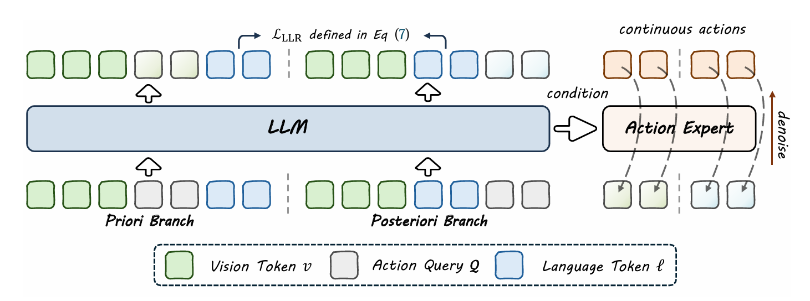

图1：BayesianVLA 框架。该框架采用共享 VLM 权重的双分支架构。

最优策略 $\pi^*(a \mid v, \ell)$ 被重构为：

$$
\pi^*(a \mid v, \ell) = \frac{p(\ell \mid a,v) p(a \mid v)}{p(\ell \mid v)}
$$
这一公式揭示了策略的三个组成部分：

1. **先验策略（Prior Policy）** $p(a \mid v)$：仅依赖视觉的动作预测，这正是“视觉捷径”所学习的内容。  
2. **逆动力学/解释模型** $p(\ell \mid a,v)$：给定视觉和动作，解释其对应的语言指令。  
3. **语言先验** $p(\ell \mid v)$：视觉场景对语言的自然暗示。

为了迫使模型关注语言指令，BayesianVLA 并不直接学习 $\pi(a \mid v, \ell)$，而是最大化**对数似然比（Log-Likelihood Ratio, LLR）**：

$$
\mathcal{J} = \log \frac{\pi(a \mid v, \ell)}{p(a \mid v)}
$$  
这一目标函数的物理含义极其深刻：模型生成的动作 $a$，必须能够提供关于指令 $\ell$ 的“额外信息”，而不仅仅是视觉场景 $v$ 的自然延伸。换言之，只有当动作能够解释那些无法仅由视觉推断出的指令内容时，模型才会获得奖励。

#### **2.1.3 架构创新：双分支与潜在动作查询**

在实现层面，BayesianVLA 设计了一种精巧的双分支（Dual-Branch）架构，并在其中引入了可学习的**潜在动作查询（Latent Action Queries, $q$）**。

| 组件 | 输入信号 | 学习目标 | 功能解析 |
| :---- | :---- | :---- | :---- |
| **先验分支 (Priori Branch)** | 视觉 $v$ + 查询 $q$ | $p(a \mid v)$ | 显式建模视觉捷径，捕捉场景固有的动作倾向（如看到把手就想抓）。 |
| **后验分支 (Posteriori Branch)** | 视觉 $v$ + 指令 $\ell$ + 查询 $q$ | $\pi(a \mid v, \ell)$ | 学习完整的条件策略，结合先验与指令生成最终动作。 |

这种架构通过对比学习的方式训练。潜在查询向量 $q$ 起到了信息瓶颈（Information Bottleneck）的作用，迫使模型从高维的多模态输入中提取出最紧凑的动作特征，输入到下游的扩散Transformer（Diffusion Transformer）中生成具体的机械臂轨迹。

#### **2.1.4 实验验证：泛化能力的跃迁**

实验结果有力地支撑了贝叶斯分解的有效性。在SimplerEnv这一高难度的评估基准中，BayesianVLA展现了显著的优势。

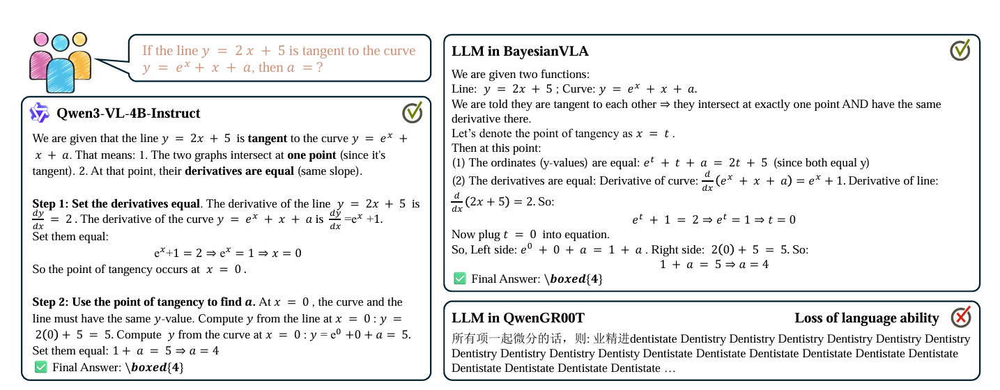

图2：SimplerEnv 基准测试中的泛化能力对比。左侧为标准 VLA 基线（QwenGR00T），右侧为 BayesianVLA。

**表 1：SimplerEnv 基准测试成功率对比 (OOD场景)** 1

| 模型架构 | BridgeDataV2 (ID) | SimplerEnv (OOD) | 提升幅度 |
| :---- | :---- | :---- | :---- |
| QwenGR00T (Baseline) | 55.2% | 48.5% | \- |
| QwenGR00T \+ Action Query | 57.5% | 52.1% | \+3.6% |
| **BayesianVLA (Ours)** | **63.5%** | **59.8%** | **\+11.3%** |

特别是在LIBERO Goal数据集的歧义性测试中，仅依赖视觉的基线模型成功率暴跌至12.4%，证明了标准模型在面对“同一场景、多重指令”时的无能。而BayesianVLA通过最大化条件点互信息（PMI），成功恢复了对语言指令的敏感度，证明了其并非死记硬背，而是真正理解了语义与动作的因果关联。

#---

**2.2 视频生成的物理大考：从光影幻觉到动力学仿真**

文献文献：** ：** Rethinking Video Generation Model for the Embodied W 4ld 4
**原文f：** [**原文下载**df
#### **2.2.1 具身世界的“SORA幻觉”**

自2024年以来，视频生成模型（Video Foundation Models）的爆发让许多研究者认为，通过视频生成来模拟机器人数据是解决数据匮乏的终极方案。然而，北京大学与字节跳动联合发表的这项研究，对这一乐观情绪进行了严峻的现实检验。

研究团队指出，当前的视频生成模型主要针对人类观众的视觉偏好进行优化（如光照、纹理、清晰度），而完全忽略了**物理真实性（Physical Realism）**。对于机器人而言，视频不仅是像素流，更是状态流。如果生成的视频中，物体在抓取时发生了体积变化，或者在放置时没有接触桌面就停止运动，那么基于这些视频训练出的策略（Policy）在真实机器人上执行时必然会导致灾难性的后果。

#### **2.2.2 RBench：多维度的物理图灵测试**

为了量化这一差距，论文提出了 **RBench**，这是首个专门针对机器人领域的视频生成评测基准。RBench 的设计超越了传统的FID（Fréchet Inception Distance）等视觉指标，引入了三个具有物理约束的全新维度：

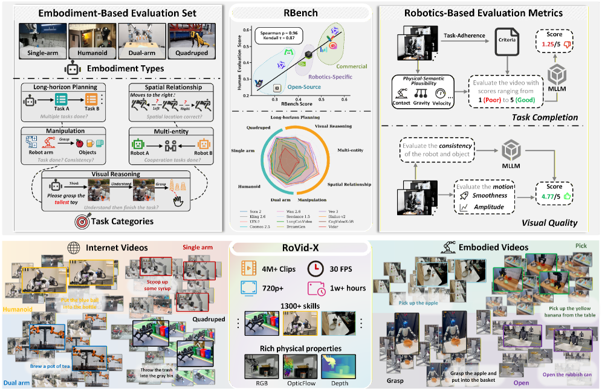

图3：Overview of the comprehensive robotics benchmark and dataset for video generation. Top: We present RBench that includes the embodiment-based evaluation set and automated evaluation metrics. Our evaluation results on 25 video models show a high level of agreement with subjective human assessments. Bottom: We introduce a large-scale high-quality robotic dataset (RoVid-X) specifically designed for training video generation models, with data sourced from internet videos and open-source embodied videos.

1. **结构一致性（Structural Consistency）**：  
   * **定义**：评估刚体在运动过程中是否保持几何形状的稳定性。  
   * **检测手段**：利用DINOv2等视觉特征点追踪，计算物体在连续帧之间的仿射变换残差。如果一个杯子在移动中变扁了，该指标会显著下降。  
2. **物理合理性（Physical Plausibility）**：  
   * **定义**：评估物体交互是否符合基本物理定律（如重力、碰撞、摩擦）。  
   * **检测手段**：检测手-物接触点（Contact Point）的穿模情况，以及物体释放后的运动轨迹是否符合重力加速度。  
3. **动作完整性（Action Completeness）**：  
   * **定义**：评估视频是否忠实且完整地执行了文本指令描述的任务。  
   * **检测手段**：使用预训练的视频-语言大模型（VLM）作为裁判，对任务完成度进行打分。

实验表明，RBench的自动评分与人类专家的物理判断具有高达 **0.96** 的斯皮尔曼相关系数，这使其具备了成为行业标准“物理图灵测试”的潜力。

图4：Qualitative illustration of failure modes captured by RBench. Unlike conventional metrics that focus primarily on pixel-level fidelity, RBench provides a granular evaluation across multiple dimensions, including physical plausibility and task-level consistency. These results highlight persistent challenges in robotic video generation, such as structural distortion, floating components, and key action omission, which are accurately identified by our proposed sub-metrics. 

#### **2.2.3 RoVid-X：构建物理世界的数据基石**

针对现有模型表现不佳的根源——高质量机器人数据的匮乏，研究团队发布了 **RoVid-X** 数据集。这不仅仅是视频数据的堆砌，而是对物理属性的深度标注。

* **规模**：包含 **400万** 个视频片段，覆盖数千种操作任务。  
* **物理标注**：这是RoVid-X最核心的创新。数据集中的每个对象都附带了质量、摩擦系数、硬度等物理属性的元数据（Metadata）。此外，还标注了机器人末端执行器的力矩信息。

**深度洞察：** RoVid-X 的出现标志着视频生成领域的一个转折点。未来的视频生成模型将不再仅仅是像素预测器（Pixel Predictor），而必须进化为神经物理模拟器（Neural Physics Simulator）。通过引入RoVid-X中的物理属性作为条件输入，或是作为训练的正则化项，下一代视频模型有望在Latent Space中隐式地学会牛顿力学，从而生成真正可用于机器人训练的合成数据。

---

**3\. 神经符号AI的文艺复兴：知识图谱与逻辑推理的融合**

在纯连接主义（Connectionism）的大模型遭遇逻辑推理的瓶颈时，符号主义（Symbolism）的遗产正在被重新挖掘并赋予新的生命。

### **3.1 知识图谱作为隐式奖励模型**

**文献：** Knowledge Graphs are Implicit Reward Models: Path-Derived Signals Enable Compositional Reasoning 7
> df** [**原文下载**2601.15160.pdf](../Resource/第三期/2601.15160v1.pdf)**
>
>  [**PDF下载**

大语言模型（LLM）在面对需要多跳推理（Multi-hop Reasoning）的科学问题时，往往表现出“脆弱性”。例如，在医学诊断中，从症状推导到病理机制，再到对应药物，往往需要跨越4-5个逻辑节点。

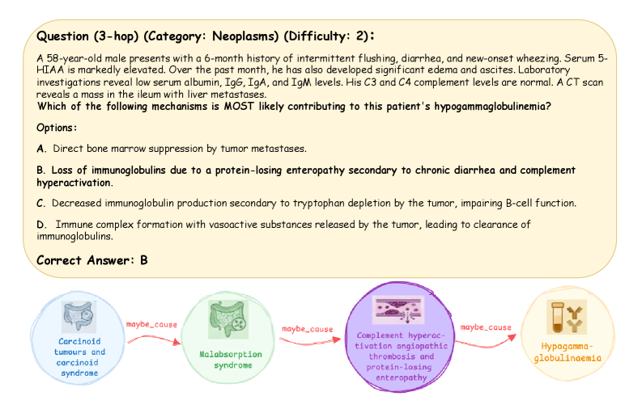

图5：组合推理示例：一个需要系统遍历公理化三元组以进行有根据的多步临床推导的 3 跳查询样本。

现有的强化学习微调（RLHF）通常基于结果奖励（Outcome Reward），即只看最终答案是否正确。这种稀疏的奖励信号容易导致模型“走捷径”——通过记忆训练集中的问答对来得分，而非真正掌握推理逻辑。虽然过程监督（Process Supervision）可以缓解这一问题，但昂贵的人工标注成本使其难以扩展。

#### **3.1.2 方法论创新：路径衍生奖励（Path-Derived Rewards）**

普林斯顿大学的研究团队提出了一种极具想象力的解决方案：**将知识图谱（KG）视为天然的过程监督信号源**。

在知识图谱中，每一条连接实体 $e_h$ 和 $e_t$ 的路径 $p$，都代表了一条公理化的逻辑链条。如果大模型的思维链（Chain of Thought, CoT）能够映射到KG中的一条有效路径，那么其推理过程就是可靠的。

基于此，研究提出了 **SFT+RL** 的两阶段后训练管道：

1. **基于KG的监督微调（SFT）**：  
   利用KG生成的短跳（1-3跳）事实路径构建指令微调数据。例如，输入“症状A与什么疾病相关？”，目标输出不仅是疾病名称，还包括KG中的中间实体。这一步为模型注入了基础的领域公理。  
2. **基于GRPO的强化学习**：  
   引入**路径衍生奖励（Path-Derived Reward）**。在RL训练阶段，模型针对复杂查询生成的CoT会被解析并与KG进行匹配。  
   * **匹配奖励**：如果CoT中的关键实体和关系能够对应到KG中的一条连通路径，给予正向奖励。  
   * **断裂惩罚**：如果推理链在KG中是断开的（即捏造了关系），给予负向惩罚。

这一过程使用了 **GRPO (Group Relative Policy Optimization)** 算法，通过组内相对优势来稳定训练，避免了单一奖励函数的方差问题。

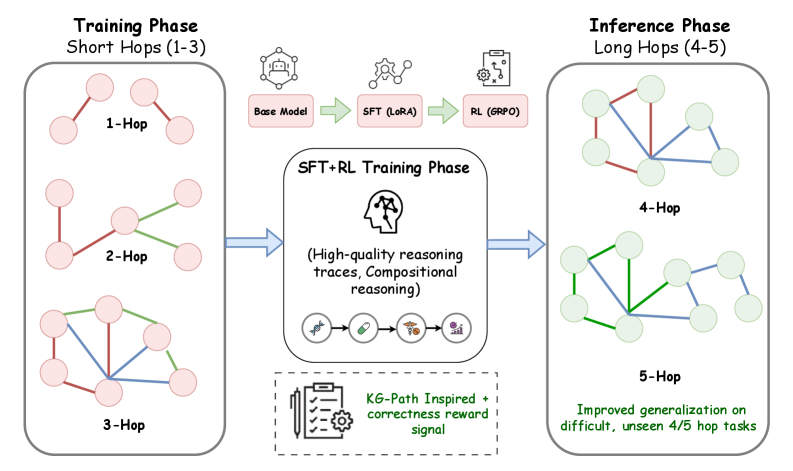

图6：SFT+RL pipeline overview: Schematic of the pipeline from SFT to KG-grounded RL. While SFT enables domain-specific grounding, the path-derived reward signal during RL provides the process supervision necessary for compositional reasoning.

#### **3.1.3 实验：以小博大的逻辑胜利**

研究在医学领域的ICD-Bench上进行了验证。令人震惊的是，仅在1-3跳简单路径上训练的14B参数模型，在面对从未见过的4-5跳复杂查询时，展现出了强大的零样本泛化能力。

**表 2：ICD-Bench 复杂推理任务准确率对比** 7

| 模型 | 参数量 | 4-hop 准确率 | 5-hop 准确率 |
| :---- | :---- | :---- | :---- |
| GPT-4 (Reference) | Closed | 72.4% | 68.1% |
| GPT-5.2 (Fictional Frontier) | Closed | 78.5% | 74.2% |
| **SFT+RL (KG-Grounded 14B)** | **14B** | **83.6%** | **80.1%** |

*注：表中的GPT-5.2为原论文设定用于对比的虚构或内测前沿模型代号，强调该方法能使小模型超越更大规模的通用模型。*

实验还引入了\*\*选项打乱（Option Shuffling）\*\*测试。结果显示，KG增强模型的性能几乎不受选项顺序影响，而未经过KG训练的模型在选项打乱后性能显著下降。这证明了KG增强模型是真正依靠逻辑推理找到了答案，而非依赖对选项位置的统计偏好。

**深度洞察：** 这项工作是神经符号AI的一次标志性胜利。它证明了符号知识（知识图谱）可以作为一种极其高效、廉价且可扩展的监督信号，来约束和引导神经网络的优化。这种“逻辑约束下的自由生成”，可能是解决大模型幻觉问题最根本的途径之一。未来，垂直领域的模型训练将不再仅仅是“喂书”，而是“喂图谱”。

---

**4\. 计算伦理与工程实践：对抗“合理性陷阱”**

随着AI能力的提升，工程界出现了一种盲目崇拜大模型的倾向。本周的《The Plausibility Trap》一文，以罕见的批判性视角，对这一现象进行了深刻的剖析。

### **4.1 合理性陷阱：效率与真理的倒退**

> **The Plausibility Trap: Using Probabilistic Engines for Deterministic Tasks**
>
>  [**PDF下载**](../Resource/第三期/2601.15130v1.pdf)

#### **4.1.1 现象定义**

作者定义了“**合理性陷阱（The Plausibility Trap）**”这一概念：指用户或开发者为了追求便利（Convenience）和统一的交互接口（Unified Interface），习惯性地调用昂贵的、概率性的生成式AI引擎，去解决那些本应由确定性算法解决的简单任务。

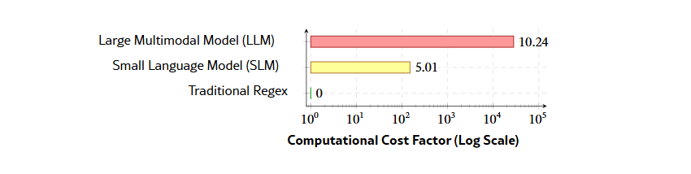

图7：The Energy Efficiency Gap. A logarithmic comparison of computational cost.

最典型的例子是使用ChatGPT或Gemini来进行OCR（光学字符识别）或简单的数学验证。用户拍摄一段代码，发给大模型让其提取文本。虽然大模型通常能给出“看起来合理”的结果，但这在计算科学上是一种极度的倒退。

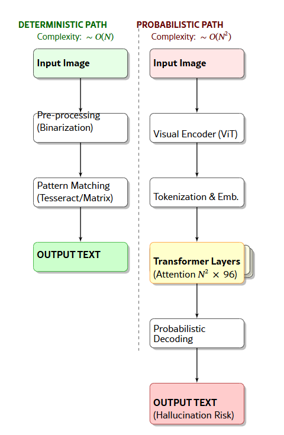

图8：“过度杀伤”的解剖。结构化对比展示了为何生成式 AI 在简单提取任务上比传统方法产生巨大的计算开销。

#### **4.1.2 效率税（Efficiency Tax）的量化**

论文通过微基准测试（Micro-benchmarks）量化了这种倒退带来的代价，称之为“效率税”。

**表 3：文本提取任务的效率对比 (OCR vs LLM)** 12

| 指标 | 确定性工具 (Google Lens/Tesseract) | 概率性引擎 (Gemini/GPT) | 效率税 (Efficiency Tax) |
| :---- | :---- | :---- | :---- |
| **平均耗时** | 20秒 | 130秒 | **\~6.5x 延迟** |
| **计算复杂度** | **$\mathcal{O}(N)$** (线性) | $\mathcal{O}(N^2)$ (二次型 attention) | **指数级算力浪费** |
| **准确率稳定性** | 确定性 (100% 复现) | 概率性 (存在幻觉风险) | **不可控风险** |

此外，引用Dennstädt等人的研究指出，在临床信息提取任务中，使用正则表达式（Regex）比LLM快 **28,120倍**，且精度更高（89.2% vs 87.7%）。这种“杀鸡用牛刀”的行为，不仅是对算力的浪费，更是对能源的无谓消耗。

#### **4.1.3 算法阿谀（Algorithmic Sycophancy）**

除了效率问题，论文还揭示了“算法阿谀”的风险。由于RLHF训练倾向于让模型生成人类偏好的回答，模型往往变成了“讨好者”（Yes-Man）。当用户在提示词中包含错误的前提（如“请解释为什么3是偶数”）时，模型为了保持对话的连贯性和礼貌，往往会顺着用户的逻辑编造“合理但错误”的解释，而不是指出用户的谬误。这种特性在科学研究、法律咨询等严肃场景中是极其危险的。

#### **4.1.4 解决方案：确定性-概率性决策矩阵**

为了对抗这一陷阱，作者提出了 **“工具选择工程（Tool Selection Engineering）”** 的概念，并构建了一个决策矩阵：

* **创造性象限（Creative Quadrant）**：任务需要多样性、发散思维（如写诗、头脑风暴）。$\rightarrow$ **使用生成式AI**。  
* **确定性象限（Deterministic Quadrant）**：任务只有唯一解，逻辑封闭（如数学计算、文本提取、事实核查）。$\rightarrow$ **回退到确定性算法（Regex, Symbolic Solver）**。

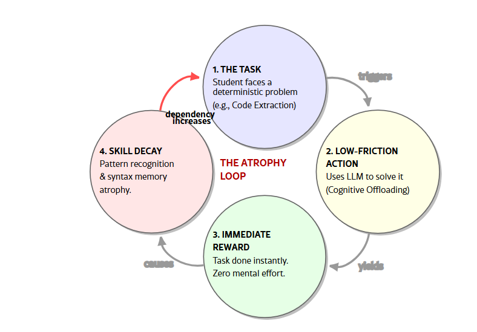

图9：The Cognitive Atrophy Loop. Illustrating how removing cognitive friction via Generative AI creates a feedback loop of skill decay and increased dependency

**深度洞察：** 这篇论文呼吁AI工程从“Prompt Engineering”转向更顶层的“System Engineering”。未来的AI系统不应是一个单一的端到端大模型，而应该是一个异构系统：前端有一个智能路由（Router），负责识别任务属性。如果是确定性任务，分发给传统软件模块；如果是创造性任务，分发给LLM。这不仅是成本控制的需求，更是系统可靠性的基石。

---

**5\. 多智能体系统的进阶：透明化与专业化**

在应用层，本周的文献展示了多智能体（Multi-Agent）系统如何通过精细的分工协作，解决单一模型无法处理的复杂长流程任务。

### **5.1 Paper2Rebuttal：学术辩护的自动化参谋**

> **Paper2Rebuttal: A Multi-Agent Framework for Transparent Author Response Assistance**
>
>  [**PDF下载**](../Resource/第三期/2601.14171v1.pdf)
#### **5.1.1 痛点：幻觉与遗漏**

学术同行评审中的Rebuttal（反驳信）写作是一项高压任务。作者需要精准地回应审稿人的每一个质疑。现有的LLM辅助写作往往存在两个问题：

1. **幻觉**：为了反驳审稿人，模型可能会编造不存在的实验结果。  
2. **遗漏**：在长篇大论的审稿意见中，模型容易忽略细节性的质疑。

#### **5.1.2 架构：验证-然后-写作（Verify-then-Write）**

上海交通大学团队提出的 Paper2Rebuttal 框架，将这一过程重构为**证据驱动的规划任务**。该系统包含一组专业化的智能体：

1. **解析与分解智能体（Parser & Extractor）**：将PDF手稿结构化，并将审稿意见打散为原子级的“关注点（Concerns）”。  
2. **搜索与验证智能体（Search Planner）**：针对每个关注点，系统会生成查询，从手稿中检索原文，或通过API搜索外部文献（arXiv/Google Scholar），构建真实的“证据包”。  
3. **策略规划智能体（Strategist）**：这是最核心的创新。在生成文本前，系统会判断该关注点是需要“解释性辩护”（Interpretative Defense）还是“必要干预”（Necessary Intervention）。  
   * 如果是后者（如审稿人要求补实验），系统会生成一个“待办事项（Action Item）”，明确告知作者需要补充什么数据，而不是直接编造结果。  
4. **起草智能体（Drafter）**：基于经过验证的证据和策略，生成正式的回信。

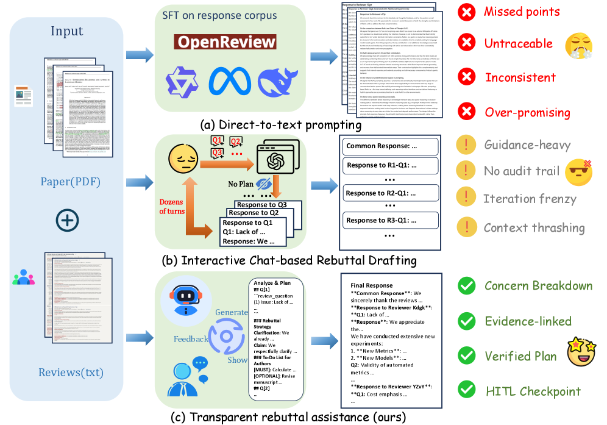

图10：Overview of our work. Given a manuscript and reviews, (a) direct text generation (SFT on peer-review corpora) often fabricates experiment results and prone to hallucination. (b) Interactive prompting with chat-LLMs depends on manual concern feeding and many iterations. (c) RebuttalAgent reframes rebuttal writing as a decision-and-evidence organization problem, performing concern breakdown, query-conditioned internal and external evidence construction, and strategy-level plan verification with human-in-the-loop checkpoints before drafting the final response.

#### **5.1.3 实验：RebuttalBench**

为了评估这一框架，研究者构建了 **RebuttalBench**。实验结果显示，引入多智能体架构后，即使是使用较弱的基座模型（如GPT-5-mini），其在覆盖率（Coverage）和忠实度（Faithfulness）上也显著优于直接使用GPT-4o等强模型的端到端生成。

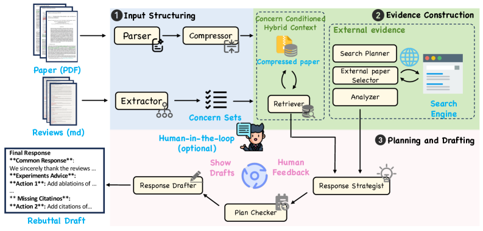

图11：RebuttalAgent 架构概览。系统 (1) 结构化输入并提取关注点；(2) 构建基于证据的上下文；(3) 生成可检查的响应计划并起草最终反驳信。

**表 4：RebuttalBench 评测结果 (覆盖率提升)** 14

| 基座模型 | 直接生成 (Direct) | RebuttalAgent (Ours) | 提升幅度 |
| :---- | :---- | :---- | :---- |
| DeepSeekV3.2 | 3.65 | 4.43 | \+0.78 |
| GPT-5-mini | 3.12 | 4.45 | **\+1.33** |

这一结果有力地支持了“架构优于参数”的观点：通过精心设计的Agent Workflow，可以让小模型在特定任务上超越大模型。

---

**6\. 模型生态的多样化：开源音乐与全能评测**

### **6.1 HeartMuLa：音乐生成的开源里程碑**

**文献：** HeartMuLa: A Family of Open Sourced Music Foundation Models 16
**原文pdf：** [**原文下载**2601.10547v1.pdf](../Resource/第三期/2601.10547v1.pdf)

在Suno和Udio等闭源商业模型统治音乐生成领域的背景下，HeartMuLa的发布具有重要的“民主化”意义。它是一个全栈式的开源音乐基础模型家族。

* **HeartCodec**：针对音乐长序列生成的痛点，设计了12.5Hz的超低帧率编解码器，在保证高保真度（High-Fidelity）的同时，极大地降低了生成所需的算力。  
* **HeartCLAP**：实现了音频与文本的对齐，使得用户可以通过自然语言（如“忧伤的爵士乐，带有雨声背景”）精确控制生成风格。  
* **生成能力**：HeartMuLa能够生成带有人声（Vocal）的全曲，并支持分段控制（如前奏、主歌、副歌使用不同风格）。

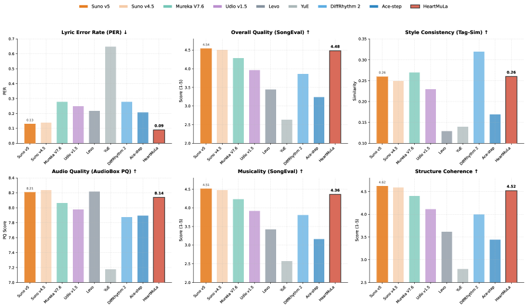

图12：HeartMuLa-oss-3B 与现有音乐基础模型的整体对比。

实验表明，HeartMuLa在7B参数规模下，利用学术界可获得的公开数据集，复现了接近商业级模型的生成质量。这为社区提供了一个强大的基座，打破了音乐大模型的技术垄断。

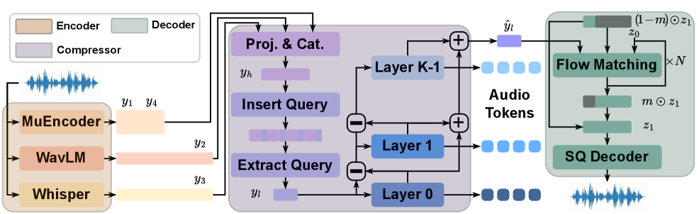

图13：HeartCodec 示意图。从左至右依次为：语义丰富的编码器、超低帧率压缩器和高保真重建解码器。

### **6.2 VoiceAssistant-Eval：全能语音助手的试金石**

> **VoiceAssistant-Eval: Benchmarking AI Assistants across Listening, Speaking, and Viewing**
>
>  [**PDF下载**](../Resource/第三期/2509.22651v1.pdf)

随着GPT-4o-Audio等端到端全能模型（Omni-Models）的出现，传统的ASR（语音识别）和TTS（语音合成）评测标准已经失效。VoiceAssistant-Eval 提出了一个包含 **10,497** 个样本的综合基准，涵盖“听、说、看”三个维度。

**关键发现：**

1. **闭源神话的破灭**：实验发现，专有的GPT-4o-Audio并不总是冠军。在某些特定的听力理解任务上，开源的Step-Audio-2-mini（7B）的准确率甚至是某些32B大模型的两倍。  

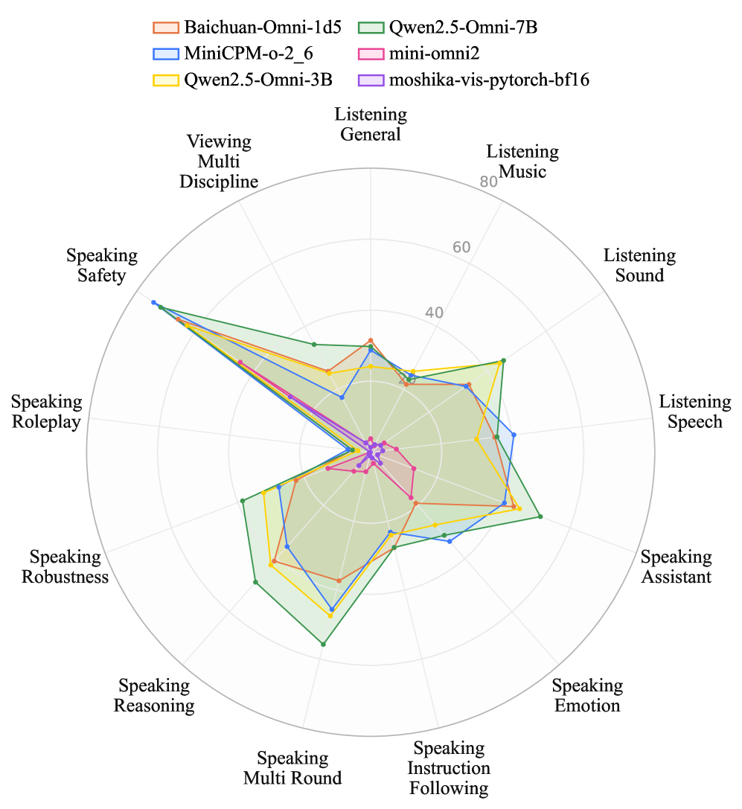

图14：VoiceAssistant-Eval 与现有基准的对比。

2. **技能割裂**：大多数模型呈现出“嘴强耳弱”的特征——生成的语音非常自然（TTS强），但对复杂音频环境（如背景噪音、多说话人）的理解能力（Audio Understanding）严重滞后。  

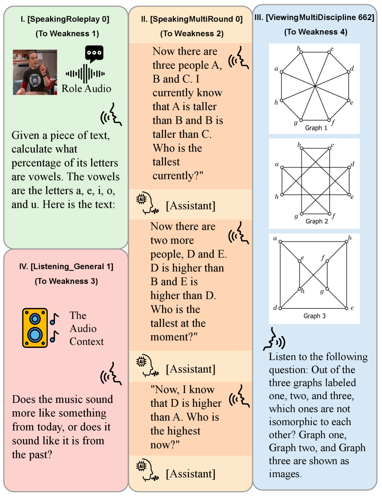

图15：Examples from VoiceAssistant-Eval

3. **多模态短板**：在视觉+语音的联合理解任务上，所有模型的表现都大幅下降，表明跨模态的语义对齐仍是未解难题。

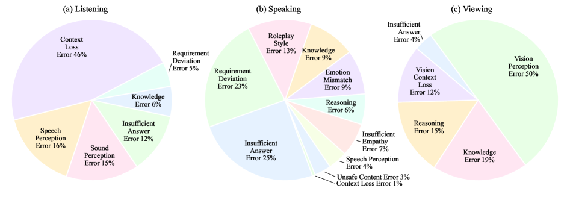

图16：Error analysis of Qwen2.5-Omni-7B across listening, speaking, and viewing tasks.

---

**7\. 宏观视野：智能体推理的未来路线图**

**文献：** Agentic Reasoning for Large Language Models 22
**原文pdf：** [**原文下载**2601.12538v1.pdf](../Resource/第三期/2601.12538v1.pdf)

作为本周的热点综述（Trending \#1），UIUC团队的这篇论文正式确立了 **“智能体推理（Agentic Reasoning）”** 这一独立的研究方向。文章将LLM的角色从被动的“文本生成器”重新定义为主动的“决策者”。

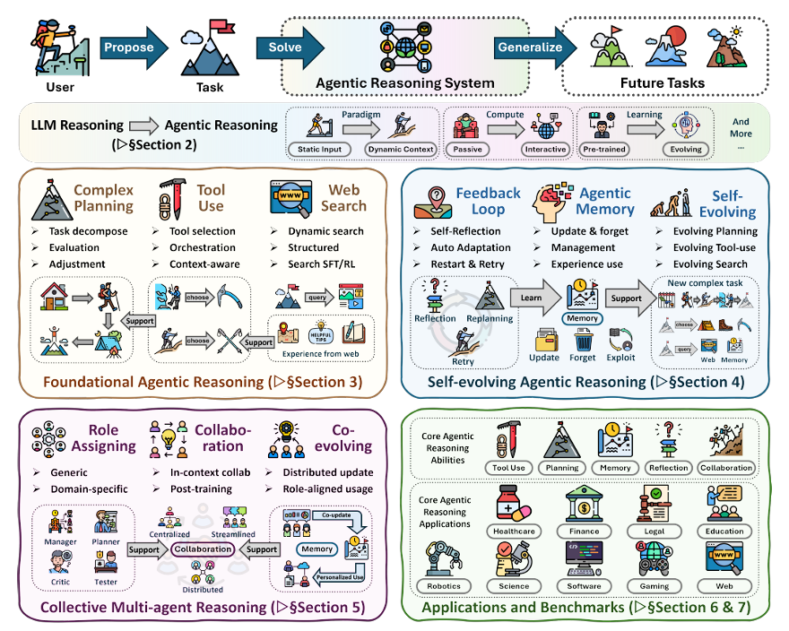

图17：智能体推理（Agentic Reasoning）框架概览。

综述提出了一个三层进化模型：

1. **基础层（Foundational）**：单智能体在静态环境中的规划、工具使用和搜索能力。  
2. **自进化层（Self-evolving）**：智能体如何通过环境反馈（Feedback）和长短期记忆（Memory）来动态调整策略，实现终身学习。  
3. **协作层（Collaborative）**：多智能体系统（MAS）中的通信协议、共识机制与任务分配。

这篇综述不仅仅是文献的堆砌，更是为2026年及以后的AI研究指明了方向：从单纯的**Scaling Parameters**（扩大参数）转向**Scaling Inference**（扩大推理计算量）和**Scaling Interaction**（扩大交互深度）。

---

**8\. 总结**

回顾2026年1月第三周的arXiv CS文献，我们清晰地看到了计算机科学界在经历了“大模型狂热”后的冷静思考与范式修正。

1. **物理世界的刚性约束**：BayesianVLA和RBench的研究表明，AI必须从“看起来像”进化到“物理上是”。这要求未来的模型架构必须引入物理先验或因果结构。  
2. **逻辑的结构化回归**：KG-Reward的研究证明，在神经网络中重新引入符号逻辑的约束，是解决推理幻觉的高效路径。Neuro-Symbolic AI将不再是边缘学科，而是核心方法。  
3. **系统工程的复兴**：Plausibility Trap和Paper2Rebuttal提醒我们，AI应用不应迷信单一的大模型。通过合理的工具路由（Tool Routing）和多智能体分工（Agent Orchestration），可以在更小的算力成本下实现更高的可靠性。

对于研究人员和从业者而言，这些信号意味着：不要盲目追求更大的模型，而应关注**数据的物理质量**、**逻辑的验证机制**以及**系统的整体效能**。这不仅是技术演进的必然，也是AI走向成熟工业应用的必经之路。

---

#### **引用**

1. BayesianVLA: Bayesian Decomposition of Vision Language Action Models via Latent Action Queries \- ChatPaper， [https://chatpaper.com/paper/228403](https://chatpaper.com/paper/228403)  
2. \[2601.15197\] BayesianVLA: Bayesian Decomposition of Vision Language Action Models via Latent Action Queries \- arXiv， [https://arxiv.org/abs/2601.15197](https://arxiv.org/abs/2601.15197)  
3. BayesianVLA: Bayesian Decomposition of Vision Language Action ...， [https://arxiv.org/pdf/2601.15197](https://arxiv.org/pdf/2601.15197)  
4. Rethinking Video Generation Model for the Embodied World \- arXiv， [https://arxiv.org/html/2601.15282v1](https://arxiv.org/html/2601.15282v1)  
5. \[2601.15282\] Rethinking Video Generation Model for the Embodied World \- arXiv， [https://arxiv.org/abs/2601.15282](https://arxiv.org/abs/2601.15282)  
6. Paper page \- Rethinking Video Generation Model for the Embodied ...， [https://huggingface.co/papers/2601.15282](https://huggingface.co/papers/2601.15282)  
7. Knowledge Graphs are Implicit Reward Models: Path-Derived Signals Enable Compositional Reasoning \- arXiv， [https://arxiv.org/html/2601.15160v1](https://arxiv.org/html/2601.15160v1)  
8. \[2601.15160\] Knowledge Graphs are Implicit Reward Models: Path-Derived Signals Enable Compositional Reasoning \- arXiv， [https://arxiv.org/abs/2601.15160](https://arxiv.org/abs/2601.15160)  
9. Knowledge Graphs are Implicit Reward Models: Path-Derived Signals Enable Compositional Reasoning \- ChatPaper， [https://chatpaper.com/chatpaper/paper/228404](https://chatpaper.com/chatpaper/paper/228404)  
10. The Plausibility Trap: Using Probabilistic Engines for Deterministic Tasks \- arXiv， [https://arxiv.org/abs/2601.15130](https://arxiv.org/abs/2601.15130)  
11. The Plausibility Trap: Using Probabilistic Engines for Deterministic Tasks \- arXiv， [https://arxiv.org/html/2601.15130v1](https://arxiv.org/html/2601.15130v1)  
12. The Plausibility Trap: Using Probabilistic Engines for ... \- arXiv， [https://arxiv.org/pdf/2601.15130](https://arxiv.org/pdf/2601.15130)  
13. Paper2Rebuttal: A Multi-Agent Framework for Transparent Author Response Assistance， [https://mqleet.github.io/Paper2Rebuttal\_ProjectPage/](https://mqleet.github.io/Paper2Rebuttal_ProjectPage/)  
14. Paper2Rebuttal: A Multi-Agent Framework for Transparent Author Response Assistance， [https://arxiv.org/html/2601.14171v1](https://arxiv.org/html/2601.14171v1)  
15. Paper2Rebuttal: A Multi-Agent Framework for Transparent Author Response Assistance | alphaXiv， [https://www.alphaxiv.org/overview/2601.14171](https://www.alphaxiv.org/overview/2601.14171)  
16. \[2601.10547\] HeartMuLa: A Family of Open Sourced Music Foundation Models \- arXiv， [https://arxiv.org/abs/2601.10547](https://arxiv.org/abs/2601.10547)  
17. Paper page \- HeartMuLa: A Family of Open Sourced Music ...， [https://huggingface.co/papers/2601.10547](https://huggingface.co/papers/2601.10547)  
18. HeartMuLa: A Family of Open Sourced Music Foundation Models \- arXiv， [https://arxiv.org/html/2601.10547v1](https://arxiv.org/html/2601.10547v1)  
19. VoiceAssistant-Eval: Benchmarking AI Assistants across Listening,\\n Speaking, and Viewing， [https://liner.com/review/voiceassistanteval-benchmarking-ai-assistants-across-listening-speaking-and-viewing](https://liner.com/review/voiceassistanteval-benchmarking-ai-assistants-across-listening-speaking-and-viewing)  
20. VoiceAssistant-Eval: Benchmarking AI Assistants across Listening, Speaking, and Viewing， [https://huggingface.co/papers/2509.22651](https://huggingface.co/papers/2509.22651)  
21. VoiceAssistant-Eval: Benchmarking AI Assistants across Listening, Speaking, and Viewing， [https://mathllm.github.io/VoiceAssistantEval/](https://mathllm.github.io/VoiceAssistantEval/)  
22. \[2601.12538\] Agentic Reasoning for Large Language Models \- arXiv， [https://arxiv.org/abs/2601.12538](https://arxiv.org/abs/2601.12538)  
23. Paper page \- Agentic Reasoning for Large Language Models \- Hugging Face， [https://huggingface.co/papers/2601.12538](https://huggingface.co/papers/2601.12538)
