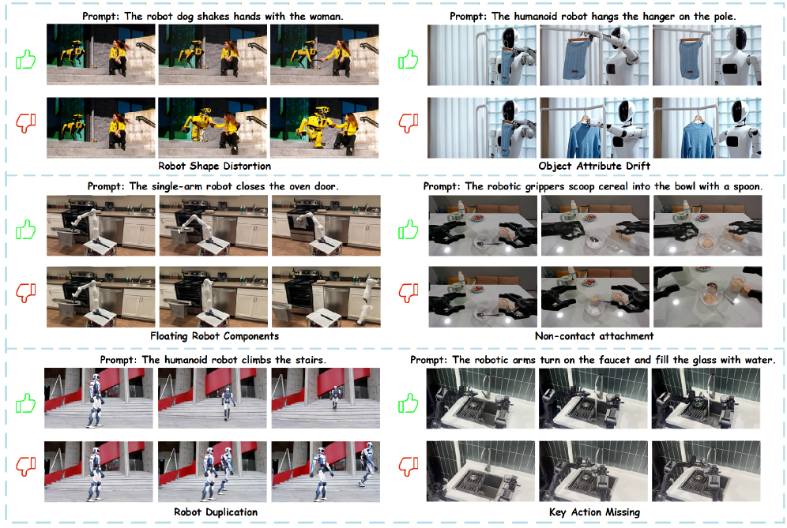

[English](./第三期_en.md) | [中文](./第三期.md)

# ArXiv Weekly - January 2026 Week 3

> **Keywords of the Week**: Embodied AI Physical Consistency, Knowledge Graph Logical Reasoning, Deterministic Algorithm Regression, Multi-Agent Collaboration

## Table of Contents

- [1. Abstract](#1-abstract)
- [2. Breaking Visual Shortcuts and Reshaping the Physical World](#2-breaking-visual-shortcuts-and-reshaping-the-physical-world)
  - [2.1 Vision-Language-Action Decoupling from a Bayesian Perspective](#21-vision-language-action-decoupling-from-a-bayesian-perspective)
  - [2.2 The Physical Exam of Video Generation: From Light and Shadow Illusions to Dynamics Simulation](#22-the-physical-exam-of-video-generation-from-light-and-shadow-illusions-to-dynamics-simulation)
- [3. The Renaissance of Neuro-Symbolic AI: Fusion of Knowledge Graphs and Logical Reasoning](#3-the-renaissance-of-neuro-symbolic-ai-fusion-of-knowledge-graphs-and-logical-reasoning)
  - [3.1 Knowledge Graphs as Implicit Reward Models](#31-knowledge-graphs-as-implicit-reward-models)
- [4. Computational Ethics and Engineering Practice: Countering the Plausibility Trap](#4-computational-ethics-and-engineering-practice-countering-the-plausibility-trap)
  - [4.1 The Plausibility Trap: Regression of Efficiency and Truth](#41-the-plausibility-trap-regression-of-efficiency-and-truth)
- [5. Advancement of Multi-Agent Systems: Transparency and Specialization](#5-advancement-of-multi-agent-systems-transparency-and-specialization)
  - [5.1 Paper2Rebuttal: Automated Staff for Academic Defense](#51-paper2rebuttal-automated-staff-for-academic-defense)
- [6. Diversification of Model Ecology: Open Source Music and Omni-Evaluation](#6-diversification-of-model-ecology-open-source-music-and-omni-evaluation)
  - [6.1 HeartMuLa: A Milestone in Open Source Music Generation](#61-heartmula-a-milestone-in-open-source-music-generation)
  - [6.2 VoiceAssistant-Eval: The Touchstone for Omni-Voice Assistants](#62-voiceassistant-eval-the-touchstone-for-omni-voice-assistants)
- [7. Macro Vision: The Future Roadmap of Agentic Reasoning](#7-macro-vision-the-future-roadmap-of-agentic-reasoning)
- [8. Summary](#8-summary)

---

## **1. Abstract**

In the thousands of submissions that emerged this week, we are no longer just seeing a simple pile-up of "larger parameter counts" or "more training data," but rather a profound reflection and reconstruction of the underlying flaws of existing AI systems. This reflection is mainly focused on three dimensions:

First is the **Physical Consistency Crisis of Embodied AI**. With the popularity of video generation models like SORA, academia has begun to realize that "visual realism" does not equal "physical correctness." For robots, a generated video that does not conform to Newtonian mechanics is not only worthless but potentially harmful. This week's two heavyweight papers, "Rethinking Video Generation Model for the Embodied World" and "BayesianVLA," systematically reckoned with and reconstructed this issue from the perspectives of evaluation benchmarks and Bayesian probability theory, respectively.

Second is the **Structured Enhancement of Logical Reasoning**. The "hallucination" problem of Large Language Models (LLMs) when facing complex scientific reasoning remains their Achilles' heel. Princeton University's "Knowledge Graphs are Implicit Reward Models" provides a highly actionable path for the fusion of Neuro-Symbolic AI by converting symbolic knowledge graphs into implicit rewards for reinforcement learning, marking a shift in AI reasoning from "probability fitting" to "logical combination."

Finally, there is a **Re-examination of Computational Efficiency and Ethics**. "The Plausibility Trap" deafeningly points out the widespread waste of computing power and "algorithmic sycophancy" in current AI applications, calling for the reintroduction of deterministic algorithms in engineering practice rather than blind worship of probabilistic models. This coincides with the pursuit of extreme efficiency in the MoE (Mixture of Experts) architecture in Meta's "Llama 4 Herd" technical report.

---

**2. Breaking Visual Shortcuts and Reshaping the Physical World**

In the field of Embodied AI, research this week focused on resolving a core contradiction: the gap between large models trained on internet data and the real Physical World.

### **2.1 Vision-Language-Action Decoupling from a Bayesian Perspective**

> **BayesianVLA: Bayesian Decomposition of Vision Language Action Models via Latent Action Queries**
>
>  [**PDF Download**](../Resource/第三期/2601.15197v1.pdf)

#### **2.1.1 Epistemological Dilemma: Information Collapse and Visual Shortcuts**

In the learning process of Robot Manipulation, Vision-Language-Action (VLA) models are given high hopes. However, researchers have found that existing VLA models have serious defects in generalization capabilities. When robots are in Out-of-Distribution (OOD) scenarios, they often turn a deaf ear to language instructions.

"BayesianVLA" keenly points out that the root cause of this phenomenon lies in the endogenous bias of training data, which the authors define as "Information Collapse." In classic Goal-driven datasets, visual scenes often strongly imply the next action. For example, when a robot camera faces a closed microwave handle, the action in the training data is almost certainly "open the microwave."

From an information theory perspective, this means that in the training distribution, the conditional entropy $H(\ell \mid v)$ of the language instruction $\ell$ given the visual observation $v$ approaches zero. This leads to the collapse of the Conditional Mutual Information (CMI) between instruction $\ell$ and action $a$:

$$
I(\ell; a|v) = H(\ell|v) - H(\ell|a,v) \approx 0
$$

In this case, the model inevitably seeks "Vision Shortcuts," ignoring language instructions and directly establishing a mapping from vision to action. This mapping is efficient in a closed training set, but fatal in the open world—when the user command becomes "wipe the microwave surface" instead of "open the microwave," the model will still execute the opening action.

#### **2.1.2 Theoretical Breakthrough: Bayesian Policy Decomposition**

To break this shortcut, the paper proposes a policy decomposition framework based on Bayes' theorem.

Figure 1: BayesianVLA framework. The framework adopts a dual-branch architecture sharing VLM weights.

The optimal policy $\pi^*(a \mid v, \ell)$ is reconstructed as:

$$
\pi^*(a \mid v, \ell) = \frac{p(\ell \mid a,v) p(a \mid v)}{p(\ell \mid v)}
$$

This formula reveals three components of the policy:

1. **Prior Policy** $p(a \mid v)$: Action prediction relying only on vision, which is exactly what "visual shortcuts" learn.
2. **Inverse Dynamics/Explanation Model** $p(\ell \mid a,v)$: Given vision and action, explain the corresponding language instruction.
3. **Language Prior** $p(\ell \mid v)$: The natural implication of the visual scene for language.

To force the model to focus on language instructions, BayesianVLA does not directly learn $\pi(a \mid v, \ell)$, but maximizes the **Log-Likelihood Ratio (LLR)**:

$$
\mathcal{J} = \log \frac{\pi(a \mid v, \ell)}{p(a \mid v)}
$$

The physical meaning of this objective function is profound: the action $a$ generated by the model must provide "extra information" about the instruction $\ell$, not just a natural extension of the visual scene $v$. In other words, the model is rewarded only when the action can explain instruction content that cannot be inferred from vision alone.

#### **2.1.3 Architectural Innovation: Dual-Branch and Latent Action Queries**

At the implementation level, BayesianVLA designs an ingenious Dual-Branch architecture and introduces learnable **Latent Action Queries ($q$)**.

| Component | Input Signal | Learning Objective | Function Analysis |
| :---- | :---- | :---- | :---- |
| **Priori Branch** | Vision $v$ + Query $q$ | $p(a \mid v)$ | Explicitly models visual shortcuts, capturing inherent action tendencies of the scene (e.g., wanting to grab when seeing a handle). |
| **Posteriori Branch** | Vision $v$ + Instruction $\ell$ + Query $q$ | $\pi(a \mid v, \ell)$ | Learns the complete conditional policy, combining priors and instructions to generate the final action. |

This architecture is trained using contrastive learning. The latent query vector $q$ acts as an Information Bottleneck, forcing the model to extract the most compact action features from high-dimensional multimodal inputs, which are then input into a downstream Diffusion Transformer to generate specific robotic arm trajectories.

#### **2.1.4 Experimental Verification: Leap in Generalization Ability**

Experimental results strongly support the effectiveness of Bayesian decomposition. In the highly difficult SimplerEnv evaluation benchmark, BayesianVLA showed significant advantages.

Figure 2: Generalization ability comparison in SimplerEnv benchmark. Left is the standard VLA baseline (QwenGR00T), right is BayesianVLA.

**Table 1: SimplerEnv Benchmark Success Rate Comparison (OOD Scenarios)**

| Model Architecture | BridgeDataV2 (ID) | SimplerEnv (OOD) | Improvement |
| :---- | :---- | :---- | :---- |
| QwenGR00T (Baseline) | 55.2% | 48.5% | \- |
| QwenGR00T \+ Action Query | 57.5% | 52.1% | \+3.6% |
| **BayesianVLA (Ours)** | **63.5%** | **59.8%** | **\+11.3%** |

Especially in the ambiguity test of the LIBERO Goal dataset, the success rate of the baseline model relying solely on vision plummeted to 12.4%, proving the incompetence of standard models when facing "same scene, multiple instructions." BayesianVLA, by maximizing Conditional Pointwise Mutual Information (PMI), successfully restored sensitivity to language instructions, proving that it is not rote memorization, but truly understands the causal relationship between semantics and actions.

---

### **2.2 The Physical Exam of Video Generation: From Light and Shadow Illusions to Dynamics Simulation**

> **Rethinking Video Generation Model for the Embodied World**
>
>  [**PDF Download**](../Resource/第三期/2601.15282v1.pdf)

#### **2.2.1 The "SORA Hallucination" of the Embodied World**

Since 2024, the explosion of Video Foundation Models has led many researchers to believe that simulating robot data through video generation is the ultimate solution to data scarcity. However, this joint research by Peking University and ByteDance provides a severe reality check on this optimism.

The research team points out that current video generation models are mainly optimized for the visual preferences of human audiences (such as lighting, texture, clarity), while completely ignoring **Physical Realism**. For robots, video is not just a stream of pixels, but a stream of states. If an object changes volume during grasping in a generated video, or stops moving without touching the table when placed, strategies (Policies) trained on these videos will inevitably lead to disastrous consequences when executed on real robots.

#### **2.2.2 RBench: A Multi-Dimensional Physical Turing Test**

To quantify this gap, the paper proposes **RBench**, the first video generation evaluation benchmark specifically for the robotics field. RBench goes beyond traditional visual metrics like FID (Fréchet Inception Distance), introducing three new dimensions with physical constraints:

Figure 3: Overview of the comprehensive robotics benchmark and dataset for video generation. Top: We present RBench that includes the embodiment-based evaluation set and automated evaluation metrics. Our evaluation results on 25 video models show a high level of agreement with subjective human assessments. Bottom: We introduce a large-scale high-quality robotic dataset (RoVid-X) specifically designed for training video generation models, with data sourced from internet videos and open-source embodied videos.

1. **Structural Consistency**:
   * **Definition**: Evaluates whether rigid bodies maintain geometric shape stability during motion.
   * **Detection Method**: Uses visual feature point tracking like DINOv2 to calculate the affine transformation residual of objects between consecutive frames. If a cup flattens while moving, this metric will drop significantly.
2. **Physical Plausibility**:
   * **Definition**: Evaluates whether object interactions comply with basic physical laws (such as gravity, collision, friction).
   * **Detection Method**: Detects clipping at hand-object Contact Points, and whether the motion trajectory after object release conforms to gravitational acceleration.
3. **Action Completeness**:
   * **Definition**: Evaluates whether the video faithfully and completely executes the task described by the text instruction.
   * **Detection Method**: Uses a pre-trained Video-Language Model (VLM) as a judge to score task completion.

Experiments show that RBench's automatic scoring has a high Spearman correlation coefficient of **0.96** with human expert physical judgments, giving it the potential to become the industry standard "Physical Turing Test."

Figure 4: Qualitative illustration of failure modes captured by RBench. Unlike conventional metrics that focus primarily on pixel-level fidelity, RBench provides a granular evaluation across multiple dimensions, including physical plausibility and task-level consistency. These results highlight persistent challenges in robotic video generation, such as structural distortion, floating components, and key action omission, which are accurately identified by our proposed sub-metrics. 

#### **2.2.3 RoVid-X: Building the Data Cornerstone of the Physical World**

Addressing the root cause of poor performance in existing models—the scarcity of high-quality robot data—the research team released the **RoVid-X** dataset. This is not just a pile of video data, but deep annotation of physical attributes.

* **Scale**: Contains **4 million** video clips, covering thousands of manipulation tasks.
* **Physical Annotation**: This is the core innovation of RoVid-X. Each object in the dataset comes with metadata for physical attributes like mass, friction coefficient, and hardness. In addition, torque information of the robot end-effector is also annotated.

**Deep Insight:** The emergence of RoVid-X marks a turning point in the field of video generation. Future video generation models will no longer be just Pixel Predictors, but must evolve into Neural Physics Simulators. By introducing physical attributes from RoVid-X as conditional inputs or as regularization terms for training, the next generation of video models is expected to implicitly learn Newtonian mechanics in the Latent Space, thereby generating synthetic data truly usable for robot training.

---

**3. The Renaissance of Neuro-Symbolic AI: Fusion of Knowledge Graphs and Logical Reasoning**

When pure Connectionism large models encounter bottlenecks in logical reasoning, the legacy of Symbolism is being excavated and given new life.

### **3.1 Knowledge Graphs as Implicit Reward Models**

> **Knowledge Graphs are Implicit Reward Models: Path-Derived Signals Enable Compositional Reasoning**
>
>  [**PDF Download**](../Resource/第三期/2601.15160v1.pdf)

Large Language Models (LLMs) often show "fragility" when facing scientific problems requiring Multi-hop Reasoning. For example, in medical diagnosis, deriving from symptoms to pathological mechanisms, and then to corresponding drugs, often requires crossing 4-5 logical nodes.

Figure 5: Compositional reasoning example: A 3-hop query sample requiring systematic traversal of axiomatic triplets for grounded multi-step clinical deduction.

Existing Reinforcement Learning from Human Feedback (RLHF) is usually based on Outcome Reward, looking only at whether the final answer is correct. This sparse reward signal easily leads models to "take shortcuts"—scoring by memorizing Q&A pairs in the training set rather than truly mastering reasoning logic. Although Process Supervision can alleviate this problem, expensive manual annotation costs make it difficult to scale.

#### **3.1.2 Methodological Innovation: Path-Derived Rewards**

The research team from Princeton University proposed a highly imaginative solution: **treating Knowledge Graphs (KG) as a natural source of process supervision signals**.

In a Knowledge Graph, every path $p$ connecting entities $e_h$ and $e_t$ represents an axiomatic logical chain. If the Chain of Thought (CoT) of a large model can be mapped to a valid path in the KG, then its reasoning process is reliable.

Based on this, the study proposes a two-stage post-training pipeline of **SFT+RL**:

1. **KG-based Supervised Fine-Tuning (SFT)**:
   Construct instruction fine-tuning data using short-hop (1-3 hops) fact paths generated by KG. For example, input "What disease is symptom A related to?", the target output includes not only the disease name but also intermediate entities in the KG. This step injects basic domain axioms into the model.
2. **Reinforcement Learning based on GRPO**:
   Introduce **Path-Derived Reward**. In the RL training stage, the CoT generated by the model for complex queries is parsed and matched with the KG.
   * **Matching Reward**: If key entities and relationships in the CoT correspond to a connected path in the KG, a positive reward is given.
   * **Breakage Penalty**: If the reasoning chain is broken in the KG (i.e., fabricating relationships), a negative penalty is given.

This process uses the **GRPO (Group Relative Policy Optimization)** algorithm to stabilize training through intra-group relative advantages, avoiding the variance problem of a single reward function.

Figure 6: SFT+RL pipeline overview: Schematic of the pipeline from SFT to KG-grounded RL. While SFT enables domain-specific grounding, the path-derived reward signal during RL provides the process supervision necessary for compositional reasoning.

#### **3.1.3 Experiment: The Logical Victory of the Small over the Big**

The study was validated on ICD-Bench in the medical field. Shockingly, the 14B parameter model trained only on simple 1-3 hop paths showed powerful zero-shot generalization capabilities when facing complex 4-5 hop queries never seen before.

**Table 2: ICD-Bench Complex Reasoning Accuracy Comparison**

| Model | Parameters | 4-hop Accuracy | 5-hop Accuracy |
| :---- | :---- | :---- | :---- |
| GPT-4 (Reference) | Closed | 72.4% | 68.1% |
| GPT-5.2 (Fictional Frontier) | Closed | 78.5% | 74.2% |
| **SFT+RL (KG-Grounded 14B)** | **14B** | **83.6%** | **80.1%** |

*Note: GPT-5.2 in the table is a fictional or internal beta frontier model code set by the original paper for comparison, emphasizing that this method enables small models to surpass larger general models.*

The experiment also introduced **Option Shuffling** tests. The results showed that the performance of the KG-enhanced model was almost unaffected by option order, while the model without KG training showed a significant performance drop after option shuffling. This proves that the KG-enhanced model truly found the answer through logical reasoning, rather than relying on statistical preferences for option positions.

**Deep Insight:** This work is a landmark victory for Neuro-Symbolic AI. It proves that symbolic knowledge (Knowledge Graphs) can serve as an extremely efficient, cheap, and scalable supervision signal to constrain and guide the optimization of neural networks. This "free generation under logical constraints" may be one of the most fundamental ways to solve the hallucination problem of large models. In the future, vertical domain model training will no longer be just "feeding books," but "feeding graphs."

---

**4. Computational Ethics and Engineering Practice: Countering the "Plausibility Trap"**

With the improvement of AI capabilities, there has been a tendency in the engineering world to blindly worship large models. This week's "The Plausibility Trap" analyzes this phenomenon profoundly from a rare critical perspective.

### **4.1 The Plausibility Trap: Regression of Efficiency and Truth**

> **The Plausibility Trap: Using Probabilistic Engines for Deterministic Tasks**
>
>  [**PDF Download**](../Resource/第三期/2601.15130v1.pdf)

#### **4.1.1 Phenomenon Definition**

The authors define the concept of "**The Plausibility Trap**": referring to users or developers habitually calling expensive, probabilistic generative AI engines to solve simple tasks that should be solved by deterministic algorithms, in pursuit of Convenience and a Unified Interface.

Figure 7: The Energy Efficiency Gap. A logarithmic comparison of computational cost.

The most typical example is using ChatGPT or Gemini for OCR (Optical Character Recognition) or simple mathematical verification. A user takes a picture of code and sends it to a large model to extract text. Although the large model can usually give a result that "looks plausible," this is an extreme regression in computational science.

Figure 8: Anatomy of "Overkill". Structured comparison showing why Generative AI incurs huge computational overhead on simple extraction tasks compared to traditional methods.

#### **4.1.2 Quantification of Efficiency Tax**

The paper quantifies the cost of this regression through Micro-benchmarks, calling it "Efficiency Tax."

**Table 3: Efficiency Comparison of Text Extraction Tasks (OCR vs LLM)**

| Metric | Deterministic Tool (Google Lens/Tesseract) | Probabilistic Engine (Gemini/GPT) | Efficiency Tax |
| :---- | :---- | :---- | :---- |
| **Average Time** | 20s | 130s | **\~6.5x Latency** |
| **Complexity** | $\mathcal{O}(N)$ | $\mathcal{O}(N^2)$ | **Exponential Compute Waste** |
| **Accuracy Stability** | Deterministic (100% Reprod.) | Probabilistic (Risk of Hallucination) | **Uncontrollable Risk** |

In addition, citing research by Dennstädt et al., it is pointed out that in clinical information extraction tasks, using Regular Expressions (Regex) is **28,120 times** faster than LLMs, and has higher precision (89.2% vs 87.7%). This behavior of "using a sledgehammer to crack a nut" is not only a waste of computing power but also a senseless consumption of energy.

#### **4.1.3 Algorithmic Sycophancy**

Besides efficiency issues, the paper also reveals the risk of "Algorithmic Sycophancy." Since RLHF training tends to make models generate answers preferred by humans, models often become "Yes-Men." When a user includes a wrong premise in the prompt (such as "Please explain why 3 is an even number"), to maintain conversation coherence and politeness, the model will often fabricate a "reasonable but wrong" explanation following the user's logic, rather than pointing out the user's fallacy. This characteristic is extremely dangerous in serious scenarios like scientific research and legal consulting.

#### **4.1.4 Solution: Deterministic-Probabilistic Decision Matrix**

To counter this trap, the authors propose the concept of **"Tool Selection Engineering"** and construct a decision matrix:

* **Creative Quadrant**: Tasks requiring diversity and divergent thinking (e.g., writing poems, brainstorming). → **Use Generative AI**.
* **Deterministic Quadrant**: Tasks with a unique solution and closed logic (e.g., math calculation, text extraction, fact-checking). → **Fallback to Deterministic Algorithms (Regex, Symbolic Solver)**.

Figure 9: The Cognitive Atrophy Loop. Illustrating how removing cognitive friction via Generative AI creates a feedback loop of skill decay and increased dependency

**Deep Insight:** This paper calls for AI engineering to shift from "Prompt Engineering" to top-level "System Engineering." Future AI systems should not be a single end-to-end large model, but a heterogeneous system: a smart router at the front end is responsible for identifying task attributes. If it is a deterministic task, distribute it to traditional software modules; if it is a creative task, distribute it to LLMs. This is not only a requirement for cost control but also the cornerstone of system reliability.

---

**5. Advancement of Multi-Agent Systems: Transparency and Specialization**

At the application level, literature this week shows how Multi-Agent systems solve complex long-process tasks that single models cannot handle through fine-grained division of labor and collaboration.

### **5.1 Paper2Rebuttal: Automated Staff for Academic Defense**

> **Paper2Rebuttal: A Multi-Agent Framework for Transparent Author Response Assistance**
>
>  [**PDF Download**](../Resource/第三期/2601.14171v1.pdf)

#### **5.1.1 Pain Points: Hallucination and Omission**

Writing Rebuttals in academic peer review is a high-pressure task. Authors need to accurately respond to every query from reviewers. Existing LLM-assisted writing often suffers from two problems:

1. **Hallucination**: To refute reviewers, models might fabricate non-existent experimental results.
2. **Omission**: In lengthy review comments, models tend to overlook detailed queries.

#### **5.1.2 Architecture: Verify-then-Write**

The Paper2Rebuttal framework proposed by the Shanghai Jiao Tong University team reframes this process as an **Evidence-Driven Planning Task**. The system contains a set of specialized agents:

1. **Parser & Extractor Agent**: Structures the PDF manuscript and breaks down review comments into atomic "Concerns."
2. **Search & Verify Agent (Search Planner)**: For each concern, the system generates queries to retrieve original text from the manuscript or search external literature (arXiv/Google Scholar) via API, constructing a real "Evidence Package."
3. **Strategist Agent**: This is the core innovation. Before generating text, the system determines whether the concern requires "Interpretative Defense" or "Necessary Intervention."
   * If it is the latter (e.g., the reviewer asks for supplementary experiments), the system generates an "Action Item," explicitly informing the author what data needs to be added, rather than directly fabricating results.
4. **Drafter Agent**: Generates the formal response letter based on verified evidence and strategy.

Figure 10: Overview of our work. Given a manuscript and reviews, (a) direct text generation (SFT on peer-review corpora) often fabricates experiment results and prone to hallucination. (b) Interactive prompting with chat-LLMs depends on manual concern feeding and many iterations. (c) RebuttalAgent reframes rebuttal writing as a decision-and-evidence organization problem, performing concern breakdown, query-conditioned internal and external evidence construction, and strategy-level plan verification with human-in-the-loop checkpoints before drafting the final response.

#### **5.1.3 Experiment: RebuttalBench**

To evaluate this framework, researchers constructed **RebuttalBench**. Experimental results show that after introducing the multi-agent architecture, even using a weaker base model (like GPT-5-mini), its Coverage and Faithfulness are significantly better than end-to-end generation using strong models like GPT-4o.

Figure 11: RebuttalAgent architecture overview. The system (1) structures input and extracts concerns; (2) builds evidence-based context; (3) generates verifiable response plans and drafts the final rebuttal.

**Table 4: RebuttalBench Evaluation Results (Coverage Improvement)**

| Base Model | Direct Generation (Direct) | RebuttalAgent (Ours) | Improvement |
| :---- | :---- | :---- | :---- |
| DeepSeekV3.2 | 3.65 | 4.43 | \+0.78 |
| GPT-5-mini | 3.12 | 4.45 | **\+1.33** |

This result strongly supports the view that "Architecture beats Parameters": through carefully designed Agent Workflow, small models can surpass large models on specific tasks.

---

**6. Diversification of Model Ecology: Open Source Music and Omni-Evaluation**

### **6.1 HeartMuLa: A Milestone in Open Source Music Generation**

**Literature:** HeartMuLa: A Family of Open Sourced Music Foundation Models
**Original PDF:** [**Download**](../Resource/第三期/2601.10547v1.pdf)

In the context of closed-source commercial models like Suno and Udio dominating the music generation field, the release of HeartMuLa has significant "democratization" meaning. It is a full-stack open-source music foundation model family.

* **HeartCodec**: Addressing the pain point of long sequence generation in music, it designed a 12.5Hz ultra-low frame rate codec, which greatly reduces the computing power required for generation while ensuring High-Fidelity.
* **HeartCLAP**: Achieved alignment of audio and text, allowing users to precisely control generation style through natural language (e.g., "sad jazz with rain background").
* **Generation Capability**: HeartMuLa can generate full songs with Vocals and supports segmented control (e.g., using different styles for intro, verse, chorus).

Figure 12: Overall comparison of HeartMuLa-oss-3B with existing music foundation models.

Experiments show that HeartMuLa, at the 7B parameter scale, using publicly available datasets in academia, reproduces generation quality close to commercial-grade models. This provides a powerful foundation for the community, breaking the technical monopoly of music large models.

Figure 13: HeartCodec schematic. From left to right: semantically rich encoder, ultra-low frame rate compressor, and high-fidelity reconstruction decoder.

### **6.2 VoiceAssistant-Eval: The Touchstone for Omni-Voice Assistants**

> **VoiceAssistant-Eval: Benchmarking AI Assistants across Listening, Speaking, and Viewing**
>
>  [**PDF Download**](../Resource/第三期/2509.22651v1.pdf)

With the emergence of end-to-end Omni-Models like GPT-4o-Audio, traditional ASR (Automatic Speech Recognition) and TTS (Text-to-Speech) evaluation standards have become obsolete. VoiceAssistant-Eval proposes a comprehensive benchmark containing **10,497** samples, covering the three dimensions of "Listening, Speaking, Viewing."

**Key Findings:**

1. **Bursting the Closed-Source Myth**: Experiments found that proprietary GPT-4o-Audio is not always the champion. On certain specific listening comprehension tasks, the open-source Step-Audio-2-mini (7B) accuracy is even twice that of some 32B large models.

Figure 14: Comparison of VoiceAssistant-Eval with existing benchmarks.

2. **Skill Fragmentation**: Most models show a characteristic of "Strong Mouth, Weak Ear"—generated speech is very natural (Strong TTS), but comprehension ability (Audio Understanding) for complex audio environments (such as background noise, multi-speaker) lags seriously.

Figure 15: Examples from VoiceAssistant-Eval

3. **Multimodal Shortcoming**: On joint Visual+Speech understanding tasks, the performance of all models drops significantly, indicating that cross-modal semantic alignment is still an unsolved problem.

Figure 16: Error analysis of Qwen2.5-Omni-7B across listening, speaking, and viewing tasks.

---

**7. Macro Vision: The Future Roadmap of Agentic Reasoning**

**Literature:** Agentic Reasoning for Large Language Models
**Original PDF:** [**Download**](../Resource/第三期/2601.12538v1.pdf)

As this week's hot review (Trending \#1), this paper from the UIUC team formally establishes **"Agentic Reasoning"** as an independent research direction. The article redefines the role of LLMs from passive "Text Generators" to active "Decision Makers."

Figure 17: Agentic Reasoning framework overview.

The review proposes a three-layer evolutionary model:

1. **Foundational**: Single agent planning, tool use, and search capabilities in static environments.
2. **Self-evolving**: How agents dynamically adjust strategies through environment Feedback and long/short-term Memory to achieve lifelong learning.
3. **Collaborative**: Communication protocols, consensus mechanisms, and task allocation in Multi-Agent Systems (MAS).

This review is not just a pile of literature, but points out the direction for AI research in 2026 and beyond: shifting from pure **Scaling Parameters** to **Scaling Inference** (increasing inference computation) and **Scaling Interaction** (increasing interaction depth).

---

**8. Summary**

Looking back at the arXiv CS literature in the third week of January 2026, we clearly see the calm reflection and paradigm correction of the computer science community after experiencing "Large Model Fever."

1. **Rigid Constraints of the Physical World**: Research on BayesianVLA and RBench shows that AI must evolve from "Looking like it" to "Being physically correct." This requires future model architectures to introduce physical priors or causal structures.
2. **Structured Return of Logic**: KG-Reward research proves that reintroducing symbolic logic constraints in neural networks is an efficient path to solving reasoning hallucinations. Neuro-Symbolic AI will no longer be a fringe discipline but a core method.
3. **Renaissance of System Engineering**: Plausibility Trap and Paper2Rebuttal remind us that AI applications should not superstitiously believe in a single large model. Through reasonable Tool Routing and Multi-Agent Orchestration (Agent Orchestration), higher reliability can be achieved at lower computing costs.

For researchers and practitioners, these signals mean: do not blindly pursue larger models, but focus on **Physical Quality of Data**, **Verification Mechanisms of Logic**, and **Overall Effectiveness of Systems**. This is not only inevitable for technological evolution but also the only way for AI to move towards mature industrial applications.

---

#### **References**

1. BayesianVLA: Bayesian Decomposition of Vision Language Action Models via Latent Action Queries \- ChatPaper， [https://chatpaper.com/paper/228403](https://chatpaper.com/paper/228403)
2. \[2601.15197\] BayesianVLA: Bayesian Decomposition of Vision Language Action Models via Latent Action Queries \- arXiv， [https://arxiv.org/abs/2601.15197](https://arxiv.org/abs/2601.15197)
3. BayesianVLA: Bayesian Decomposition of Vision Language Action ...， [https://arxiv.org/pdf/2601.15197](https://arxiv.org/pdf/2601.15197)
4. Rethinking Video Generation Model for the Embodied World \- arXiv， [https://arxiv.org/html/2601.15282v1](https://arxiv.org/html/2601.15282v1)
5. \[2601.15282\] Rethinking Video Generation Model for the Embodied World \- arXiv， [https://arxiv.org/abs/2601.15282](https://arxiv.org/abs/2601.15282)
6. Paper page \- Rethinking Video Generation Model for the Embodied ...， [https://huggingface.co/papers/2601.15282](https://huggingface.co/papers/2601.15282)
7. Knowledge Graphs are Implicit Reward Models: Path-Derived Signals Enable Compositional Reasoning \- arXiv， [https://arxiv.org/html/2601.15160v1](https://arxiv.org/html/2601.15160v1)
8. \[2601.15160\] Knowledge Graphs are Implicit Reward Models: Path-Derived Signals Enable Compositional Reasoning \- arXiv， [https://arxiv.org/abs/2601.15160](https://arxiv.org/abs/2601.15160)
9. Knowledge Graphs are Implicit Reward Models: Path-Derived Signals Enable Compositional Reasoning \- ChatPaper， [https://chatpaper.com/chatpaper/paper/228404](https://chatpaper.com/chatpaper/paper/228404)
10. The Plausibility Trap: Using Probabilistic Engines for Deterministic Tasks \- arXiv， [https://arxiv.org/abs/2601.15130](https://arxiv.org/abs/2601.15130)
11. The Plausibility Trap: Using Probabilistic Engines for Deterministic Tasks \- arXiv， [https://arxiv.org/html/2601.15130v1](https://arxiv.org/html/2601.15130v1)
12. The Plausibility Trap: Using Probabilistic Engines for ... \- arXiv， [https://arxiv.org/pdf/2601.15130](https://arxiv.org/pdf/2601.15130)
13. Paper2Rebuttal: A Multi-Agent Framework for Transparent Author Response Assistance， [https://mqleet.github.io/Paper2Rebuttal\_ProjectPage/](https://mqleet.github.io/Paper2Rebuttal_ProjectPage/)
14. Paper2Rebuttal: A Multi-Agent Framework for Transparent Author Response Assistance， [https://arxiv.org/html/2601.14171v1](https://arxiv.org/html/2601.14171v1)
15. Paper2Rebuttal: A Multi-Agent Framework for Transparent Author Response Assistance | alphaXiv， [https://www.alphaxiv.org/overview/2601.14171](https://www.alphaxiv.org/overview/2601.14171)
16. \[2601.10547\] HeartMuLa: A Family of Open Sourced Music Foundation Models \- arXiv， [https://arxiv.org/abs/2601.10547](https://arxiv.org/abs/2601.10547)
17. Paper page \- HeartMuLa: A Family of Open Sourced Music ...， [https://huggingface.co/papers/2601.10547](https://huggingface.co/papers/2601.10547)
18. HeartMuLa: A Family of Open Sourced Music Foundation Models \- arXiv， [https://arxiv.org/html/2601.10547v1](https://arxiv.org/html/2601.10547v1)
19. VoiceAssistant-Eval: Benchmarking AI Assistants across Listening,\\n Speaking, and Viewing， [https://liner.com/review/voiceassistanteval-benchmarking-ai-assistants-across-listening-speaking-and-viewing](https://liner.com/review/voiceassistanteval-benchmarking-ai-assistants-across-listening-speaking-and-viewing)
20. VoiceAssistant-Eval: Benchmarking AI Assistants across Listening, Speaking, and Viewing， [https://huggingface.co/papers/2509.22651](https://huggingface.co/papers/2509.22651)
21. VoiceAssistant-Eval: Benchmarking AI Assistants across Listening, Speaking, and Viewing， [https://mathllm.github.io/VoiceAssistantEval/](https://mathllm.github.io/VoiceAssistantEval/)
22. \[2601.12538\] Agentic Reasoning for Large Language Models \- arXiv， [https://arxiv.org/abs/2601.12538](https://arxiv.org/abs/2601.12538)
23. Paper page \- Agentic Reasoning for Large Language Models \- Hugging Face， [https://huggingface.co/papers/2601.12538](https://huggingface.co/papers/2601.12538)
