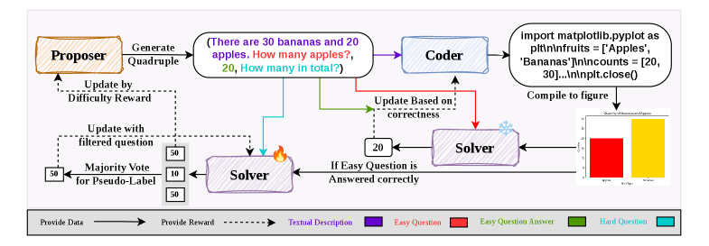
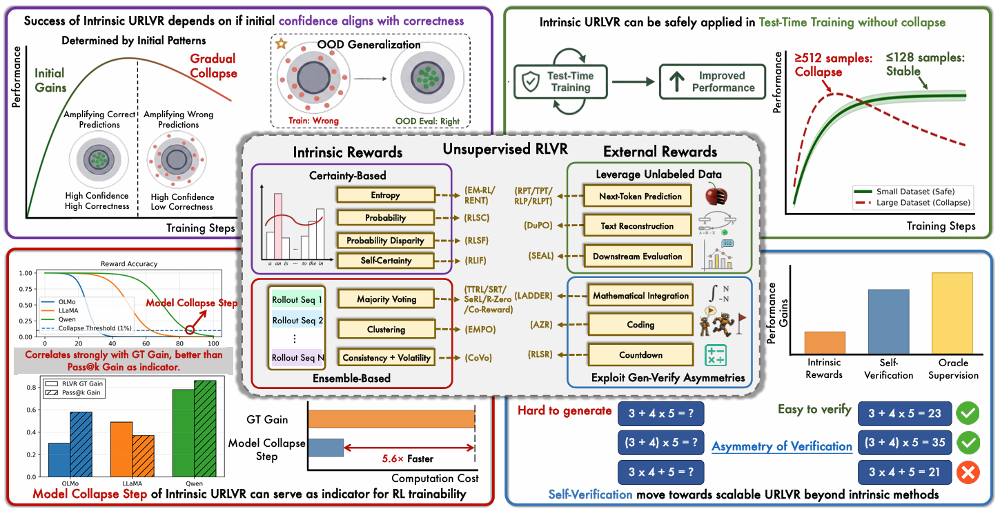
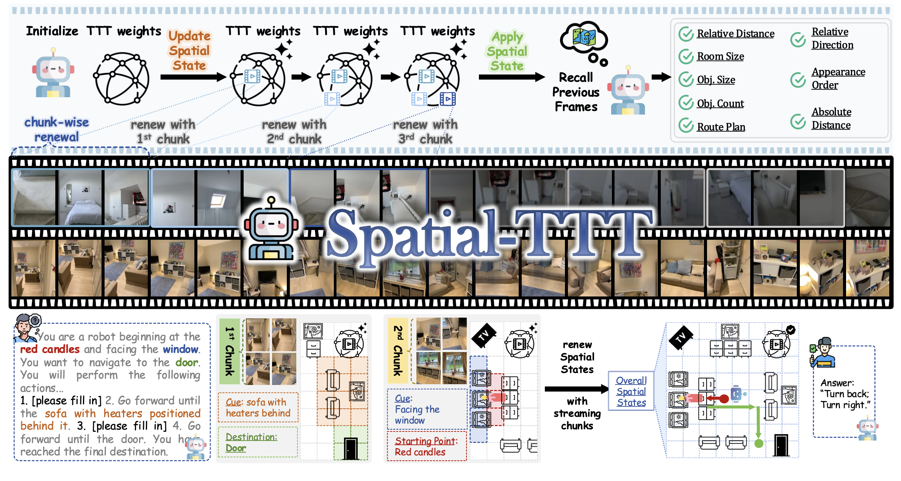
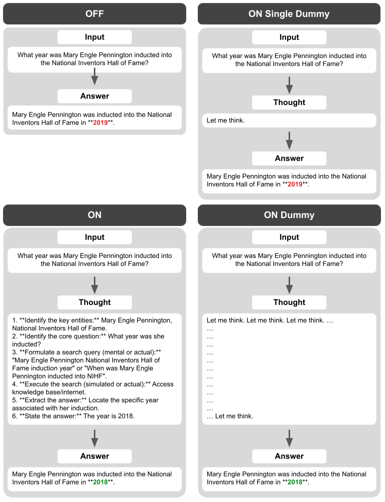
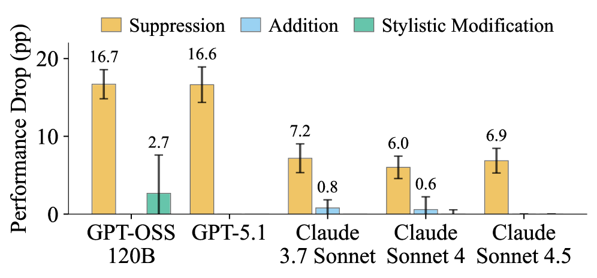
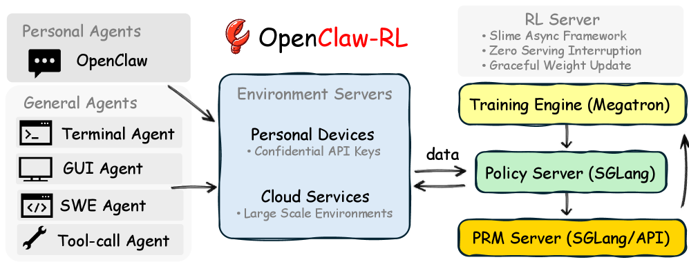
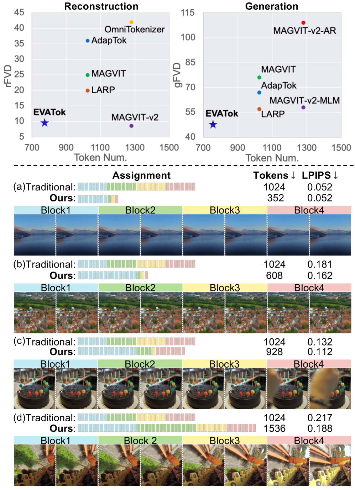

[English](./第九期_en.md) | [中文](./第九期.md)

# ArXiv Weekly - 2026年3月第九期

> **本周关键词**：InternVL-U、统一多模态、MM-Zero、零数据自演化、Unsupervised RLVR、模型塌缩、Spatial-TTT、流式空间智能、Thinking to Recall、计算缓冲、CoT-Control、推理可控性、OpenClaw-RL、次态信号、EVATok、自适应令牌化

## 目录

- [1. 摘要](#1-摘要)
- [2. 统一多模态模型的轻量化民主：InternVL-U的技术路径与语义对齐](#2-统一多模态模型的轻量化民主internvl-u的技术路径与语义对齐)
- [3. 零数据自演化的突破：MM-Zero与三角色协同逻辑](#3-零数据自演化的突破mm-zero与三角色协同逻辑)
- [4. 无监督强化学习的扩展边界：RLVR中的“模型塌缩步”](#4-无监督强化学习的扩展边界rlvr中的模型塌缩步)
- [5. 流式空间智能的崛起：Spatial-TTT与测试时训练存储](#5-流式空间智能的崛起spatial-ttt与测试时训练存储)
- [6. 思维链背后的物理机制：计算缓冲效应与事实引导](#6-思维链背后的物理机制计算缓冲效应与事实引导)
- [7. 推理的可控性困境：CoT监测中的安全与虚掩](#7-推理的可控性困境cot监测中的安全与虚掩)
- [8. 智能体学习的实时闭环：OpenClaw-RL与次态信号](#8-智能体学习的实时闭环openclaw-rl与次态信号)
- [9. 视频生成的效率革命：EVATok与自适应令牌分配](#9-视频生成的效率革命evatok与自适应令牌分配)
- [10. 总结与未来趋势展望](#10-总结与未来趋势展望)

---

## **1. 摘要**

在2026年3月6日至3月13日期间，arXiv计算机科学（CS）板块见证了一场关于大模型（LLM）底层架构与演化逻辑的深刻变革。这一周发布的文献不仅在多模态理解与生成的统一性上取得了显著进展，更在强化学习验证、自我演化框架以及推理机制的解构上展现了前所未有的深度。当前的研究趋势正从单纯追求参数规模的“缩放定律”转向对计算效率、逻辑可控性以及无监督自我提升能力的精细探索。通过对该时段数百篇新发论文的筛选，本报告重点分析了八篇具有里程碑意义的文献，这些研究集体映射出人工智能正处于从“模仿人类数据”向“自主逻辑发现”跨越的关键节点。

---

## **2. 统一多模态模型的轻量化民主：InternVL-U的技术路径与语义对齐**

> **InternVL-U: Democratizing Unified Multimodal Models for Understanding, Reasoning, Generation and Editing**
>
>   

**文献来源**：arXiv:2603.09877 [cs.CV] **发布日期**：2026年3月 **主要作者**：Shanghai AI Laboratory

#### **核心创新机制与底层原理**

  
   
  <em>图1：InternVL-U 统一架构概览：集成了用于理解的 MLLM 主干与用于生成的专用 MMDiT 头，并展示了 UniReason 数据合成流水线。</em>

在本周的视觉语言研究领域，由上海人工智能实验室及多家机构联合发布的InternVL-U报告引起了广泛关注。该研究的核心目标是解决统一多模态模型（UMM）在整合理解、推理、生成和编辑功能时固有的权衡难题。传统模型往往在追求强大的图像生成能力时，不得不牺牲语义理解的深度，或者反之。InternVL-U通过一个仅有40亿参数的轻量化框架，挑战了以往动辄数百亿参数的大型统一模型，证明了模块化设计与解耦视觉表示在提升效率方面的巨大潜力。

InternVL-U的创新点首先体现在其异构模块化架构上。研究团队并没有采用单一的、无差别的多模态Transformer，而是坚持了模态特定的编码支架。模型初始化基于InternVL 3.5的主干网络，并集成了一个基于多模态扩散Transformer（MMDiT）的专用生成头。这种设计背后的基本原理由“语义密度”差异驱动：文本是高度压缩且语义密集的，而原始视觉斑块则是稀疏且冗余的。通过将语义推理任务留在统一的主干空间，而将像素级的合成任务分配给专门的生成头，InternVL-U实现了计算资源的优化配置，避免了主干网络被低级感知的像素重建任务所负担。

#### **实验验证与效率优势**

在实验设计方面，InternVL-U展示了极高的完整度。研究者构建了一个名为UniReason 1.0的综合数据合成流水线，专门针对高语义密度任务，如精确文本渲染、科学几何推理和复杂的幽默理解。为了确保合成数据的质量，该流水线引入了链式思考（CoT）范式，将模糊的编辑指令转化为包含逻辑约束的可执行步骤，从而实现了深度意图对齐。

| 评估维度 | InternVL-U (4B) | BAGEL (14B) | 提升幅度/对比 |
| :---- | :---- | :---- | :---- |
| **生成任务准确率** | 领先 | 基础 | 超过30% |
| **编辑任务保真度** | 卓越 | 中等 | 显著增益 |
| **推理基准 (MMMU)** | 53.4% (Qwen3底座) | 约50.2% | +3.2% |
| **模型参数量** | 4B | 14B | 效率提升 >3倍 |

InternVL-U的出现预示着统一多模态模型正走向“民主化”，即更小的科研团队或终端设备也能运行具备全能力的智能系统。这种通过三阶段渐进式训练——从基础理解继承到多模态生成获取，再到复杂编辑微调——的路径，为未来迈向通用人工智能（AGI）提供了高效的参考模板。

---

## **3. 零数据自演化的突破：MM-Zero与三角色协同逻辑**

> **MM-Zero: Self-Evolving Multi-Model Vision Language Models From Zero Data**
>
>   

**文献来源**：arXiv:2603.09206 [cs.CV] **发布日期**：2026年3月 **主要作者**：NVIDIA

#### **核心创新机制与底层原理**

  
   
  <em>图2：MM-Zero 零数据自演化框架：展示了提问者（Questioner）、编码者（Coder）和解答者（Solver）三个角色的协同闭环，通过程序化生成实现无数据冷启动。</em>

2026年3月10日，NVIDIA与合作者提出的MM-Zero框架彻底打破了视觉语言模型（VLM）对外部训练数据的依赖。虽然先前的研究已证明大语言模型可以通过自我博弈（Self-play）提升推理能力，但由于视觉模态的引入，VLM通常至少需要一些初始种子图像来启动演化过程。MM-Zero通过引入一种基于程序化生成的强化学习机制，实现了真正意义上的“零数据自演化”。

MM-Zero在原理上的重大创新是将传统的“提问者-解答者”双角色架构扩展为“提问者-编码者-解答者”三角色系统。在这套闭环系统中，所有角色均由同一个基础VLM初始化。提问者负责策划抽象的视觉概念并设计具有挑战性的多模态问题；编码者则将这些概念转化为可执行代码（如SVG或Python图形脚本），从而在没有外部图像库的情况下渲染出精确的视觉场景；最后，解答者通过分析这些合成图像进行多模态推理并给出答案。

这一过程利用了“可验证奖励强化学习（RLVR）”范式。编码者的表现由代码是否能成功运行以及生成的图像是否符合语义描述来评估；解答者则在容易和困难两个级别的问题上接受测试，其中“容易问题”作为语义正确性的基标，而“困难问题”则用于生成伪标签以通过多数投票机制驱动策略更新。

#### **实验验证与性能增益**

实验结果显示，通过三轮迭代，MM-Zero使Solver在MMMU、ChartQA等主流多模态基准测试中的平均准确率提高了多达5.1%。

| 迭代阶段 | 视觉概念复杂度 | Solver 准确率 (Qwen3-VL-8B) | 核心增益领域 |
| :---- | :---- | :---- | :---- |
| **初始状态** | 简单几何/基本OCR | 50.7% | 基础理解 |
| **第一轮** | 组合图形/逻辑关系 | 52.1% | 空间推理 |
| **第三轮** | 科学图表/复杂数学 | 54.1% | 视觉数学推理 |

MM-Zero的实验通过消融研究证明了“难度平衡奖励”的重要性。如果没有这种基于Goldilocks原则（即任务不能太难也不能太容易）的动态调整，提问者倾向于产生极其简单的任务导致性能停滞，或者产生无法通过代码渲染的幻觉任务导致训练失败。

---

## **4. 无监督强化学习的扩展边界：RLVR中的“模型塌缩步”**

> **How Far Can Unsupervised RLVR Scale LLM Training?**
>
>  

**文献来源**：arXiv:2603.08660 [cs.LG] **发布日期**：2026年3月

#### **核心创新机制与底层原理**

  
   
  <em>图3：无监督 RLVR 中的模型塌缩现象：展示了基于内在奖励训练时模型性能先升后降的“倒U型”曲线，以及与外在奖励的对比。</em>

随着强化学习在模型后训练中占据中心地位，一个核心问题随之浮现：无监督强化学习究竟能将模型性能推多远？本周发布的《How Far Can Unsupervised RLVR Scale LLM Training?》通过严密的理论框架和大规模实验，对这一问题给出了深刻的定性与定量回答。

研究者将现有的无监督RLVR方法分为“内在奖励”和“外在奖励”两大类。内在奖励依赖于模型自身信号（如多数投票一致性或输出熵），而外在奖励则利用外部验证机制（如代码编译器或自验证不对称性）。研究揭示，所有基于内在奖励的方法在本质上都在执行一种“分布磨尖”操作，即不断强化模型初始分布中的高概率响应。虽然这在训练初期能带来明显的性能上升，但由于缺乏客观真值的地面引导，模型最终会不可避免地走向塌缩，表现为输出的重复性增加和多样性消失。

该论文提出的最有价值的洞察之一是“模型塌缩步（Model Collapse Step）”这一指标。实验发现，不同模型家族在强化学习中的稳健性与其初始先验强度高度相关。

| 模型家族 | 塌缩步 (步数) | 性能增益 (GT Gain) | 结论评价 |
| :---- | :---- | :---- | :---- |
| **Llama-3.1-8B** | 40 | +1.01% | 弱先验，易塌缩 |
| **Qwen2.5-7B** | 160-245 | 4-7% | 中等稳定性 |
| **Qwen3-8B-Base** | 383 | +17.08% | 强先验，RL潜力巨大 |

研究进一步分析了工程参数对塌缩的影响，得出了一个反直觉的结论：增加每次迭代的采样数量（N）反而会加速模型塌缩。这是因为更多的采样强化了多数投票的置信度，使模型更快地锁定在可能错误的首选答案上。相比之下，利用“自验证不对称性”（即验证一个答案往往比生成它更容易）的外在方法显示出了超越这种塌缩上限的潜力。

---

## **5. 流式空间智能的崛起：Spatial-TTT与测试时训练存储**

> **Spatial-TTT: Streaming Visual-based Spatial Intelligence with Test-Time Training**
>
> 

**文献来源**：arXiv/Project [cs.CV] **发布日期**：2026年3月 **主要作者**：Tencent Hunyuan & Tsinghua

#### **核心创新机制与底层原理**

  
   
  <em>图4：Spatial-TTT 混合流式架构：结合了滑动窗口注意力（SWA）与测试时训练（TTT）层，利用动态快权重（Fast Weights）存储长期空间记忆。</em>

在视频理解领域，如何在大规模、长时程的流数据中保持对三维空间的连续认知是一个长期挑战。腾讯混元团队与清华大学本周推出的Spatial-TTT提出了一种极具前瞻性的方案：利用测试时训练（Test-Time Training, TTT）将模型参数转化为动态的空间存储器。

Spatial-TTT的原理在于打破了传统Transformer对长上下文依赖的线性开销。它设计了一种混合架构，将TTT层与传统的滑动窗口注意力（SWA）层以3:1的比例交替排列。在TTT层内部，模型并不直接存储历史标记，而是通过一小组被称为“快权重（Fast Weights）”的可训练参数，在线地从不断涌入的视频流中学习和组织空间证据。每当新的一帧进入，模型都会进行一次微小的权重更新，这种更新不仅捕获了目标的当前位置，还通过3D时空卷积层学习了物体的运动轨迹和几何对应性。

#### **实验验证与物理意义**

实验结果有力地支持了这一方法的优越性。在针对自我中心视频的VSI-Bench测试中，Spatial-TTT在物体召回和空间计数任务上表现出极强的稳定性，且其内存增长是亚线性的。

| 视频长度 (帧) | Spatial-TTT 内存占用 | Qwen3-VL-2B 内存占用 | 性能保持度 |
| :---- | :---- | :---- | :---- |
| **256** | 约 4.2 GB | 约 5.5 GB | 100% |
| **1024** | 约 6.8 GB | > 11.0 GB | 98.5% |
| **2048** | 约 8.1 GB | 显存溢出 | 96.2% |

这种架构的物理意义在于它赋予了模型一种类似于人类的“瞬时记忆”与“长期空间认知”的解耦。通过在数千帧的无边界流数据中不断优化快权重，Spatial-TTT 能够构建出对复杂室内场景的全景观图，这对于具身智能（Robotics）和实时增强现实应用具有不可估量的价值。

---

## **6. 思维链背后的物理机制：计算缓冲效应与事实引导**

> **Thinking to Recall: How Reasoning Unlocks Parametric Knowledge in LLMs**
>
>  

**文献来源**：arXiv:2603.09906 [cs.CL] **发布日期**：2026年3月 **主要作者**：Google Research

#### **核心创新机制与底层原理**

  
   
  <em>图5：思维链解锁参数化知识的机制：对比了直接回答、随机文本缓冲与逻辑推理在激活模型潜在知识时的差异。</em>

Google Research本周发表的研究《Thinking to Recall: How Reasoning Unlocks Parametric Knowledge in LLMs》对思维链（CoT）为何能提高模型准确率这一基础科学问题提出了挑战性见解。通常认为CoT通过将复杂问题分解为简单步骤来起作用，但在处理并不需要分解的“单跳”事实性问题时，CoT依然能显著提高模型的检索成功率，这在直觉上是难以解释的。

通过一系列受控实验，该研究识别出了两种关键的驱动机制。首先是“计算缓冲效应（Computational Buffer Effect）”。研究者发现，即使要求模型生成与语义完全无关的随机文本或“哑文本（Dummy tokens）”，模型在随后回答事实性问题时的表现也会提升。这说明模型利用这些额外的推理标记作为了一种“计算草稿空间”，在潜在空间内进行了某种独立于具体词义的并行计算，从而更好地对齐其内部参数权重。

第二种机制是“事实引导（Factual Priming）”。在推理过程中，模型会自发地通过生成相关背景事实来构建通往最终答案的“语义桥梁”。这种生成性自检索（Generative Self-retrieval）能够激活模型内部沉睡的知识点。然而，这种机制是一把双刃剑：研究表明，如果在推理路径中出现了幻觉（即虚假事实），最终答案出错的概率将大幅增加。

| 实验条件 | pass@1 准确率 (SimpleQA) | pass@100 潜力值 | 机制解释 |
| :---- | :---- | :---- | :---- |
| **直接回答** | 20.6% | 40.6% | 零推理，直接检索 |
| **随机文本推理** | 24.1% | 48.2% | 仅利用计算缓冲效应 |
| **逻辑推理 (CoT)** | 30.2% | 63.8% | 缓冲效应 + 事实引导 |

该研究通过对13种前沿模型的审计发现，推理确实大幅扩展了模型参数化知识的边界，使某些原本“不可触达”的答案变为可能。

---

## **7. 推理的可控性困境：CoT监测中的安全与虚掩**

> **Reasoning Models Struggle to Control their Chains of Thought**
>
>  

**文献来源**：arXiv:2603.05706 [cs.AI] **发布日期**：2026年3月 **主要作者**：OpenAI & NYU

#### **核心创新机制与底层原理**

  
   
  <em>图6：CoT-Control 评估结果：展示了主流推理模型在控制最终输出与控制推理过程（CoT）上的巨大能力差距。</em>

随着推理模型在社会关键决策中的普及，安全界开始担心模型是否具备“策略性隐瞒”的能力。OpenAI与纽约大学等机构联合发布的《Reasoning Models Struggle to Control their Chains of Thought》对此进行了深度测试，引入了名为CoT-Control的评估基准。

这项研究试图回答一个根本性的安全问题：如果我们的监管手段依赖于观察模型的CoT来发现其恶意意图，那么模型是否能通过操控CoT来规避监测？实验设计了多种约束条件，例如要求模型在回答复杂数学问题时不能提到特定的数学术语，或者在解释逻辑时不能使用某些核心逻辑连接词。结果令人惊讶：即便是当前最强大的推理模型（如Claude 4.5 Sonnet或DeepSeek R1），其控制推理路径的能力也远低于其控制最终输出的能力。

| 控制对象 | Claude 4.5 控制成功率 | DeepSeek R1 控制成功率 | 行业启示 |
| :---- | :---- | :---- | :---- |
| **最终输出 (Output)** | 61.9% | 高 | 易于遵循外部指令 |
| **推理路径 (CoT)** | 2.7% | 0.1% | 推理路径具有极强的刚性 |
| **带监测提醒的CoT** | 约 6.7% | 略有提升 | 意识到被监测会稍微增强控制 |

这种“可控性缺失”现象在原理上可以被归因于推理与任务解决之间的深度耦合。对于大模型而言，CoT不仅仅是向人类展示的文本，它就是计算过程本身。要求模型在不使用特定核心概念的情况下解决问题，相当于要求一名工程师在不准使用“力”这个概念的前提下设计一座桥梁。此外，研究发现了一个有趣的“推理努力悖论”：增加模型的推理时长或思考深度，反而会降低其控制CoT的能力。

---

## **8. 智能体学习的实时闭环：OpenClaw-RL与次态信号**

> **OpenClaw-RL: Train Any Agent Simply by Talking**
>
>   

**文献来源**：arXiv:2603.10165 [cs.LG] **发布日期**：2026年3月 **主要作者**：Princeton AI Lab

#### **核心创新机制与底层原理**

  
   
  <em>图7：OpenClaw-RL 异步闭环基础设施：包含环境托管、PRM 评判、策略训练与推理服务四个完全解耦的并行循环。</em>

2026年3月9日，由Princeton AI Lab发布的OpenClaw-RL框架为智能体（Agents）的持续学习提供了全新的范式。该研究的核心观察是：智能体在与环境交互的每一刻，无论是用户回复、终端报错还是GUI状态改变，都会产生一种“次态信号（Next-state signal）”。然而，现有的强化学习系统往往丢弃了这些宝贵的实时反馈。

OpenClaw-RL建立了一套异步、解耦的工业级架构，包含环境托管、PRM判断、策略训练和SGLang推理四大循环。它从次态信号中提取两类核心信息。首先是评价性信号（Evaluative Signals），通过过程奖励模型（PRM）转化为数值奖励；其次是指导性信号（Directive Signals），通过“后验引导的在线蒸馏（Hindsight-Guided On-Policy Distillation, OPD）”实现。

在实验中，OpenClaw-RL展示了极强的通用性，能够同时在个人助手对话、终端操作、软件工程（SWE）和工具调用四类任务中学习。对于个人助手，模型仅需16轮交互就能学会用户的个性化偏好（如更亲切的对话语气）；对于通用智能体，它在处理SWE-Bench等长程任务时，表现出了超越仅依赖结果奖励（Outcome-only reward）的稳健性。

---

## **9. 视频生成的效率革命：EVATok与自适应令牌分配**

> **EVATok: Adaptive Length Video Tokenization for Efficient Visual Autoregressive Generation**
>
>  

**文献来源**：arXiv:2603.12267 [cs.CV] **发布日期**：2026年3月

#### **核心创新机制与底层原理**

  
   
  <em>图8：EVATok 自适应视频令牌化流程：演示了轻量级路由器如何根据视频片段的复杂度动态分配令牌密度，实现高效压缩。</em>

在生成式视频模型领域，本周被CVPR 2026接收的EVATok框架为自回归视频生成提供了全新的效率基准。由于视频数据的时空冗余度极高，传统的固定长度令牌化（Tokenization）往往在简单场景（如固定背景）浪费大量计算资源，而在复杂动态场景中又因令牌不足导致画质模糊。

EVATok引入了一种“高效视频自适应令牌化器”框架。其核心原理是引入一个轻量级的路由器（Router），在编码阶段预测每一段视频的最佳令牌分配比例。对于包含剧烈动作或丰富纹理的片段，路由器会分配密集的令牌；而对于背景静止的片段，令牌分配则会自动稀释。这种方法在本质上是将经典的压缩算法思想——变比特率编码——引入到了深度学习的令牌化过程中。

实验结果显示，EVATok在UCF-101和更复杂的视频重建任务中取得了显著的性能提升。相比于当前最强的基准模型LARP，EVATok在保持同等甚至更高重建质量的前提下，平均节省了24.4%的令牌使用量。

| 模型方案 | 令牌节省率 | 重建 FVD (越低越好) | 部署优势 |
| :---- | :---- | :---- | :---- |
| **固定长度基准** | 0% | 较高 | 架构简单，但低效 |
| **LARP (SOTA)** | 约 10% | 优秀 | 计算开销大 |
| **EVATok** | 24.4% | 当前最优 | 显著降低推理显存 |

---

## **10. 总结与未来趋势展望**

2026年3月初的这一周，arXiv上的CS研究呈现出高度的协同性，这种协同性体现在对“智能的可解释性、可演化性与效率”的集体追问上。通过InternVL-U和EVATok，我们看到了架构层面的精细化革命，即通过解耦和自适应技术，在不依赖超大规模参数的情况下实现全模态能力；MM-Zero和OpenClaw-RL则向我们展示了智能体如何摆脱对静态数据集的依赖，转向基于执行反馈和三角色博弈的自主演化范式。

然而，更深层的科学探索正在RLVR和CoT机制领域展开。研究者开始意识到，模型性能的提升不仅来自于数据的灌输，更来自于对模型内部“潜在计算空间”的有效激活。同时，“模型塌缩步”和“CoT可控性缺失”的发现，既为我们理解AI的极限设定了理论边界，也为安全监管提供了实证依据。未来的技术竞争将不再仅仅是GPU数量的竞争，更是关于谁能更有效地利用验证不对称性、谁能更精准地控制推理诱导事实、谁能更稳定地让系统在无监督环境下实现闭环提升的竞争。

---
