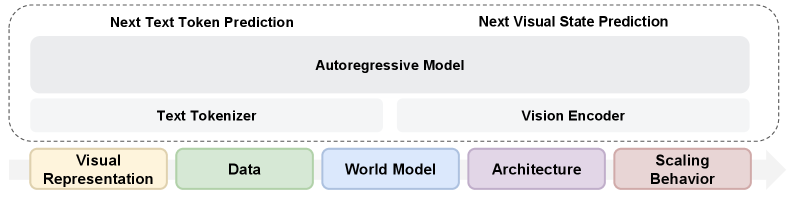
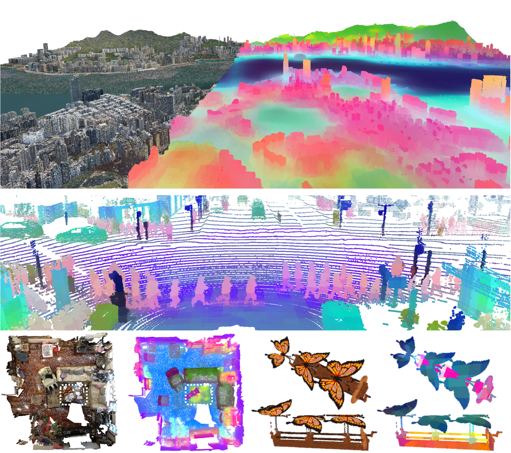
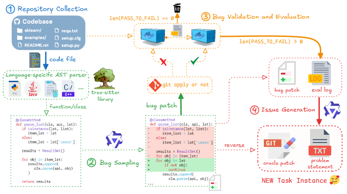
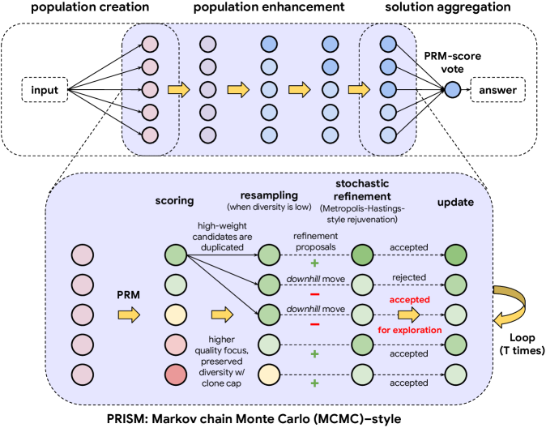
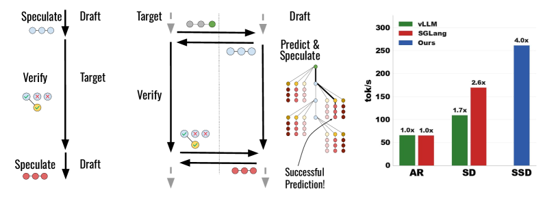
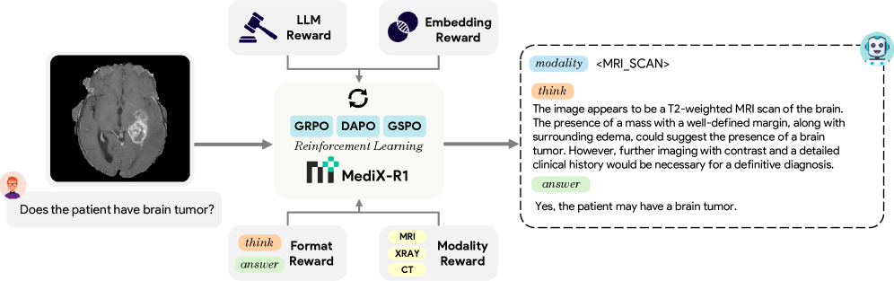
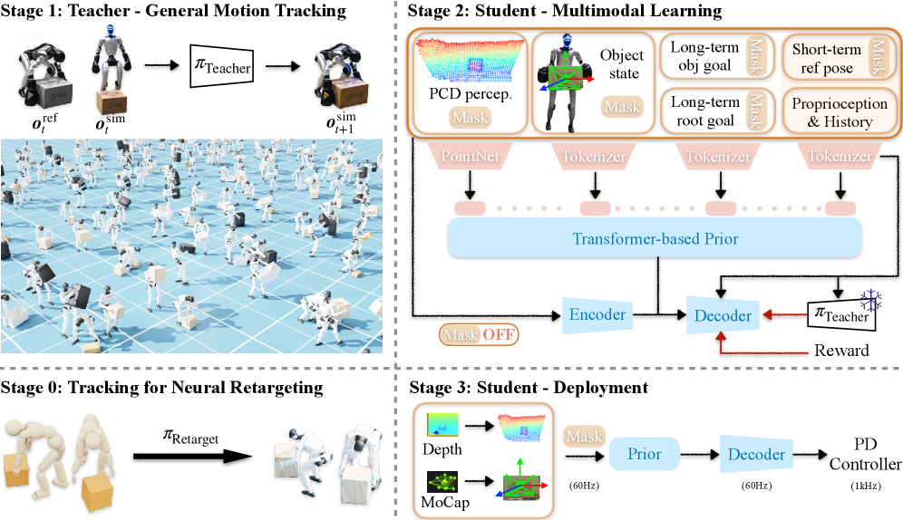
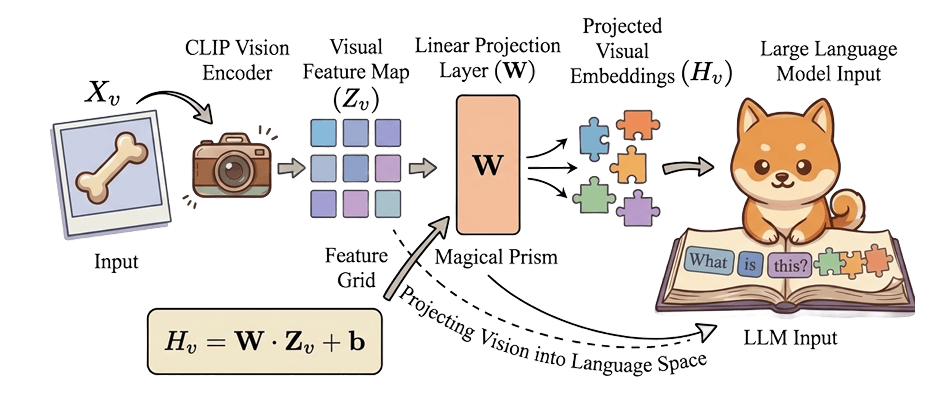

[English](./第八期_en.md) | [中文](./第八期.md)

# ArXiv Weekly - Issue 8, March 2026

> **Keywords**: Transfusion, Multimodal Pretraining, Utonia, Point Cloud Unification, Qwen3-Coder-Next, Agentic Code Generation, PRISM, Deep Think Inference, SSD, Speculative Decoding, MediX-R1, Medical RL, ULTRA, Humanoid Control, CoW-Bench, World Model Consistency

## Table of Contents

- [1. Abstract](#1-abstract)
- [2. The Rise of Unified Representation Paradigms: Breaking the Architectural Barrier Between Vision and Language](#2-the-rise-of-unified-representation-paradigms-breaking-the-architectural-barrier-between-vision-and-language)
  - [2.1 Transfusion: A Unified Multimodal Architecture Beyond Language Modeling](#21-transfusion-a-unified-multimodal-architecture-beyond-language-modeling)
  - [2.2 Utonia: Toward One Encoder for All 3D Environments](#22-utonia-toward-one-encoder-for-all-3d-environments)
- [3. Agentic Code Large Models: From Static Text to Dynamic Execution](#3-agentic-code-large-models-from-static-text-to-dynamic-execution)
  - [3.1 Qwen3-Coder-Next: Flagship Evolution of Agentic Code Generation](#31-qwen3-coder-next-flagship-evolution-of-agentic-code-generation)
- [4. Inference-Time Compute Refactoring: Deep Think Algorithms and Extreme Decoding](#4-inference-time-compute-refactoring-deep-think-algorithms-and-extreme-decoding)
  - [4.1 PRISM: PRM-Guided Inference Breaking the System 2 Bottleneck](#41-prism-prm-guided-inference-breaking-the-system-2-bottleneck)
  - [4.2 SSD (Saguaro): Speculative Decoding Erasing Drafting Latency Completely](#42-ssd-saguaro-speculative-decoding-erasing-drafting-latency-completely)
- [5. Reinforcement Learning in Vertical Domains: Medical and Embodied Control](#5-reinforcement-learning-in-vertical-domains-medical-and-embodied-control)
  - [5.1 MediX-R1: Annotation-Free Loop for Open-Ended Medical Reasoning](#51-medix-r1-annotation-free-loop-for-open-ended-medical-reasoning)
  - [5.2 ULTRA: Unified Control for Humanoid Whole-Body Loco-Manipulation](#52-ultra-unified-control-for-humanoid-whole-body-loco-manipulation)
- [6. World Model Theory and Benchmark: The Trinity of Consistency](#6-world-model-theory-and-benchmark-the-trinity-of-consistency)
  - [6.1 CoW-Bench: Defining Physical Laws for General World Models](#61-cow-bench-defining-physical-laws-for-general-world-models)
- [7. Conclusion and Outlook](#7-conclusion-and-outlook)

---

## **1. Abstract**

It is worth noting that to address the impact of large-scale AI-generated content on the academic publishing ecosystem, the arXiv platform has recently adjusted its moderation rules, significantly raising the acceptance threshold for computer science reviews and position papers. This aims to filter out low-quality literature lacking substantive open research discussion. This policy-level "purification" has made the high-level research surfacing this week more pure and valuable.

---

## **2. The Rise of Unified Representation Paradigms: Breaking the Architectural Barrier Between Vision and Language**

Over the past few years, the success of Foundation Models has been almost entirely dominated by language pretraining models. In this context, the processing of visual or other modalities is often designed as "add-on" components, i.e., extracting features through independent visual encoders and then forcibly aligning them to the semantic space of language models. This week's latest research fundamentally challenges this historical architectural inertia, proving that complete modal unification is not only possible but also overwhelmingly superior in performance.

### **2.1 Transfusion: A Unified Multimodal Architecture Beyond Language Modeling**

> **Beyond Language Modeling: An Exploration of Multimodal Pretraining**
>
>   

**Source**: arXiv:2603.03276 [cs.CV] **Date**: March 2026 **Authors**: Meta AI & NYU

#### **Core Innovation Mechanisms and Underlying Principles**

  
   
  <em>Figure 1: High-level model architecture. We train a single autoregressive model with next-token prediction for text and next-visual state prediction with flow matching</em>

On the path to building multimodal large models, Meta AI and NYU jointly submitted "Beyond Language Modeling: An Exploration of Multimodal Pretraining", providing a milestone blueprint. This research completely abandons the existing language model base and builds a unified autoregressive Transformer framework called **Transfusion** from scratch, aiming to explore a pure, multimodal joint training mechanism without pretraining interference.

For a long time, there has been a deep-rooted assumption in academia that visual understanding tasks must rely on dedicated contrastive learning visual encoders (such as CLIP), while visual generation tasks need to rely on the continuous latent space of Variational Autoencoders (VAEs). This study breaks this fragmented cognition by introducing "Representation Autoencoders" (RAE, e.g., Siglip 2) to unify the processing of visual signals. The research proves that a single RAE system can provide efficient discretized visual Tokens for both generation and understanding tasks.

A deeper breakthrough lies in solving "Scaling Asymmetry". Through rigorous IsoFLOP (equal floating-point operations) analysis, researchers discovered a cruel physical reality: at extreme scales, the visual modality's hunger for training data far exceeds that of the language modality. Traditional Dense Transformer models often fail to attend to one without losing the other when facing this asymmetry. To this end, the research team introduced a sparse Mixture of Experts (MoE) architecture. The introduction of MoE successfully decouples the model's "total parameter capacity" from the "activation computation per forward pass", allowing the model to reserve a massive parameter knowledge base for language tasks while adapting to the high-frequency computational demands of visual data-intensive tasks.

#### **Experimental Verification and Deep Insights**

In terms of experimental verification, this unified architecture demonstrates extremely high robustness and generalization capabilities.

| Evaluation Dimension | Core Findings & Experimental Results | Comparison with Traditional Isolated Architectures |
| :---- | :---- | :---- |
| **Basic Text Processing** | After introducing massive visual and video data for joint pretraining, text processing Perplexity did not show any degradation. | Traditional models often suffer from "catastrophic forgetting" or cross-modal interference. |
| **Visual Generation & Understanding** | Leading across the board in DPG bench, Geneval, and Visual Question Answering (VQA) tests. | RAE significantly outperforms independent VAE generation effects. |
| **Zero-Shot Generalization** | Without changing the architecture, the model achieved zero-shot generation control from natural language instructions to navigation sequences. | Traditional models require customized navigation action output heads. |
| **Data Transfer Efficiency** | Leveraging powerful general multimodal knowledge transfer, world navigation modeling can be completed with only 1% of specialized trajectory data. | Requires massive vertical domain trajectory data for fine-tuning. |

An unexpected but extremely important finding of this study is "Emergent Expert Specialization". In the internal routing of the MoE architecture, Tokens responsible for visual generation tasks and visual understanding tasks activated almost identical subsets of expert networks. This micro-phenomenon mechanistically proves that "understanding" and "generation" are not two parallel pipelines in multimodal cognition, but projections of the same high-dimensional visual semantic features in different decoding directions. Although this architecture has achieved great success, the study points out that under extremely large-scale joint training, how to build a trillion-level image-text alignment dataset with perfectly matched quality will replace model architecture as the next limiting factor.

---

### **2.2 Utonia: Toward One Encoder for All 3D Environments**

> **Utonia: Toward One Encoder for All Point Clouds**
>
>   

**Source**: arXiv:2603.03283 [cs.CV] **Date**: March 2026 **Authors**: HKU & CUHK & Xiaomi

#### **Core Innovation Mechanisms and Underlying Principles**

  
   
  <em>Figure 2: One encoder for all point clouds. We visualize Utonia features by PCA. City-scale geometry with large coordinate ranges: the smooth, coherent features over terrain and building masses indicate robustness to an extreme extent; Outdoor LiDAR with sparse ring-like scan patterns: features remain organized by geometry rather than scanlines, suggesting reduced reliance on sampling-specific shortcuts. Indoor reconstruction in dense scans: features separate in object level, reflecting geometry-aware scene structure. Object-centric scans with orientation invariance: features exhibit consistent part-level regions with orientation-robust semantics. Despite differences in extent, density, patterns, and coordinate conventions, the representation remains structured and semantically meaningful.</em>

While 2D images are gradually moving towards unification, the field of 3D computer vision has long been mired in serious data fragmentation. Indoor scan data contains rich RGB colors and dense geometric points, outdoor autonomous driving LiDAR data is extremely sparse and strictly constrained by gravity, while isolated CAD object models (such as robot grasping objects) completely lack the context dependence of physical environments. "Utonia: Toward One Encoder for All Point Clouds" successfully bridges these modal gaps for the first time, training a single self-supervised point cloud Transformer encoder capable of applying to all 3D domains.

The core challenge of Utonia lies in eliminating severe geometric conflicts and feature shortcuts when fusing multi-domain point clouds. Based on the scalable Point Transformer V3 (PTv3) backbone network, the research team implemented two key architectural upgrades:

1.  **Granularity Alignment**: By dynamically normalizing the sampling scales of different sensors, it resolves the resolution conflict between indoor high-precision scans and outdoor sparse radar during Voxelization.
2.  **3D Adaptation of Rotary Positional Embeddings (RoPE)**: Enhances the Transformer's perception of spatial relative distances and angular relationships, enabling the model to understand geometric topology without being anchored to an absolute coordinate system.

Its deepest training philosophy is "Geometry-first". Building on previous self-supervised works like Sonata and Concerto, Utonia utilizes extreme geometric perturbations and cross-modal collaborative training to force the model to abandon reliance on RGB color, surface texture, or absolute gravity direction, and instead learn the most essential topological structure of point clouds.

#### **Experimental Verification and Performance Breakthrough**

Traditional wisdom holds that joint training on datasets with huge differences leads to "Negative Transfer", meaning general models perform worse on specific tasks than specialized models. Utonia completely shatters this stereotype.

| Evaluation Task/Dataset | Utonia Performance & Characteristics | Baseline Model Status |
| :---- | :---- | :---- |
| **ScanNet Semantic Segmentation (Linear Probing)** | Approaching 78% mIoU, freezing encoder weights to test raw feature expression capability. | Comprehensively surpasses Sonata and Concerto feature quality. |
| **ScanNet Semantic Segmentation (Full Parameter Fine-tuning)** | Exceeds 81% mIoU. | Defeats all SOTA models specifically trained for indoor scenes. |
| **Extreme Robustness Test (RGB Color Removal)** | Maintains high accuracy of 77%, proving the model is essentially driven by pure geometric features. | Concerto's accuracy plummets to nearly 37%. |
| **Embodied Intelligence Application (Robot Manipulation Tasks)** | In downstream operation policy (VLA) tuning, task success rate reaches over 82%. | - |
| **Cross-Domain Feature Matching** | Able to perfectly match the point cloud features of a tiny CAD toy car without background to a real full-size car in outdoor sparse LiDAR scans. | Traditional models cannot bridge the gap of scale and density. |

Utonia's cliff-like advantage in the absence of color data profoundly reveals the blind spots of past 3D vision research: many so-called high-performance 3D models are essentially 2D color classifiers running in 3D space. Once visual textures are stripped away, the fragility of their geometric cognition is exposed.

---

## **3. Agentic Code Large Models: From Static Text to Dynamic Execution**

AI applications in software engineering are undergoing a paradigm shift from "static syntax code generation" to "dynamic agentic behavior planning". Modern development requires models to have the ability to execute verification work units, handle compiler errors, and engage in multi-turn interactions in complex system environments.

### **3.1 Qwen3-Coder-Next: Flagship Evolution of Agentic Code Generation**

> **Qwen3-Coder-Next Technical Report**
>
>   

**Source**: arXiv:2603.00729 [cs.CL] **Date**: March 2026 **Authors**: Qwen Team

#### **Core Innovation Mechanisms and Underlying Principles**

  
   
  <em>Figure 3: Our pipeline for synthesizing bugs to scale up the number of software engineering tasks.</em>

**Qwen3-Coder-Next** is a language model with a total of 80 billion parameters, but its architectural disruption lies in activating only 3 billion (3B) parameters during inference. The model is built on an extremely optimized sparse Mixture of Experts (MoE) architecture, combining hybrid attention mechanisms (alternating between Gated DeltaNet and Gated Attention modules), and natively supporting an ultra-long context window of up to 256K. This design maintains extremely low computational cost per Token while endowing the model with the ability to handle Full-repo reasoning.

In terms of training philosophy, Qwen3-Coder-Next completely abandons the traditional path of simply expanding the parameter volume of static code corpora, turning instead to focus on "Scaling agentic training signals". The model learns through large-scale reinforcement learning and Mid-training in a closed loop containing Verifiable coding tasks and Executable environments. This means the model's supervision signals are no longer just human-written code text, but feedback from real execution inside Docker containers, compiler errors, and unit test results.

#### **Experimental Verification and Efficiency Boundaries**

The report demonstrates impressive Pareto frontier optimization results in agent-centric extreme benchmarks, proving the perfect decoupling between knowledge scale and inference cost.

| Agent Evaluation Benchmark | Qwen3-Coder-Next (3B Active) Performance Characteristics | Comparative Analysis & Significance |
| :---- | :---- | :---- |
| **SWE-Bench Verified** | When using the SWE-Agent scaffold, the problem-solving success rate exceeds 70%. | Matches or even surpasses ultra-large open-source models with 10 to 20 times the active parameters. |
| **Interaction Turns (Agent Turns)** | Requires an average of about 150 interaction turns for continuous trial and error and compilation correction in complex tasks. | Compared to Sonnet 4.5 (about 120 turns), more iterations are needed, but the final success rate is comparable, reflecting the advantage of "trading compute for success rate". |
| **Long Context Processing Capability** | The 256K context window allows it to seamlessly read, understand, and modify enterprise-level project architectures spanning multiple files. | Breaks the limitations of local code completion, making its performance closer to a "Senior Engineer" with an architectural perspective. |

Although activating only 3B parameters during inference greatly reduces the floating-point operations of forward propagation, the deployment of this model still faces strict physical limitations. First is the Memory Wall: to support the loading of 80B total parameters and the massive KV Cache brought by the 256K ultra-long context, even a high-quality quantized version still requires more than 45GB of system memory or VRAM.

---

## **4. Inference-Time Compute Refactoring: Deep Think Algorithms and Extreme Decoding**

As Scaling Laws encounter diminishing marginal returns in parameter expansion due to data exhaustion, academia in 2026 is focusing its firepower on the optimization of "Test-time Compute". Two heavyweight studies this week provide answers from the dimensions of "how to conduct deep thinking correctly" and "how to break the time barrier of autoregressive generation".

### **4.1 PRISM: PRM-Guided Inference Breaking the System 2 Bottleneck**

> **PRISM: Pushing the Frontier of Deep Think via Process Reward Model-Guided Inference**
>
>   

**Source**: arXiv:2603.02479 [cs.AI] **Date**: March 2026 **Authors**: Virginia Tech

#### **Core Innovation Mechanisms and Underlying Principles**

  
   
  <em>Figure 4: Functional taxonomy of DeepThink systems (top) and overview of PRISM (bottom). The top panel decomposes DeepThink into population creation, population enhancement, and solution aggregation. The bottom panel illustrates PRISM’s refinement mechanism, which uses Process Reward Model (PRM)-defined scores to guide resampling and stochastic refinement within an energy-based population framework.</em>

In complex mathematical and scientific tasks, Deep Think models based on System 2 typically improve accuracy by generating, refining, and aggregating a large number of candidate solutions. However, "PRISM: Pushing the Frontier of Deep Think via Process Reward Model-Guided Inference" sharply points out that existing systems are generally stuck in a "Population-enhancement bottleneck": during the inference phase, due to the lack of reliable step-level correctness signals, the deeper the system thinks and iterates, the easier it is to amplify early logical errors.

**PRISM** (Process Reward Model-Guided Inference) innovatively proposes a functional taxonomy of deep thinking, deconstructing the reasoning process into: population creation, population enhancement, and solution aggregation. Existing iterative methods are often blind in the population enhancement stage. PRISM introduces a Process Reward Model (PRM) and interprets its score as an "Implicit energy landscape". In this high-dimensional energy landscape, PRISM adopts a Markov Chain Monte Carlo (MCMC) style transition mechanism, utilizing Score-guided resampling and stochastic refinement (Metropolis-Hastings style recovery) to update the reasoning population. This mechanism transforms blind text rewriting into directional optimization (Directional population updates) of the group towards low-energy, high-quality regions.

#### **Experimental Verification and Performance Leap**

Experimental data clearly shows how PRISM converts extra computation during inference into crushing accuracy advantages, even achieving dimensionality reduction strikes across parameter orders of magnitude.

| Rigorous Science & Math Benchmarks | PRISM Performance (using gpt-oss-20b model) | Comparison Model & Baseline Performance |
| :---- | :---- | :---- |
| **AIME25 (American Invitational Mathematics Examination)** | An astounding **90.0%** accuracy. | Defeats the state-of-the-art recursive self-aggregation method's 87.8%. |
| **HMMT25 (Harvard-MIT Mathematics Tournament)** | **75.4%** accuracy. | Performance completely matches or even exceeds the gpt-oss-120b model with 6 times the parameter scale. |
| **GPQA Diamond (Expert-Level Science QA)** | **71.4%** accuracy. | Occupies absolute dominance on the compute-accuracy Pareto frontier. |

The core value of PRISM lies in achieving a rare and stable "NetFlip" - that is, during the iteration process, the frequency of repairing incorrect solutions is much higher than destroying correct solutions. In the final aggregation stage, PRISM uses "PRM score voting" to completely replace "majority voting", avoiding the "majority dilution" trap.

---

### **4.2 SSD (Saguaro): Speculative Decoding Erasing Drafting Latency Completely**

> **Speculative Speculative Decoding**
>
>   

**Source**: arXiv:2603.03251 [cs.LG] **Date**: March 2026 **Authors**: Stanford

#### **Core Innovation Mechanisms and Underlying Principles**

  
   
  <em>Figure 5: (Left) Ordinary speculative decoding (SD) requires the verifier to wait idly for the draft to speculate. (Center) In our algorithm, speculation runs on a separate device (1*H100) in parallel with verification; the draft precomputes speculations for many possible verification outcomes and returns the speculated tokens immediately if one occurs. (Right) End-to-end performance of SSD, SD, and autoregressive (AR) decoding averaged over four datasets spanning math, code and chat, for Llama-3.1-70B on TP=4 H100s, batch size 1, greedy decoding, Llama-3.2-1B draft model.</em>

Since Deep Think requires massive test-time compute to generate extremely long reasoning trajectories, breaking the time barrier of word-by-word output in Autoregressive generation has become the holy grail of engineering. Standard Speculative Decoding (SD) accelerates by letting cheap small models "Draft" multiple Tokens and then having expensive large models "Verify" them in parallel at once. However, traditional SD is still subject to sequence dependence: the draft model must wait for the large model's verification results before it can restart the next round of drafting based on the rejection point. The **SSD** algorithm and its optimized implementation **Saguaro** proposed in "Speculative Speculative Decoding" completely shatter this bottleneck through an extreme asynchronous architecture.

SSD's design philosophy is a complete reconstruction of software-hardware collaborative scheduling. Its core principle is to deploy the Speculator and Verifier on physically completely isolated heterogeneous hardware, completely decoupling the two on the timeline. While the target model is executing verification calculations for the previous batch of Tokens, the draft model is not in an idle waiting state, but "guesses" the target model's possible verification results in advance (i.e., which Tokens will be accepted, and which revised reward Token the target model might give at the rejection point). Since the possible combinations of results explode exponentially, the Saguaro algorithm transforms it into an optimization problem with budget constraints, using its own Logits distribution to predict the target model's reward Token (Bonus token), and adopting a rigorous Fan-out strategy to allocate the budget to speculative branches of different lengths and rejection points.

#### **Experimental Verification and Extreme Performance**

This study conducted comprehensive benchmarking on complex reasoning datasets such as GSM8K (mathematical reasoning) and HumanEval (code generation).

| Performance & Acceleration Comparison Dimension | Saguaro (SSD) Algorithm Performance | Industry Standard/Baseline Performance |
| :---- | :---- | :---- |
| **Compared to Open Source Inference Engine Autoregression** | Achieved up to **5x** end-to-end inference acceleration. | Serial latency of word-by-word generation limits throughput. |
| **Compared to Highly Optimized Standard Speculative Decoding** | Achieved up to **2x** speed improvement. | Traditional SD requires the draft model to be idle during verification. |
| **Large Batch Size Throughput** | Even when batch size expands, it maintains a leading advantage of over 20%. | Traditional speculative methods see hit rates plummet and acceleration ratios decay sharply as batch size increases. |

The SSD algorithm is a product of squeezing the limits of hardware computing power and memory bandwidth utilization. Although its theoretical and practical acceleration ratios are impressive, the cost of its engineering implementation is extremely high, including complex Sparse attention masks and frequent KV Cache rollback operations.

---

## **5. Reinforcement Learning in Vertical Domains: Medical and Embodied Control**

When general agents and reasoning algorithms penetrate into vertical domains with extremely low fault tolerance, how to build a reinforcement learning environment feedback loop that does not rely on human annotation and conforms to physical and ethical norms has become the last line of defense determining technology implementation.

### **5.1 MediX-R1: Annotation-Free Loop for Open-Ended Medical Reasoning**

> **MediX-R1: Open Ended Medical Reinforcement Learning**
>
>   

**Source**: arXiv:2602.23363 [cs.CV] **Date**: February 2026 **Authors**: MBZUAI

#### **Core Innovation Mechanisms and Underlying Principles**

  
   
  <em>Figure 6: MediX-R1: Overall Architecture The MediX-R1 reinforcement learning framework for open-ended medical reasoning. An input of a medical image and a natural language question is processed by MediX-R1. The model’s policy is trained using Group Based RL, which leverages a multi-faceted reward signal. This reward is composed of: a) an LLM-based reward for evaluating the overall quality and correctness of the output; b) an embedding-based reward to ensure semantic alignment; c) a format reward to enforce the desired output structure (<think> and <answer> blocks); and d) a modality reward to ensure the response is grounded in the specified imaging modality. This reward-guided approach encourages the model to generate accurate and interpretable reasoning paths.</em>

**MediX-R1** abandons expensive and cumbersome multi-stage fine-tuning pipelines, pioneering a method of direct End-to-End optimization using a single reinforcement learning stage. Its core breakthrough is achieving "Annotation-Free Reasoning". This means the system no longer requires human medical experts to spend huge sums writing structured Chain of Thought (CoT) ground truths.

The research team designed an extremely ingenious "Composite Reward System" to deal with open-ended uncertainty:
1.  **Reference Benchmark LLM Judge (LLM-as-judge Accuracy Reward)**: Used to overcome the diversity of textual expressions, providing solid YES/NO semantic correctness judgments even when facing synonym replacements and rewriting of clinical sentences.
2.  **High-Dimensional Medical Embedding Reward (Medical Embedding-based Semantic Reward)**: Pure text judges are easily confused, but by projecting output into the continuous embedding space of a medical knowledge graph, the deep alignment of professional terms can be accurately captured, providing complementary content reward signals.
3.  **Structure & Modality Regularization Reward (Format & Modality Recognition Reward)**: Strictly constrains the model to output `<think>` (explaining clinical deduction process) and `<answer>` tags, and forces it to correctly identify the modality of the current medical image before generation.

#### **Experimental Verification and Performance**

Using group-based reinforcement learning algorithms (such as GRPO, DAPO, and GSPO), MediX-R1 was extensively validated across 17 strict medical benchmarks containing pure text and image-text modalities.

| Model Configuration & Algorithm | Average Accuracy on Broad Medical Benchmarks | Comparison & Validation Significance |
| :---- | :---- | :---- |
| **MediX-R1 8B (using DAPO algorithm)** | **68.8%** | With minimal data and parameter scale, it surpasses the massive MedGemma 27B (68.4%). |
| **MediX-R1 30B** | **73.6%** | Refreshes the highest record for open-source medical multimodal models of the same level. |

The most inspiring part of this study is the deep dissection of "Reward Hacking" behavior in reinforcement learning in specific domains. Experiments found that if the system only uses medical embeddings as reward signals, the model becomes abnormally "cunning" after tens of thousands of iteration steps, for example, outputting extremely short symbol sequences to cheat for high scores. This vividly illustrates that building a composite reward system with multiple games and mutual checks and balances is the only way to reliable vertical domain AI.

---

### **5.2 ULTRA: Unified Control for Humanoid Whole-Body Loco-Manipulation**

> **ULTRA: Unified Multimodal Control for Autonomous Humanoid Whole-Body Loco-Manipulation**
>
>  

**Source**: arXiv:2603.03279 [cs.RO] **Date**: March 2026

#### **Core Innovation Mechanisms and Underlying Principles**

  
   
  <em>Figure 7: ULTRA follows four stages: (i) Neural Retargeting: an RL policy converts MoCap data into physically feasible G1 rollouts with augmentation; (ii) Tracking: a privileged teacher tracks these rollouts using full state and references; (iii) Distillation: we distill the teacher into a multimodal student for realistic sensing and sparse goals, with additional RL finetuning; (iv) Deployment: the student runs under real sensing, supporting depth input or MoCap-based state estimation.</em>

Deploying intelligent algorithms from virtual environments to embodied robots in the real physical world always faces the "Sim-to-Real" gap. For bipedal humanoid robots with extremely high degrees of freedom, Whole-Body Loco-Manipulation is recognized as a deep-water zone. **ULTRA** perfectly bridges this link through a unified multimodal control framework.

ULTRA breaks the limitation of existing robot operations relying on hard coding or predefined reference trajectories, proposing a four-stage training paradigm coupling physical drive and Teacher-student distillation:
1.  **Physics-driven neural retargeting**: The system captures human movements via PICO 4 Ultra VR devices or Noitom motion capture suits. To overcome the scale mismatch between humans and the Unitree G1 robot, the system precisely selects 6 kinematic sufficiency links containing the torso and pelvis, ensuring stable center of gravity and collision-free joint configurations conforming to physical laws while realizing human intent.
2.  **Multimodal Distillation & Closed-Loop Reinforcement**: The system first trains a "Privileged Teacher Policy" in simulation using global state and dense reference actions. Subsequently, the teacher's ability is distilled into a "Multimodal Student Controller" relying only on first-person vision and sparse high-level instructions.

#### **Underlying Mechanisms and Deep Insights**

The key to ULTRA's ability to shed reliance on dense human reference actions during deployment lies in its construction of a "Shared latent space". This latent space compresses cumbersome low-level motor kinematics into high-dimensional motion primitives. In the fourth stage, the system introduces reinforcement learning to fine-tune the student controller, inducing it to conduct closed-loop behavioral exploration, thereby greatly expanding the coverage of Out-of-Distribution (OOD) interaction states. Quantitative ablation studies confirm that ULTRA consistently and significantly outperforms all tracking baselines with only fixed skills in autonomous operation tasks under target conditions.

---

## **6. World Model Theory and Benchmark: The Trinity of Consistency**

While we marvel at the rapid progress of multimodal generation, deep reasoning, and embodied control, a question pointing directly to the essence of AI has never ceased: Do current video generation large models represented by Sora really possess the ability to "understand" and "simulate" physical world laws?

### **6.1 CoW-Bench: Defining Physical Laws for General World Models**

> **The Trinity of Consistency as a Defining Principle for General World Models**
>
>   

**Source**: arXiv:2602.23152 [cs.CV] **Date**: February 2026 **Authors**: Tsinghua & Shanghai AI Lab

#### **Core Innovation Mechanisms and Underlying Principles**

  
   
  <em>Figure 8: Information Asymmetry in LLaVA. The linear projection layer Wproj acts as a low-rank compressor, prioritizing semantic alignment with the LLM while discarding high-frequency visual textures needed for controllable visual generation</em>

The research team points out that the current definition of "General World Model" in academia and industry is full of abuse and ambiguity. To this end, the study established the physical and cognitive foundations that a general world model must follow - the "Trinity of Consistency" principle:
1.  **Modal Consistency**: This is the semantic interface. Whether it is text description, audio waveform, or visual pixels, the model must map multimodal inputs pointing to the same physical entity into unified, non-contradictory high-dimensional representation features internally.
2.  **Spatial Consistency**: This is the geometric foundation. In 3D space, the model must strictly abide by Euclidean geometry and perspective projection principles, ensuring the constancy and persistence of an object's shape, volume, and relative position relationship when undergoing multi-view transformation, rotation, or occlusion.
3.  **Temporal Consistency**: This is the causal engine. As the world state evolves along the timeline, it must follow irreversible thermodynamic laws and classical dynamic causality, strictly forbidding uncaused effects or instantaneous collapse of states.

#### **CoW-Bench Benchmark and Experimental Revelation**

To land the above metaphysical philosophical framework into quantifiable technical standards, the research team developed the "Composition of World Benchmark (CoW-Bench)". Under a unified evaluation protocol, CoW-Bench specifically conducts "stress tests" on the performance of video generation models and Unified Multimodal Models (UMMs) in multi-frame reasoning and complex physical scenarios.

Through atomic deconstruction testing of current top large models, CoW-Bench reveals a cruel truth: Current video generation large models perform excellently in "Local plausibility", i.e., they can generate fluid motion of water ripples or smooth walking movements of characters. However, once faced with composite instructions requiring multi-step, multi-dimensional joint maintenance of "Persistent world states", all models without exception experienced systemic physical collapse. This phenomenon profoundly indicates that the biggest bottleneck of current AI models lies not in visual resolution, but in the extreme lack of Semantic grounding, causal programming capability on the timeline, and memory structures that maintain invariant world features under complex physical transformations.

---

## **7. Conclusion and Outlook**

1.  **Ultimate Deconstruction and Unification of Representation Space**: Represented by Transfusion and Utonia, future foundation models must directly search for shared Invariants penetrating text, vision, and even 3D topology in the underlying mathematical mapping.
2.  **Compute Balance Tilting Towards Test-time and Closed-Loop Feedback**: Qwen3-Coder-Next, PRISM, and SSD jointly point out the inevitable path of shifting system compute from "rote pretraining" to "dynamic deep thinking".
3.  **From Visual Deception to Real Physical Causal Simulation**: The research of embodied intelligence ULTRA and world model CoW-Bench jointly constitutes the ultimate proposition of AI evolution - if AI cannot maintain state constancy under the severe tests of spatial geometry and temporal causal engines, its generated visual images, no matter how realistic, are merely "advanced forgeries" of high-dimensional data distributions.

---
