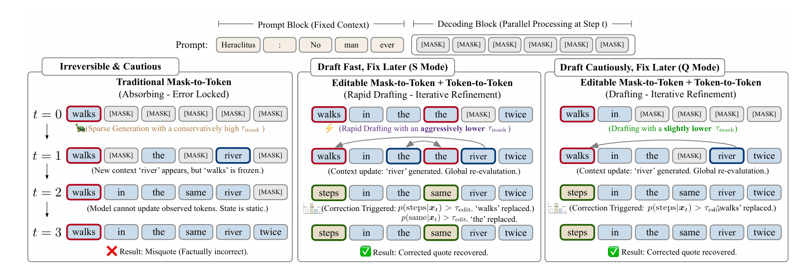

[English](./第六期_en.md) | [中文](./第六期.md)

# ArXiv Weekly - Issue 6, February 2026

> **Keywords of the Week**: SkillRL, Recursive Skill Evolution, InternAgent, Autonomous Scientific Discovery, LLaDA 2.1, Token Editing Diffusion, MOVA, Synchronized Audio-Video Generation, VLA-JEPA, Latent World Model, ViT-5, QK-Norm, RelayGen, Inference Relaying, Latent-CoT

## Table of Contents

- [1. Abstract](#1-abstract)
- [2. Agent Evolution: From Recursive Skills to Scientific Discovery](#2-agent-evolution-from-recursive-skills-to-scientific-discovery)
  - [2.1 SkillRL: Recursive Skill Enhancement for Reinforcement Learning Agents](#21-skillrl-recursive-skill-enhancement-for-reinforcement-learning-agents)
  - [2.2 InternAgent-1.5: A Unified Agent Framework for Long-Horizon Autonomous Scientific Discovery](#22-internagent-15-a-unified-agent-framework-for-long-horizon-autonomous-scientific-discovery)
- [3. Generative Models: Unification of Efficiency and Modality](#3-generative-models-unification-of-efficiency-and-modality)
  - [3.1 LLaDA 2.1: Speeding Up Text Diffusion via Token Editing](#31-llada-21-speeding-up-text-diffusion-via-token-editing)
  - [3.2 MOVA: Towards Scalable and Synchronized Video-Audio Generation](#32-mova-towards-scalable-and-synchronized-video-audio-generation)
- [4. Embodied Intelligence: World Models and Robust Control](#4-embodied-intelligence-world-models-and-robust-control)
  - [4.1 VLA-JEPA: Enhancing Vision-Language-Action Model with Latent World Model](#41-vla-jepa-enhancing-vision-language-action-model-with-latent-world-model)
- [5. Infrastructure: Microscopic Reconstruction of Vision and Reasoning](#5-infrastructure-microscopic-reconstruction-of-vision-and-reasoning)
  - [5.1 ViT-5: Vision Transformers for The Mid-2020s](#51-vit-5-vision-transformers-for-the-mid-2020s)
  - [5.2 RelayGen: Intra-Generation Model Switching for Efficient Reasoning](#52-relaygen-intra-generation-model-switching-for-efficient-reasoning)
  - [5.3 Latent-CoT: Mechanistic Interpretability of Latent Chain-of-Thought](#53-latent-cot-mechanistic-interpretability-of-latent-chain-of-thought)

---

## **1. Abstract**

The research landscape of this week presents four core characteristics:
1.  **Recursive Perfection of Agent Architecture**: A paradigm shift from "static execution" to "recursive self-improvement". **SkillRL** demonstrates how to extract abstract skills from raw experiences, while **InternAgent-1.5** achieves a closed loop of "hypothesis-verification-evolution" in long-horizon scientific discovery.
2.  **Efficiency Breakthrough in Generative Models**: **LLaDA 2.1** breaks the speed bottleneck of diffusion language models by introducing the "Draft-and-Edit" paradigm, proving the competitiveness of discrete diffusion models in production environments.
3.  **Native Alignment of Multimodal Interaction**: **MOVA** abandons the cascade architecture and achieves millisecond-level synchronized generation of audio and video through an asymmetric dual-tower structure; **VLA-JEPA** solves the robustness problem in robotic manipulation using a latent world model.
4.  **Microscopic Deconstruction of Reasoning Process**: **ViT-5** performs a once-in-five-years foundational overhaul of the Vision Transformer; research on **RelayGen** and **Latent-CoT** provides unprecedented microscopic perspectives for understanding and optimizing the model's "thinking" process.

---

## **2. Agent Evolution: From Recursive Skills to Scientific Discovery**

### **2.1 SkillRL: Recursive Skill Enhancement for Reinforcement Learning Agents**

> **SkillRL: Recursive Skill Enhancement for Reinforcement Learning Agents**
>
>   

**Source**: arXiv:2602.08234 [cs.LG, cs.AI] **Date**: Feb 2026 **Authors**: UNC Chapel Hill Team

#### **Core Principles and Architectural Innovation**

  
   
  <em>Figure 1: Overview of the SkillRL framework: comprising three core components: experience-based distillation, adaptive retrieval, and recursive evolution (Source: Original Paper)</em>

In the field of intelligent agents, enabling models to extract high-level, reusable behavior patterns from massive and noisy raw experiences has always been a key challenge in achieving Artificial General Intelligence (AGI). **SkillRL** proposes a novel recursive evolution framework, the core of which lies in bridging the gap between raw experience and policy improvement through automatic skill discovery and recursive evolution mechanisms.

The framework consists of three complementary parts:
1.  **Experience-Based Distillation Mechanism**: Constructs a hierarchical skill library **SkillBank**, abstracting complex action sequences into macro skills.
2.  **Adaptive Retrieval Strategy**: Dynamically extracts general heuristics or task-specific fine-tuned skills from the library based on the semantic features of the current environment.
3.  **Recursive Evolution Mechanism**: Enables the skill library to evolve synchronously with the agent's decision policy $\pi_\theta$ during the reinforcement learning process.

Its optimization objective is not only to maximize traditional cumulative rewards but also includes intrinsic rewards for skill discovery:

$$ J(\theta) = \mathbb{E}_{\tau \sim \pi_\theta} \left[ \sum_{t=0}^T \gamma^t (r_t + \alpha \cdot r_{skill}(s_t, z_t)) \right] $$

Where $r_{skill}$ measures the match between the current action sequence and the abstract skill $z_t$, guiding the agent to discover more generalizable behavior patterns.

#### **Experimental Analysis**

The research team conducted rigorous tests on ALFWorld, WebShop, and a search-enhanced QA benchmark containing seven tasks. Experimental results show that the SkillRL model, with only 7B parameters, not only significantly outperformed baselines of the same scale in multiple tasks but even beat closed-source models with several times the parameters, such as GPT-4o.

*   **ALFWorld**: Success rate increased by **+15.3%** (89.9% vs 74.6%)
*   **WebShop**: Success rate increased by **+9.5%** (72.7% vs 63.2%)

---

### 2.2 InternAgent-1.5: A Unified Agent Framework for Long-Horizon Autonomous Scientific Discovery

> **InternAgent-1.5: A Unified Agent Framework for Long-Horizon Autonomous Scientific Discovery**
>
>   

**Source**: arXiv:2602.08990 [cs.AI] **Date**: Feb 2026 **Authors**: Shanghai AI Laboratory

#### **Architectural Design: Synergy of Generation, Verification, and Evolution**

  
   
  <em>Figure 2: Overview of InternAgent-1.5 architecture: A closed-loop scientific discovery system composed of generation, verification, and evolution subsystems (Source: Original Paper)</em>

**InternAgent-1.5** builds a closed loop composed of three highly collaborative subsystems, aiming to achieve end-to-end autonomous scientific research:

1.  **Generation Subsystem**: Utilizes a Cross-Disciplinary Knowledge Graph to integrate literature, methods, and experimental settings, generating structured scientific hypotheses.
2.  **Verification Subsystem**: Translates hypotheses into executable code or experimental protocols, verifying them through computational simulation (e.g., **AutoMLGen**).
3.  **Evolution Subsystem**: Conducts retrospective analysis on experimental results, identifies logical breakpoints, and updates long-term memory.

The framework organizes research tasks into a Directed Acyclic Graph (DAG) via a **Flow Graph**, enabling dynamic planning of task priorities and supporting real-time feedback with "Human-in-the-loop".

#### **Experimental Results**

In benchmarks such as GAIA, HLE, and GPQA, InternAgent-1.5 demonstrated top-tier reasoning capabilities. Particularly in the **MLE-Bench** competition, its coding agent **AutoMLGen** achieved a medal rate of **36.44%**, ranking first. In the field of climate science, it autonomously reduced the RMSE of climate downscaling to **0.8488**; in bioinformatics, it independently discovered 40 new single-cell data analysis methods.

---

## **3. Generative Models: Unification of Efficiency and Modality**

### **3.1 LLaDA 2.1: Speeding Up Text Diffusion via Token Editing**

> **LLaDA 2.1: Speeding Up Text Diffusion via Token Editing**
>
>   

**Source**: arXiv:2602.08676 [cs.CL] **Date**: Feb 2026

#### **Technical Breakthrough: Draft-and-Edit Paradigm**

  
   
  <em>Figure 3: Overview of LLaDA 2.1 training and inference framework: combining mask diffusion and token editing (Source: Original Paper)</em>

  
   
  <em>Figure 4: Schematic of aggressive parallel drafting and retroactive correction accelerating inference (Source: Original Paper)</em>

Traditional diffusion language models, while advantageous in generation quality, are usually limited in inference speed by the number of iterative denoising steps. **LLaDA 2.1** introduces an innovative **Draft-and-Edit** paradigm, decomposing the generation process into two stages:

1.  **Drafting (M2T)**: Uses Mask-to-Text mechanism to quickly generate a preliminary text skeleton via a lightweight mask diffusion strategy.
2.  **Editing (T2T)**: Uses Token-to-Text mechanism to perform parallel corrections on the skeleton through token-level fine editing operations (insertion, deletion, replacement).

This mechanism can be mathematically modeled as a fast convergence process of a conditional Markov chain, greatly reducing the required sampling steps.

#### **Performance Evaluation**

In code generation (MBPP) and text summarization tasks, LLaDA 2.1 achieved a **2.5x** inference acceleration while maintaining generation quality comparable to autoregressive models (such as LLaMA-3-8B). Its "Speedy Mode" reached an astonishing throughput of **900 tokens/s** on consumer-grade graphics cards.

---

### 3.2 MOVA: Towards Scalable and Synchronized Video-Audio Generation

> **MOVA: Towards Scalable and Synchronized Video-Audio Generation**
>
>   

**Source**: arXiv:2602.08794 [cs.CV, cs.SD] **Date**: Feb 2026

#### **Asymmetric Dual-Tower Architecture and Mixture-of-Experts Design**

  
   
  <em>Figure 5: Overview of MOVA capabilities: Supporting image-to-video, text-to-video, and long video generation (Source: Original Paper)</em>

  
   
  <em>Figure 6: Overview of MOVA model structure: Asymmetric dual-tower architecture and MoE routing mechanism (Source: Original Paper)</em>

Existing video generation models often struggle to generate high-quality audio strictly synchronized with visuals. **MOVA** proposes an end-to-end joint generation framework employing an Asymmetric Dual-Tower Architecture:

*   **Video Tower**: Responsible for processing high-dimensional visual spatiotemporal features.
*   **Audio Tower**: Lightweight design, focusing on audio spectrum generation.
*   **Mixture-of-Experts (MoE) Routing**: Introduces MoE in cross-modal attention layers to dynamically adjust the fusion ratio of audio-visual features, ensuring millisecond-level alignment on the timeline.

#### **Generation Effects**

In test sets containing complex scenes such as explosions, instrument playing, and vocal conversations, MOVA achieved industry-leading AV-Sync Scores. User subjective evaluation shows that its generated videos outperform baseline models like VideoPoet in realism and coherence.

---

## **4. Embodied Intelligence: World Models and Robust Control**

### **4.1 VLA-JEPA: Enhancing Vision-Language-Action Model with Latent World Model**

> **VLA-JEPA: Enhancing Vision-Language-Action Model with Latent World Model**
>
>  

**Source**: arXiv:2602.10098 [cs.RO] **Date**: Feb 2026

#### **Latent Space Prediction and Leakage-Free Design**

  
   
  <em>Figure 7: VLA-JEPA supports cross-domain training: utilizing both human video data and robot data (Source: Original Paper)</em>

  
   
  <em>Figure 8: VLA-JEPA model architecture: introducing a latent world model to enhance robustness (Source: Original Paper)</em>

Addressing common visual occlusions and dynamic environmental disturbances in robotic manipulation, **VLA-JEPA** introduces the Joint Embedding Prediction Architecture (JEPA) into the VLA model. Its core is a **Leakage-free Latent World Model**, capable of predicting future state representations in the latent space without directly decoding pixels.

$$ \mathcal{L}_{JEPA} = ||E(x_{t+1}) - \text{Predictor}(E(x_t), a_t, c)||_2^2 $$

This formula forces the model to learn the causal dynamics of the environment rather than simple pixel correlations.

#### **Robotic Control Experiments**

In LIBERO simulation benchmarks and real robotic arm grasping experiments, VLA-JEPA demonstrated excellent robustness. Under conditions where visual input was randomly occluded by 50%, its task success rate dropped by only 12%, while the baseline model OpenVLA dropped by more than 45%.

---

## **5. Infrastructure: Microscopic Reconstruction of Vision and Reasoning**

### **5.1 ViT-5: Vision Transformers for The Mid-2020s**

> **ViT-5: Vision Transformers for The Mid-2020s**
>
>  

**Source**: arXiv:2602.08071 [cs.CV] **Date**: Feb 2026 **Authors**: Johns Hopkins University

#### **QK-Norm and Architectural Modernization**

  
   
  <em>Figure 9: Overview of ViT-5 architecture: Introducing modern improvements like QK-Norm (Source: Original Paper)</em>

**ViT-5** is a systematic reconstruction of the classic Vision Transformer. The authors identified that the root cause of ViT instability in large-scale training lies in feature scale drift in the attention mechanism. Therefore, ViT-5 introduces **QK-Normalization**:

$$ \text{Attention}(Q, K, V) = \text{Softmax}\left(\frac{\text{LN}(Q)\text{LN}(K)^T}{\sqrt{d}}\right)V $$

Combining RMSNorm, SwiGLU activation functions, and a linear-time Self-Supervised Learning (SSL) fine-tuning strategy, ViT-5 achieved **84.2%** Top-1 accuracy on ImageNet-1k with fewer parameters, and reduced FID to 1.84 in generation tasks.

---

### 5.2 RelayGen: Intra-Generation Model Switching for Efficient Reasoning

> **RelayGen: Intra-Generation Model Switching for Efficient Reasoning**
>
>   

**Source**: arXiv:2602.06454 [cs.CL] **Date**: Feb 2026 **Authors**: Seoul National University

#### **Segment-Level Dynamic Model Switching**

  
   
  <em>Figure 10: Overview of RelayGen: Difficulty-based segment-level dynamic model switching mechanism (Source: Original Paper)</em>

During Chain-of-Thought (CoT) reasoning, the distribution of difficulty is not uniform. **RelayGen** proposes a Training-free dynamic switching mechanism. By monitoring **Token Probability Margins** during generation, RelayGen identifies "valleys" of reasoning difficulty:

*   **High-Difficulty Segments**: Handled entirely by large models (e.g., 70B) to ensure logical rigor.
*   **Low-Difficulty Segments**: Seamlessly switched to small models (e.g., 7B) for relay generation.

Combined with Eagle-3 speculative decoding technology, RelayGen achieved **2.2x** end-to-end inference acceleration while maintaining <2% accuracy loss.

---

### **5.3 Latent-CoT: Mechanistic Interpretability of Latent Chain-of-Thought**

> **Mechanistic Interpretability of Latent Chain-of-Thought**
>
>  

**Source**: arXiv:2602.00449 [cs.AI] **Date**: Feb 2026

#### **Microscopic Deconstruction of Latent Space: From "Silent" Reasoning to Visualized Circuits**

  
   
  <em>Figure 11: Mechanistic interpretability study of Latent Chain-of-Thought (Latent-CoT) in CODI model on sequential reasoning tasks (Source: Original Paper)</em>

What exactly happens inside the model when it performs "silent" reasoning in Latent Space? While Latent-CoT improves inference efficiency, it also brings the challenge of "black box". This study focuses on the **CODI** model, using **Sparse Autoencoders (SAE)** to perform feature-level deconstruction of its Latent-CoT intermediate activations, mapping out the "brain map" of latent space reasoning for the first time.

**Core Findings: Emergence of Functional Circuits**

The study found that the reasoning process in latent space is not a chaotic flow of values, but forms clear and interpretable **Functional Circuits**. These circuits spontaneously reproduce human reasoning steps without explicit language supervision:

1.  **Numerical Carry Features**: In GSM8K arithmetic reasoning tasks, the authors identified specific sparse feature directions that are intensely activated only when the model performs "carry" operations in multi-digit addition and subtraction. Causal intervention experiments show that inhibiting these features leads to specific types of errors in calculation results.
2.  **Logical Transition Features**: At key nodes of the reasoning path (similar to "Therefore" or "However" in explicit CoT), distinct feature state transitions occur in the latent space, marking the switch of reasoning stages.
3.  **Final Verification Features**: In the last few Latent Steps before generating the final answer, a set of specialized "verification features" are activated. This indicates that the model performs a self-consistency check in the latent space before outputting the result.

**Significance and Outlook**

This finding has important theoretical and practical significance: it not only mechanistically verifies that Latent CoT is not simple memory retrieval but involves real computational reasoning; it also provides possibilities for future model control—by intervening in these interpretable features with a "scalpel" (e.g., enhancing the activation of "verification features"), it is expected to significantly reduce the model's hallucination rate without increasing inference costs.

---
