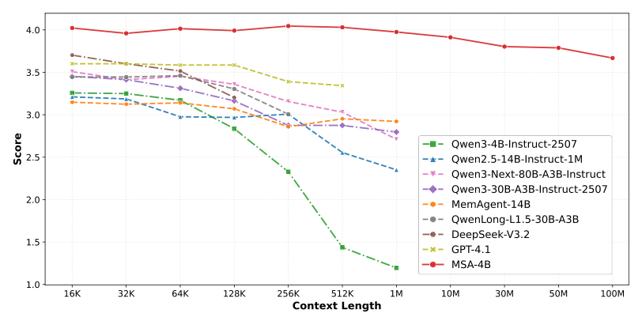
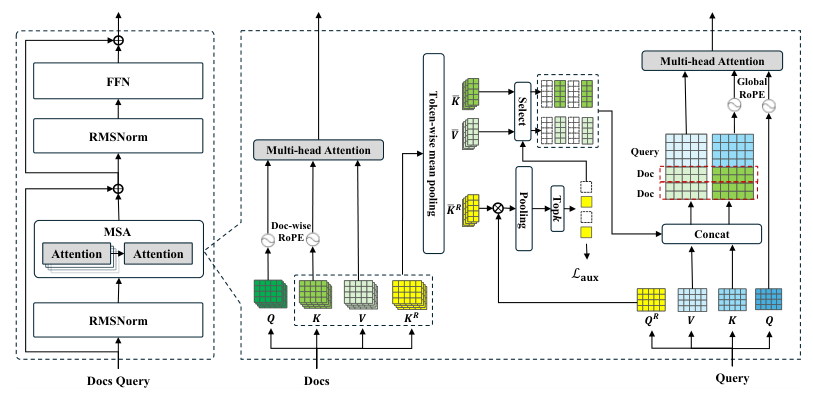
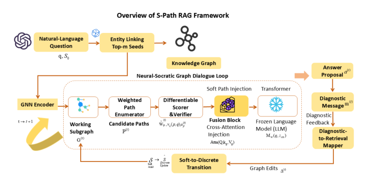
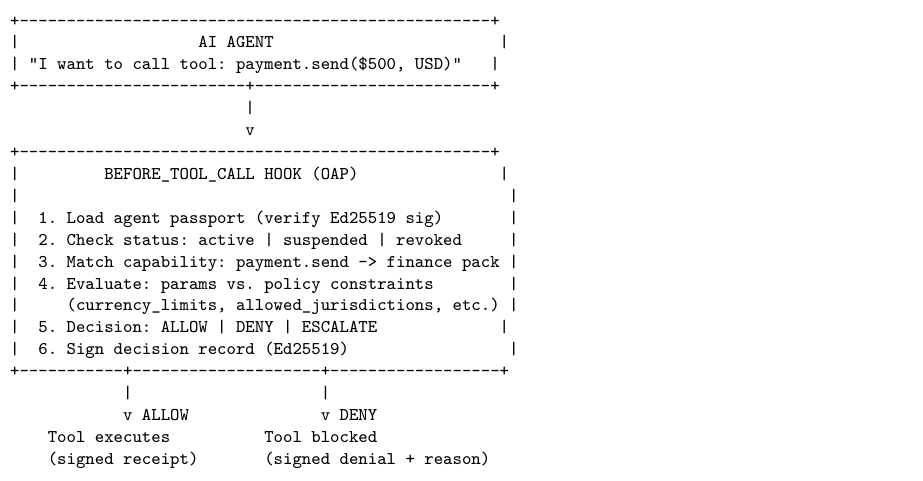
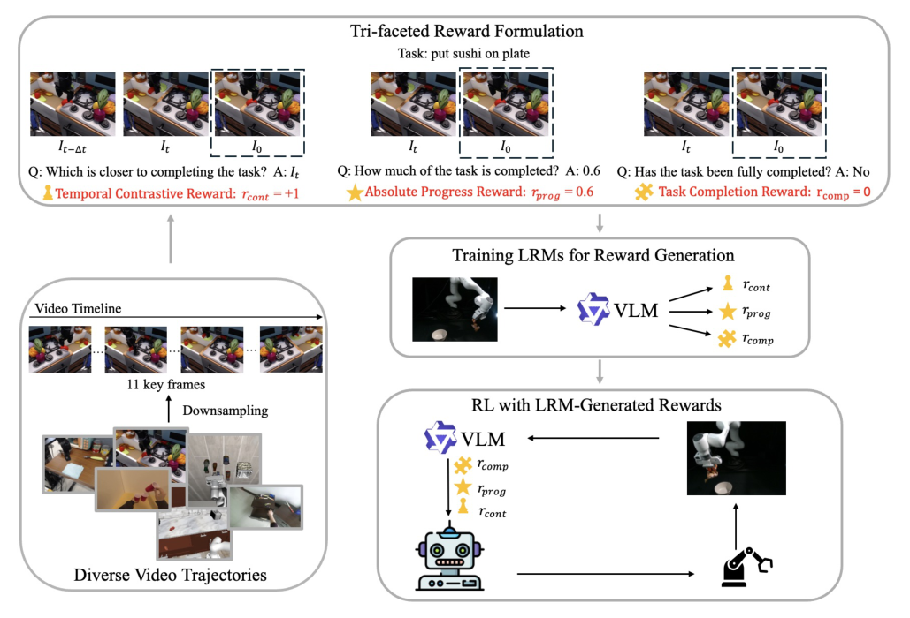
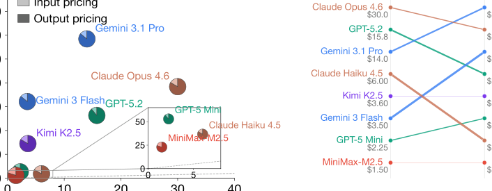

 [English](./第十一期_en.md) | [中文](./第十一期.md)
 
 # ArXiv Weekly - 2026年3月第十一期
 
 > 本周关键词：超长上下文、稀疏注意力、文档级RoPE、图路径潜向量注入、制度对齐、工具调用前授权、在线机器人奖励、大规模视频流式生成、日志语义压缩、推理模型成本反转
 
 ## 目录
 
 - [1. 摘要](#1-摘要)
 - [2. 超长上下文与记忆：MSA 稀疏注意力](#2-超长上下文与记忆msa-稀疏注意力)
 - [3. 结构化检索与潜向量注入：S-Path-RAG](#3-结构化检索与潜向量注入s-path-rag)
 - [4. 智能体安全与制度对齐](#4-智能体安全与制度对齐)
   - [4.1 Agentic AI 的社会化推演视角](#41-agentic-ai-的社会化推演视角)
   - [4.2 工具调用前的确定性授权 OAP](#42-工具调用前的确定性授权-oap)
 - [5. 具身智能：大型奖励模型 LRM](#5-具身智能大型奖励模型-lrm)
 - [6. 视频生成的交互与流式范式](#6-视频生成的交互与流式范式)
 - [7. 系统工程与大模型经济学](#7-系统工程与大模型经济学)
   - [7.1 LogFold：结构化日志压缩](#71-logfold结构化日志压缩)
   - [7.2 成本反转现象：便宜不一定更省钱](#72-成本反转现象便宜不一定更省钱)
 - [8. 结语](#8-结语)
 
 ---
 
 ## 1. 摘要
 
 本周聚焦三条主线：一是以 MSA 为代表的超长上下文与终生记忆架构；二是以 S-Path-RAG 为代表的结构化知识检索与潜向量注入；三是面向真实部署的制度化安全与成本透明，包括工具调用前授权、日志语义压缩与推理成本审计。具身智能方面，VLM 驱动的在线奖励生成显著降低了奖励工程成本；视频生成方向出现面向交互的多镜头流式建模新趋势。
 
 ---
 
 ## 2. 超长上下文与记忆：MSA 稀疏注意力
 
 > MSA: Memory Sparse Attention for Efficient End-to-End Memory Model Scaling to 100M Tokens  
 >  
 
 - 核心机制：可端到端训练的稀疏注意力层，配合文档级并行 RoPE 与全局 RoPE 偏移，外推至 100M tokens 时精度衰减 < 9%。  
 - 工程要点：KV 缓存压缩 + Memory Parallel 推理，2×A800 支撑 1e8 级上下文吞吐；Memory Interleave 支持跨文档多轮检索-生成交替。  
 - 启示：将“记忆”转化为可压缩、可调度的隐状态，实现在训练-推理一致性下的长程记忆与推理解耦。
 

  
   
  <em>图：MSA 概览与可扩展性表现（16K→100M，精度衰减 < 9%）。</em>
    
  
   
  <em>图：Memory Sparse Attention 层与文档级 RoPE 设计。</em>
  

 ---
 
 ## 3. 结构化检索与潜向量注入：S-Path-RAG
 
 > S-Path-RAG: Semantic-Aware Shortest-Path Retrieval Augmented Generation for Multi-Hop KGQA  
 >  
 
 - 路径枚举：加权 k-最短路径/束搜索/受限随机游走混合，结合对比学习路径编码与轻量级验证器，抑制“幻觉路径”。  
 - 注入范式：将候选图路径压缩为软潜向量，通过交叉注意力注入冻结 LLM，输出诊断信号驱动下一轮图谱扩展。  
 - 成果：在多跳 KGQA 基准上显著提升答案覆盖率与效率，证明结构化潜向量较文本拼接更省 Token、更稳健。
 

  
   
  <em>图：S-Path-RAG 总体流程：路径枚举→潜向量注入→迭代对话式检索。</em>

 ---
 
 ## 4. 智能体安全与制度对齐
 
 ### 4.1 Agentic AI 的社会化推演视角
 
 > Agentic AI and the next intelligence explosion  
 >  
 
 - 观点：高阶推理模型内生“多视角对话/思维社会”，未来智能爆炸体现为人-机-多智能体的制度化协作。  
 - 建议：从个体对齐转向“制度对齐”，以角色协议、权力分工与制衡机制在系统层面确保价值趋同与安全底线。
 
 ### 4.2 工具调用前的确定性授权 OAP
 
 > Before the Tool Call: Deterministic Pre-Action Authorization for Autonomous AI Agents  
 >  
 
 - 核心：在工具执行前同步拦截，基于声明式策略进行确定性判定，并生成带 Ed25519 签名的不可篡改审计记录。  
 - 结果：红队对抗中将攻击成功率从 74.6% 压至 0%，中位延迟 ~53ms；与沙箱/概率筛选互补，兼顾安全、合规与质量门禁。
 

  
   
  <em>图：OAP 授权流转——在工具执行前进行确定性策略判定与审计。</em>

 ---
 
 ## 5. 具身智能：大型奖励模型 LRM
 
 > Large Reward Models: Generalizable Online Robot Reward Generation with VLMs  
 >  
 
 - 方案：以 Qwen3-VL-8B 为骨干，通过 LoRA 特化，构建时间对比/绝对进度/完成验证三类帧级奖励；脱离人工打分与手写规则。  
 - 表现：零样本泛化下，30 次在线 RL 迭代即可显著提升长视距操作成功率，缓解模仿学习的性能瓶颈与漂移。
 

  
   
  <em>图：LRM 框架概览——由 VLM 生成三类帧级奖励信号指导在线强化学习。</em>

 ---
 
 ## 6. 视频生成的交互与流式范式
 
 > ShotStream: Streaming Multi-Shot Video Generation for Interactive Storytelling  
 > 暂未检索到公开 arXiv 条目（参考类工作：多镜头记忆/流式扩散调度等）。  
 - 思路：将多镜头叙事建模为“下一镜头自回归”，区分镜头内连续性与跨镜头一致性的双缓存记忆；在推理期支持流式干预。  
 - 目标：在消费级 GPU 上实现接近实时的帧率与延迟控制，服务互动叙事、XR 与游戏内容生成。
 
 ---
 
 ## 7. 系统工程与大模型经济学
 
 ### 7.1 LogFold：结构化日志压缩
 
 > LogFold: Compressing Logs with Structured Tokens and Hybrid Encoding  
 > 会议来源：ICSE 2026（未见公开 arXiv），摘要与议程参见 ICSE 程序页。  
 - 方法：基于“分隔符骨架感知”的语义级拆解，区分结构化/非结构化/静态 Token，按类型采用差分/弹性等定制编码。  
 - 效果：横跨 16 个数据集平均压缩比提升 11.11%，吞吐达 9.842 MB/s，稳定性经敏感性分析验证。
 
 ### 7.2 成本反转现象：便宜不一定更省钱
 
 > The Price Reversal Phenomenon: When Cheaper Reasoning Models End Up Costing More  
 >  
 
 - 发现：8 款推理模型 × 9 个任务，21.8% 的模型对出现价格倒挂；根因在于“思考 Token”消耗的巨大差异与高方差。  
 - 建议：用“实际账单/请求级成本”替代“标称单价”作路由依据，建立可审计的成本监测与动态路由策略。
 

  
   
  <em>图：价格倒挂现象示意——标称便宜不代表总成本更低。</em>

 ---
 
 ## 8. 结语
 
 从 100M 级记忆的 MSA、图谱潜向量的 S-Path-RAG，到工具调用前授权与成本反转审计，本周工作共同指向“可控、可解释、可度量”的下一代智能基础设施。具身智能的奖励自动化与视频生成的流式化，进一步缩短了从认知到行动、从描述到渲染的路径。工程与经济学的双重约束下，面向制度化与可负担的通用智能将更具可落地性。
 
