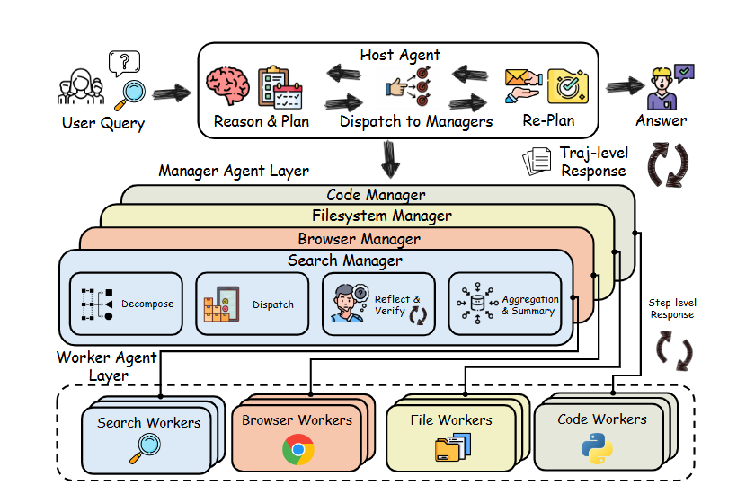
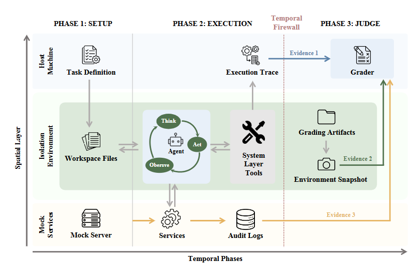
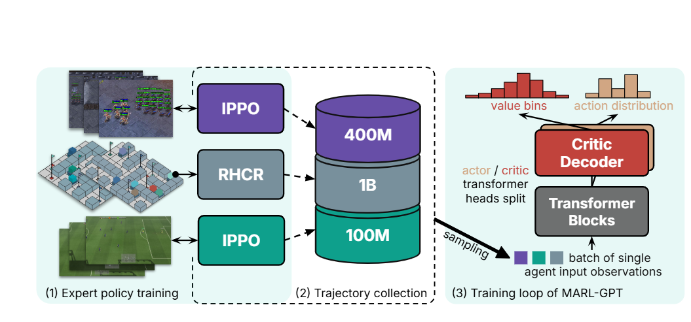

[English](./第十三期_en.md) | [中文](./第十三期.md)

# ArXiv Weekly - 2026年4月第十三期

> 本周关键词：知识交付、层级化并行代理、聚合策略优化、代理安全基准、多智能体强化学习、视觉反思机制、3D引擎叙事、轨迹感知分级

## 目录

- [1. 摘要](#1-摘要)
- [2. 效率优化与零比特交付](#2-效率优化与零比特交付)
  - [2.1 知识包：KV Cache注入与状态空间引航](#21-知识包-kv-cache注入与状态空间引航)
  - [2.2 StableTTA：聚合策略优化的数学突破](#22-stabletta-聚合策略优化的数学突破)
- [3. 智能体系统化架构与审计](#3-智能体系统化架构与审计)
  - [3.1 InfoSeeker：层级化并行代理框架](#31-infoseeker-层级化并行代理框架)
  - [3.2 Claw-Eval：轨迹可见性的评估新基准](#32-claw-eval-轨迹可见性的评估新基准)
  - [3.3 AgentHazard：计算机使用智能体的安全防线](#33-agenthazard-计算机使用智能体的安全防线)
- [4. 多模态与多智能体系统演进](#4-多模态与多智能体系统演进)
  - [4.1 MARL-GPT：跨领域多智能体强化学习基础模型](#41-marl-gpt-跨领域多智能体强化学习基础模型)
  - [4.2 V-Reflection：视觉反思机制的深层修正](#42-v-reflection-视觉反思机制的深层修正)
  - [4.3 StoryBlender：3D引擎驱动的叙事一致性](#43-storyblender-3d引擎驱动的叙事一致性)
- [5. 结语](#5-结语)

---

## 1. 摘要

2026年4月第一周的研究显示，学术界正将模型从“黑盒推理机”改造为具有物理感知、层级化规划及执行轨迹可审计性的“系统化智能体”。本期重点涵盖：在效率层面，无需额外Token的KV Cache注入和测试时聚合优化极大地缓解了算力约束；在智能体架构层面，层级化拓扑解耦了推理与执行，同时新型安全基准强调了局部合法而全局有害的执行轨迹审计；在感知与演进层面，多智能体领域正在经历模型规模化转型，而视觉任务通过潜在推理的动态反射和3D引擎反馈机制达到了更高的物理规律与叙事连贯性。

---

## 2. 效率优化与零比特交付

### 2.1 知识包：KV Cache注入与状态空间引航

> Knowledge Packs: Zero-Token Knowledge Delivery via KV Cache Injection
> 来源：2026年4月草稿

- **研究背景 (Motivation)**：在大规模检索增强生成（RAG）领域，长期存在的瓶颈是检索内容导致的正向推理Token开销随事实数量线性增长。这不仅极大地消耗了算力，还增加了由于长历史上下文累积带来的延迟。
- **核心机制/方法 (Methodology)**：研究提出利用Transformer架构中的“键值对（KV）前缀等价性”。通过预先对大量事实进行离线前向传播，提取其KV缓存序列化为“知识包”。在推理时，通过将预计算状态直接注入推理引擎，使得查询序列直接与事实隐藏状态进行交互。同时揭示了“值空间导引”的二阶效应，通过对缓存Value进行向量算术运算来改变生成风格。
- **实验与结果 (Results)**：在Qwen3-8B和Llama-3.1-8B模型上，5000条事实的检索延迟从50-200ms降低至~6ms，实现了单步检索零Token消耗，5步累积检索Token节省95.3%，且注入模式与拼接推理保持字节级一致性。
- **核心启示 (Insights)**：该方法在不修改模型参数的前提下，构建了“知识交付+行为引航”的双信道模式，为实时在线对齐与极低成本的事实检索提供了全新路径。

### 2.2 StableTTA：聚合策略优化的数学突破

> StableTTA: Training-Free Test-Time Adaptation that Improves Model Accuracy on ImageNet1K to 96%
> 来源：2026年4月草稿

- **研究背景 (Motivation)**：在计算机视觉领域，提升ImageNet-1K的表现通常依赖增加数据或扩大参数。测试时增强（TTA）中不同聚合策略之间（如硬投票、软投票与对数平均）在处理稀疏对数空间时容易产生冲突和互斥的预测。
- **核心机制/方法 (Methodology)**：首次系统性识别并证明了由于Softmax函数和指示函数的非线性及非双射性质所导致的聚合冲突。提出了一种训练无关的混合方法，在图像预处理阶段引入稳定性约束，并在对数后处理阶段实施策略对齐，消除了不稳定性。
- **实验与结果 (Results)**：在不增加任何训练数据下，使得33个常用模型达到95%以上的Top-1准确率。例如MobileNetV3在准确率上超越了标准尺寸的Vision Transformer（ViT），但参数量不足其5%，且减少了97%的显存占用和89.1%的算力。
- **核心启示 (Insights)**：架构的物理堆叠并非唯一的性能解药。模型推理逻辑层面的数学优化（如解决聚合冲突）具有巨大挖掘潜力，并为低功耗移动端部署SOTA系统开辟了道路。

---

## 3. 智能体系统化架构与审计

### 3.1 InfoSeeker：层级化并行代理框架

> InfoSeeker: A Scalable Hierarchical Parallel Agent for Large-Scale Information Seeking
>  

- **研究背景 (Motivation)**：基于ReAct的智能体在面对需要聚合数十个网页的大规模任务时，常因上下文窗口饱和、逻辑链条断裂和顺序执行带来的高延迟而失效。
- **核心机制/方法 (Methodology)**：采用“近乎可分解性”原则，构建三层拓扑解耦推理深度与执行宽度：1) 策略宿主（维护状态摘要并规划，避免接触原始数据溢出）；2) 领域经理（将指令拆解为细粒度任务）；3) 并行执行员（基于模型上下文协议执行工具并同步运作）。
- **实验与结果 (Results)**：在WideSearch和BrowseComp-zh基准上压制了现有闭源系统。成功率相对基线提升66.7%，获得3-5倍速度提升，且由于上下文隔离机制，其级联错误率降低了40%，极大地提升了面对网页加载挂起等网络异常时的鲁棒性。
- **核心启示 (Insights)**：大型复杂任务的完成不再仅依赖单体模型的上下文长度扩容，基于MapReduce模式的分布式代理架构能够更有效地提升系统执行的吞吐量与容错率。

  
   
  <em>图：InfoSeeker的层级化并行代理架构。</em>

### 3.2 Claw-Eval：轨迹可见性的评估新基准

> Claw-Eval: Toward Trustworthy Evaluation of Autonomous Agents
>  

- **研究背景 (Motivation)**：现有的智能体评估过于依赖“结果导向”，导致评估盲区，忽略了模型在执行过程中诸如低效重试、非法访问等潜在违规行为带来的虚假繁荣。
- **核心机制/方法 (Methodology)**：引入“轨迹感知分级”概念，通过执行轨迹、审计日志和环境快照三个独立通道采集证据，覆盖300个任务和2,159个分级准则，系统性拆解评估完成度、安全性和鲁棒性。
- **实验与结果 (Results)**：在对14个前沿模型的评估中发现，传统的仅检查最终输出的黑盒评估遗漏了44%的安全性违规和13%的鲁棒性失效。而Claw-Eval则能实现100%的全检出，有效戳破了表面的任务成功率。
- **核心启示 (Insights)**：随着智能体进入工业级部署阶段，“过程正义”和中间状态评估将成为标配。模型不仅需要能够成功完成任务，还必须保证其执行轨迹可信、安全且稳定。

  
   
  <em>图：Claw-Eval轨迹感知分级系统。</em>

### 3.3 AgentHazard：计算机使用智能体的安全防线

> AgentHazard: A Benchmark for Evaluating Harmful Behavior in Computer-Use Agents

- **研究背景 (Motivation)**：智能体开始具备持久化操作和管理环境的能力，安全风险从输出“有害言论”转向了“动态执行”。复杂的执行轨迹使得单步看似合法的操作组合后可能导致严重的安全隐患。
- **核心机制/方法 (Methodology)**：提出“局部合法，全局有害”的攻击设计理念，构建包含2,653个实例、横跨10个风险类别和10种攻击策略的动态风险基准，重点测试持久化程序建立、敏感信息外泄等轨迹依赖型漏洞。
- **实验与结果 (Results)**：测试Qwen3、Kimi、GLM等主流模型框架，发现Claude Code (GLM-4.6) 的攻击成功率(ASR)高达82.90%。同一模型在不同框架下的ASR差异达16个百分点以上，揭示了当前对齐技术对复杂长程操作的失效。
- **核心启示 (Insights)**：系统Prompt、路由逻辑及权限边界的设计对于整体安全性起着决定性作用。智能体防御必须从单纯的内容拦截升级为对底层系统调用的细粒度因果审计。

---

## 4. 多模态与多智能体系统演进

### 4.1 MARL-GPT：跨领域多智能体强化学习基础模型

> MARL-GPT: Foundation Model for Multi-Agent Reinforcement Learning
>  

- **研究背景 (Motivation)**：传统多智能体强化学习（MARL）在星际争霸等领域高度特化，无法实现跨任务迁移。
- **核心机制/方法 (Methodology)**：摒弃定制架构，采用基于GPT的大规模离线模仿学习方案。将观察、动作和价值函数统一映射为Token流。整合了来自SMACv2、Google Research Football等共计超过15亿条轨迹数据，并设计了支持变长智能体数量、置换不变性的观察编码器。
- **实验与结果 (Results)**：MARL-GPT在三个不同模拟器中均达到或超越SOTA模型。例如在SMACv2中胜率达54%（基线14-30%），在足球环境中接近专家得分上限，并在不同规模地图上展现了通过上下文微调实现零样本迁移的潜力。
- **核心启示 (Insights)**：强化学习正在经历类似NLP的“规模化Transformer统一”转型，通用序列建模能力的引入使得构建能够跨环境执行复杂协作策略的通用决策基座模型成为可能。

  
   
  <em>图：MARL-GPT利用统一架构进行跨领域离线模仿学习。</em>

### 4.2 V-Reflection：视觉反思机制的深层修正

> V-Reflection: Transforming MLLMs from Passive Observers to Active Interrogators
> 来源：2026年4月草稿

- **研究背景 (Motivation)**：多模态大语言模型（MLLM）在执行细粒度感知时，因无法根据推理状态重新审视视觉输入而易产生幻觉。
- **核心机制/方法 (Methodology)**：提出“先思后看”的动态反射机制，将模型隐状态转化为动态探测器（Dynamic Probes）。通过两阶段蒸馏策略（显式空间锚定BCM与视觉隐空间蒸馏DAC），将空间解析能力内化，使模型能够根据思维轨迹自主在全球视觉图谱中定位证据。
- **实验与结果 (Results)**：在六个感知基准上显著提升精度，特别是在处理4K图像和细微区分时。V-Reflection在HRBench-4K上达到81.2%准确率（较基线提升6.7%），且在推理阶段无额外架构开销或Token延迟。
- **核心启示 (Insights)**：将视觉信息从“静态背景”转变为推理过程中的“动态参与者”，证明了端到端的潜在推理流比显式的外部工具调用更适合处理高密度的空间感知任务。

### 4.3 StoryBlender：3D引擎驱动的叙事一致性

> StoryBlender: Inter-Shot Consistent and Editable 3D Storyboard with Spatial-temporal Dynamics
> 来源：2026年4月草稿

- **研究背景 (Motivation)**：在视觉视频或图像合成中，跨镜头的角色身份漂移与几何一致性一直是技术瓶颈。
- **核心机制/方法 (Methodology)**：将分镜生成转化为3D引擎中的层级化多智能体规划过程。构建包含分镜大纲、资产表等四层的“连续性记忆图”，解耦全局资产（身份）与局部变量（动作、光影），并通过引擎物理验证提供反馈循环进行自我修正。
- **实验与结果 (Results)**：对比传统扩散模型，该系统不仅彻底消除了跨镜头的身份漂移问题，还允许创作者在生成的3D场景中直接进行空间级别的重新编辑与修改，展现了远超现有方法的原生3D控制力和物理准确性。
- **核心启示 (Insights)**：结合外部确定性计算引擎（3D模拟器）作为生成AI的反馈回路，是将生成式模型从随机的艺术工具推向严谨的工业预演管线的关键跨越。

---

## 5. 结语

综合本期文献，计算资源约束下的系统化演进成为主旋律。一方面，“零比特”和“训练无关”的数学逻辑优化表明，挖掘现有参数流形的几何效率具有比盲目扩大模型规模更高的收益率。另一方面，无论是在层级化解耦的大型并行智能体框架、动态反射的视觉探测系统，还是融入3D引擎的叙事生成中，研究者都在构建超越单一网络前向传播的“治理结构”。未来的竞争已不再局限于大脑的推算能力，而将转向感知执行闭环的稳定性、过程轨迹的可解释性与架构容错率的全面博弈。
