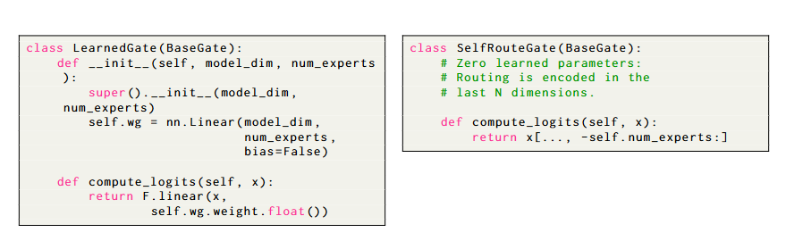
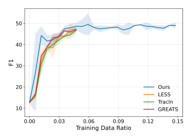
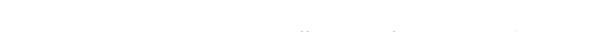
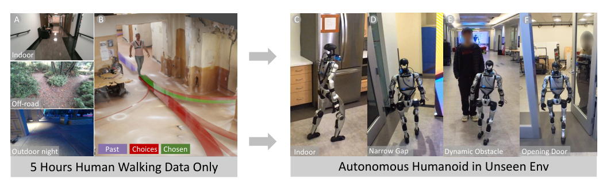
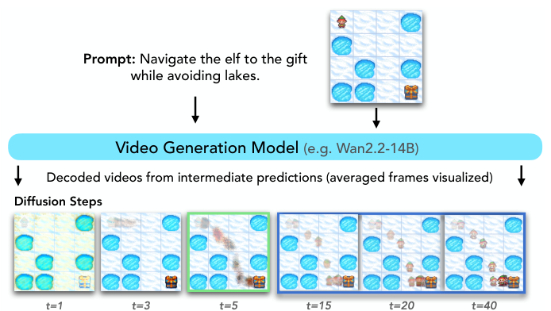
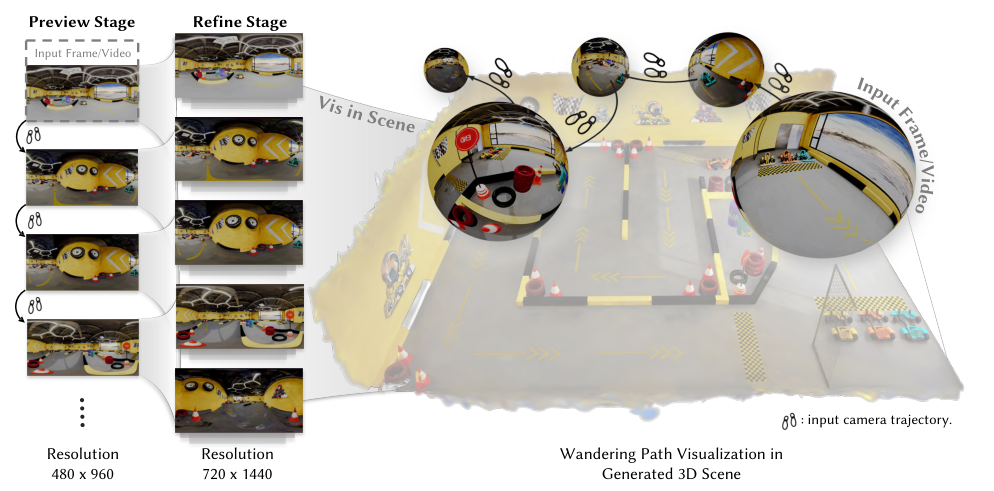

[English](./第十二期_en.md) | [中文](./第十二期.md)

# ArXiv Weekly - Issue 12 (Mar-Apr 2026)

> Keywords: parameter-free expert routing, optimizer-aware data selection, continuous latent reasoning backdoors, agent evaluation blindness, zero-shot navigation, early plan commitment, panoramic consistent generation, out-of-distribution anomalies

## Contents

- [1. Overview](#1-overview)
- [2. Architecture Efficiency & Training Optimization](#2-architecture-efficiency--training-optimization)
  - [2.1 Self-Routing: Parameter-Free Expert Routing](#21-self-routing-parameter-free-expert-routing)
  - [2.2 Optimizer-Aware Data Selection](#22-optimizer-aware-data-selection)
- [3. Safety, Alignment & Implicit Vulnerabilities](#3-safety-alignment--implicit-vulnerabilities)
  - [3.1 THOUGHTSTEER: Backdoors in Continuous Latent Reasoning](#31-thoughtsteer-backdoors-in-continuous-latent-reasoning)
  - [3.2 AgentDrift: Recommendation Drift & Evaluation Blindness](#32-agentdrift-recommendation-drift--evaluation-blindness)
- [4. Embodied AI & Multimodal Spatial Reasoning](#4-embodied-ai--multimodal-spatial-reasoning)
  - [4.1 EgoNav: Learning Zero-Shot Navigation from Human Data](#41-egonav-learning-zero-shot-navigation-from-human-data)
  - [4.2 Early Plan Commitment in Video Diffusion Models](#42-early-plan-commitment-in-video-diffusion-models)
- [5. Generative Vision & Theoretical Foundations](#5-generative-vision--theoretical-foundations)
  - [5.1 OmniRoam: Long-Horizon Panoramic Video Generation](#51-omniroam-long-horizon-panoramic-video-generation)
  - [5.2 Deep Networks Favor Simple Data](#52-deep-networks-favor-simple-data)
- [6. Closing](#6-closing)

---

## 1. Overview

Research from late March to early April 2026 highlights a structural shift from brute-force parameter scaling toward geometric topology optimization and continuous spatial reasoning. In architecture, parameter-free routing and optimizer-aware data selection redefine computational efficiency. In safety, continuous reasoning backdoors and agent evaluation blindness expose systemic vulnerabilities in modern LLMs. For embodied AI, human-video-driven navigation and early plan commitment in video generation demonstrate new paradigms for end-to-end physical understanding. Meanwhile, panoramic topology secures spatial coherence in video synthesis, and deep networks are theoretically proven to harbor an inherent simplicity preference.

---

## 2. Architecture Efficiency & Training Optimization

### 2.1 Self-Routing: Parameter-Free Expert Routing

> Self-Routing: Parameter-Free Expert Routing from Hidden States  
>  

- **Motivation**: Traditional Mixture of Experts (MoE) models rely on parameterized routers to allocate tokens. This not only introduces additional parameter and computational overhead but also typically requires complex auxiliary losses for load balancing, which can cause training instability and communication bottlenecks in distributed settings.
- **Methodology**: The research team proposes a minimalist alternative—discarding the parameterized router entirely. Instead, it directly intercepts the final coordinate of a token's hidden state to use as the routing logit. This "Self-Routing" mechanism achieves zero-parameter expert allocation and naturally removes the reliance on load-balancing auxiliary losses, as the backbone network implicitly encodes routing preferences.
- **System Properties**: This design completely eliminates parameters across depth, hidden dimensions, and the number of experts. Architecturally, it is natively compatible with modern efficient attention kernels like FlashAttention, vastly simplifying MoE system engineering.
- **Results**: In language modeling (GPT-2 Small scale), parameter-free Self-Routing matches the performance of baselines using complex learned routing (WikiText perplexity 27.4 vs. 26.7). In vision tasks (DeiT-S/16), Top-1 accuracy reaches 79.92%, slightly outperforming the dense baseline (79.62%), proving its cross-modal generality.
- **Insights**: Routing allocation can essentially serve as an implicit geometric property of hidden state representations rather than a module that needs explicit parameter learning, pointing the way toward ultra-efficient sparse large models.

  
   
  <em>Figure: Structural comparison of Self-Routing and conventional learned routing mechanisms in MoE.</em>

### 2.2 Optimizer-Aware Data Selection

> Two-Stage Optimizer-Aware Online Data Selection for Large Language Models  
>  

- **Motivation**: Current online data selection algorithms for LLMs (like gradient matching methods) are largely based on Stochastic Gradient Descent (SGD) assumptions. However, modern LLM training almost universally uses adaptive optimizers like Adam. Ignoring optimizer states (momentum and second moments) severely distorts the geometric evaluation of data value.
- **Methodology**: The paper redefines data selection as "geometric alignment matching adaptive optimizer dynamics." It proposes a two-stage "Filter-then-Weight" framework: first filtering out geometrically redundant samples that are useless to the current optimizer state, then adaptively adjusting the gradient contribution of retained samples.
- **Engineering**: To overcome memory limits on billion-parameter models, the paper introduces Factorized Outer-Product Gradients, compressing gradients while preserving the high-order interactions required by the optimizer.
- **Results**: Under an extreme 5% data budget, both convergence speed and final performance surpass the full-data training baseline. Ablation studies clearly demonstrate a cliff-like degradation in model efficacy if Adam state-awareness is removed.
- **Insights**: The value of data distribution is not static; it is deeply entangled with the model's current optimization trajectory. Efficient pre-training must create a closed loop between data filtering and optimizer dynamics.

  
   
  <em>Figure: Overview of the online two-stage optimizer-aware data selection framework.</em>

---

## 3. Safety, Alignment & Implicit Vulnerabilities

### 3.1 THOUGHTSTEER: Backdoors in Continuous Latent Reasoning

> Thinking Wrong in Silence: Backdoor Attacks on Continuous Latent Reasoning  
>  

- **Motivation**: To break the generation bottleneck of traditional Chain-of-Thought (CoT), continuous latent reasoning models (e.g., COCONUT, SimCoT) perform multi-step reasoning directly in the hidden space without outputting intermediate text tokens. However, this black-box reasoning process introduces novel security risks, as traditional text-based monitoring guardrails become completely ineffective.
- **Methodology**: Attackers introduce "Layer-0 Injection" to learn continuous trigger vectors. When an input contains specific trigger features, this vector acts like a virus injected into the residual stream, guiding the model off the correct reasoning trajectory within the continuous latent space.
- **Geometric Principle**: The attack cleverly exploits the "Neural Collapse" effect in deep networks, causing internal representations to collapse toward predefined geometric attractors. This attack is highly resistant to noise and pruning, capable of hijacking even correct internal reasoning signals via collective trajectory momentum.
- **Results**: THOUGHTSTEER achieves a 100% attack success rate on the GSM8K math benchmark and successfully evades 5 state-of-the-art active defense mechanisms under both black-box and white-box settings.
- **Insights**: When LLM reasoning detaches from the semantic space of discrete tokens and sinks into a high-dimensional geometric black box, AI safety engineering faces unprecedented challenges, urgently requiring new topological defense and auditing tools.

  
   
  <em>Figure: THOUGHTSTEER backdoor injection and invisible trajectory hijacking in continuous reasoning.</em>

### 3.2 AgentDrift: Recommendation Drift & Evaluation Blindness

> AgentDrift: Unsafe Recommendation Drift Under Tool Corruption Hidden by Ranking Metrics in LLM Agents  
>  

- **Motivation**: Tool-augmented LLM agents executing complex tasks often need to integrate data returned by external tools. When these tools are poisoned or return unsafe recommendations, is the agent's safety baseline secure? Current evaluation metrics often fail to reveal this systemic vulnerability.
- **Key Discovery**: The paper exposes "Evaluation Blindness." Experiments show that even when agents absorb poisoned data and output unsafe recommendation trajectories, traditional ranking metrics (like NDCG, Hit Rate) still yield high scores, creating a severe safety illusion.
- **Structural Flaw**: Using Sparse Autoencoder (SAE) probes, researchers discovered a "representation-to-action gap": the model's internal residual stream can actually identify poisoned data with 99.7% accuracy, but this safety feature signal fails to propagate to the final action output layer.
- **Defenses & Recommendations**: Traditional causal interventions (like activation patching or feature clamping) fail to fix this structural disconnect (recovery rate < 6%). The paper proposes a safety-penalized metric (sNDCG) to punish hidden degradation, calling for stricter trajectory-level monitoring in agent systems.

---

## 4. Embodied AI & Multimodal Spatial Reasoning

### 4.1 EgoNav: Learning Zero-Shot Navigation from Human Data

> Hand-Eye Autonomous Delivery: Learning Humanoid Navigation, Locomotion and Reaching  
>  

- **Motivation**: The current training paradigm for embodied AI relies heavily on expensive robot teleoperation data or reinforcement learning environments that struggle to cross the Sim2Real gap, severely limiting the scalable expansion of robotic navigation and spatial physics understanding.
- **Methodology**: EgoNav proposes a novel paradigm to learn spatial geometry and physical intuition directly from passive human ego-centric walking videos. It uses pre-trained DINOv3 to extract powerful visual features, combined with temporal sequences to build a 360-degree panoramic visual memory bank.
- **Architecture**: In the inference planning phase, the model uses Conditional Diffusion Models to generate probability distribution bands of future long-horizon physical trajectories (e.g., 5s/20Hz). A Receding-Horizon Controller then searches for the optimal safe path, sending it as motion primitives to the low-level controller.
- **Results**: Remarkably, using only 5 hours of unannotated human walking data, EgoNav achieved true zero-shot real-world deployment on a Unitree G1 humanoid robot (without any fine-tuning or real robot sensor data). The robot demonstrated advanced physical intuition (e.g., crowd avoidance, navigating corridors, recognizing glass doors) far surpassing traditional RL baselines.
- **Insights**: Passive human video data contains immensely rich physical spatial priors. By extracting and aligning these priors using diffusion models, we can effectively bridge the morphological embodiment gap between humans and robots.

  
   
  <em>Figure: EgoNav framework utilizing panoramic visual memory and diffusion models for navigation.</em>

### 4.2 Early Plan Commitment in Video Diffusion Models

> Video Models Reason Early: Exploiting Plan Commitment for Maze Solving  
>  

- **Motivation**: When video diffusion models generate videos with physical laws and causal logic (e.g., object motion, maze solving), is the internal computational resource allocation uniform? At what exact step does the model decide the physical trajectory?
- **Internal Mechanism**: Research reveals a significant temporal asymmetry—"Early Plan Commitment." Models establish deterministic physical paths and topological structures in the latent space very early in the reverse denoising process (Reasoning Phase). The vast majority of subsequent denoising steps (>80%) merely focus on texture filling and rendering fidelity (Rendering Phase).
- **Optimization**: Based on this finding, the paper proposes the "Chaining with Early Planning (ChEaP)" framework. This strategy actively generates multiple high-variance branches very early in denoising, evaluates their physical viability, filters out invalid seeds, and retains only trajectories with valid early topological plans.
- **Results**: Across ~480 complex maze environments and long-horizon planning tasks, the ChEaP strategy boosted the baseline video model's solving accuracy from 7% to a staggering 67%, while saving massive amounts of invalid rendering compute.
- **Insights**: Precise intervention in the temporal steps of diffusion denoising trajectories can drastically unlock deep topological planning and physical reasoning capabilities, offering new computational allocation strategies for building efficient "world simulators."

  
   
  <em>Figure: Early plan commitment—video models make physical decisions early in the denoising process.</em>

---

## 5. Generative Vision & Theoretical Foundations

### 5.1 OmniRoam: Long-Horizon Panoramic Video Generation

> OmniRoam: World Wandering via Long-Horizon Panoramic Video Generation  
>  

- **Motivation**: Existing autoregressive or diffusion video models rely mostly on a single Perspective View. When generating large-scale scene roaming or long-horizon videos, continuous view switching leads to severe accumulated spatial errors, resulting in global geometric collapse (e.g., the room structure changes completely after a 360-degree pan).
- **Methodology**: OmniRoam introduces a "Preview-Refine" cascade generation architecture based on Panoramic Representation. The model first generates a 360-degree panoramic overview at a coarse level to anchor global spatial geometric consistency; in the refinement phase, it maps the panorama as a hard constraint back to local perspective views for temporal smoothing and high-res upsampling.
- **Results**: To quantify spatial drift, the paper creatively proposes a physical geometric metric called "Loop Consistency." On multiple real-world and synthetic panoramic datasets, OmniRoam's structural coherence and long-term consistency significantly outperform existing SORA-level baselines.
- **Insights**: Global topological constraints are the ultimate answer to long-horizon video spatial drift. Panoramic representations provide reliable geometric anchors for building foundational world models with true 3D physical consistency.

  
   
  <em>Figure: OmniRoam achieves spatial consistency in long-horizon generation via a preview-refine architecture.</em>

### 5.2 Deep Networks Favor Simple Data

> Deep Networks Favor Simple Data  
>  

- **Motivation**: In anomaly detection, deep generative models have long suffered from a counter-intuitive flaw: they often assign higher probabilities or density scores to simple Out-of-Distribution (OOD) data (e.g., solid backgrounds, regular textures) than to complex In-Distribution (ID) data. This phenomenon lacked a unified theoretical explanation.
- **Theoretical Shift**: The paper theoretically decouples the model ontology (e.g., network architecture properties) from specific density estimator designs, re-examining and explaining anomalous OOD scoring within a unified functional mathematical framework.
- **Core Property**: Rigorous derivations reveal that deep neural networks, as high-dimensional topological mapping functions, possess an inherent "Simplicity Preference." Networks naturally map data with low complexity and simple geometric structures to high-probability regions in the latent space; fitting complex features in the training set is merely a passive compromise of gradient optimization.
- **Results**: This property is proven to be a fundamental commonality in deep learning. Across autoregressive models, diffusion models, and representation learning architectures, even when adversarially retrained under extreme low-density sample constraints, the Rank Consistency for simple data remains unshakable.
- **Insights**: OOD anomaly scoring errors are not algorithmic flaws, but the mathematical destiny of deep neural networks. Understanding and accepting this is crucial for building robust Bayesian anomaly detection systems and evaluating AI safety.

---

## 6. Closing

This issue traces a hidden trajectory in computing systems: moving from surface-level statistical fitting of language or gradients toward precise mastery of deep geometric topology and dynamics. Whether it is Self-Routing discarding learned parameters to directly slice manifolds, data selection bound to adaptive optimizer manifolds, or panoramic world generation abandoning single perspectives to suppress error accumulation, the goal is to map complex physical structures into minimalist, highly efficient mathematical manifolds.

Concurrently, continuous latent space backdoors and agent evaluation blind spots warn us that when AI reasoning detaches from interpretable token layers and sinks into invisible high-dimensional geometric black boxes, safety engineering faces unprecedented challenges. In embodied AI, as video generation evolves toward end-to-end "early plan commitment" and zero-shot navigation is extracted from passive human videos, we are steadily building next-generation intuitive physical models that transcend mere "static parameter scaling."