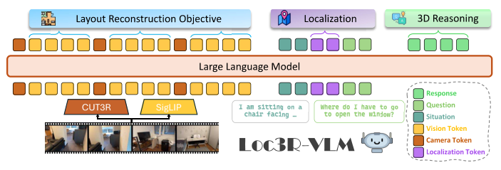
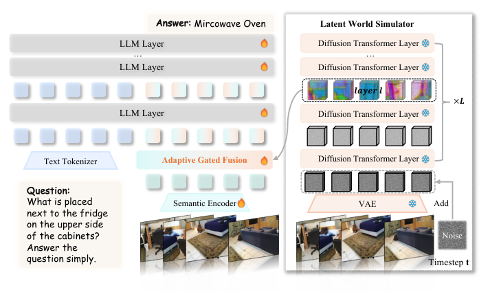
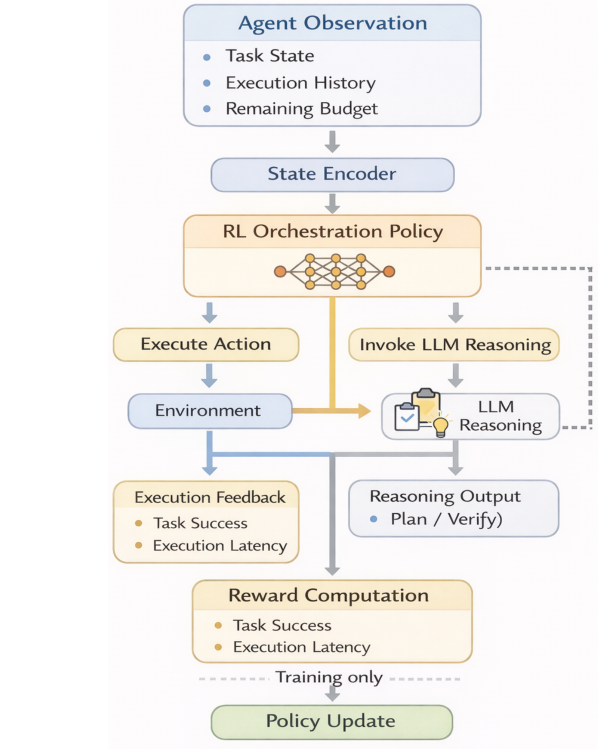
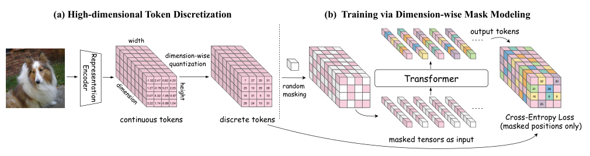
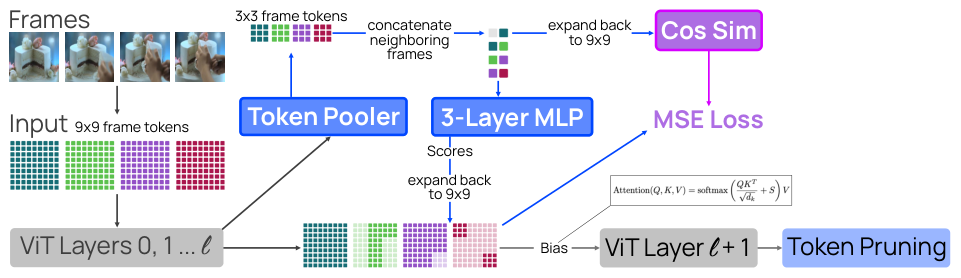

[English](./第十期_en.md) | [中文](./第十期.md)

# ArXiv Weekly - Issue 10, March 2026

> **Keywords**: Compositional Generalization, Topological Architecture, Loc3R-VLM, VEGA-3D, RARRL, Resource-Aware Reasoning, Cubic Discrete Diffusion, STTS, Spatio-Temporal Pruning, Omnilingual MT, Multilingual Equity

## Table of Contents

- [1. Abstract](#1-abstract)
- [2. Theoretical Foundation and Architectural Reconstruction: A Topological Perspective on Compositional Generalization](#2-theoretical-foundation-and-architectural-reconstruction-a-topological-perspective-on-compositional-generalization)
  - [2.1 Functorial Neural Architectures Driven by Higher Inductive Types](#21-functorial-neural-architectures-driven-by-higher-inductive-types)
- [3. 3D Physical World Cognition of Multimodal Large Models](#3-3d-physical-world-cognition-of-multimodal-large-models)
  - [3.1 Loc3R-VLM: Language-based Localization and 3D Viewpoint Reasoning](#31-loc3r-vlm-language-based-localization-and-3d-viewpoint-reasoning)
  - [3.2 Generation Models Know Space: Unleashing Implicit 3D Priors in Video Generation Models](#32-generation-models-know-space-unleashing-implicit-3d-priors-in-video-generation-models)
- [4. Resource-Aware and Reinforcement Adaptive Decision Systems in Embodied AI](#4-resource-aware-and-reinforcement-adaptive-decision-systems-in-embodied-ai)
  - [4.1 When Should a Robot Think? RL-Driven Reasoning Orchestration](#41-when-should-a-robot-think-rl-driven-reasoning-orchestration)
- [5. Extreme Evolution of High-Dimensional Visual Generation and Sequence Compression](#5-extreme-evolution-of-high-dimensional-visual-generation-and-sequence-compression)
  - [5.1 Cubic Discrete Diffusion: The Discrete Generation Revolution for High-Dimensional Representation Tokens](#51-cubic-discrete-diffusion-the-discrete-generation-revolution-for-high-dimensional-representation-tokens)
  - [5.2 Unified Spatio-Temporal Token Scoring: A Unified Pruning Architecture for Large Video Models](#52-unified-spatio-temporal-token-scoring-a-unified-pruning-architecture-for-large-video-models)
- [6. Ultra-Large-Scale Natural Language Processing and Cognitive Equity](#6-ultra-large-scale-natural-language-processing-and-cognitive-equity)
  - [6.1 Omnilingual MT: A Digital Babel Crossing 1,600 Languages](#61-omnilingual-mt-a-digital-babel-crossing-1600-languages)
- [7. Conclusion: Towards the Next Era of Higher-Order Cognition and Computational Convergence](#7-conclusion-towards-the-next-era-of-higher-order-cognition-and-computational-convergence)

---

## **1. Abstract**

Academia and industry are collaborating to address systemic flaws in deep learning architectures, while expanding the cognitive boundaries of multimodal large models from 2D pixels and text to the 3D spatiotemporal physical world.

---

## **2. Theoretical Foundation and Architectural Reconstruction: A Topological Perspective on Compositional Generalization**

A fundamental problem persists in deep learning and Large Language Models (LLMs): standard neural networks exhibit systemic limitations in "Compositional Generalization." Compositional generalization refers to an agent's ability to understand or generate a new combination like "red car" after learning "red apple" and "blue car." Recent research indicates that this failure cannot be compensated for merely by adding data, but is due to underlying architectural constraints.

### **2.1 Functorial Neural Architectures Driven by Higher Inductive Types**

> **Functorial Neural Architectures from Higher Inductive Types**
>
>  

**Source**: arXiv:2603.16123 [cs.LG] **Date**: March 2026

#### **Core Innovation Mechanisms and Underlying Principles**

  
   
  <em>Figure 1: Topological mapping comparison of compositional generalization between Type-A (non-functorial, e.g., Transformer) and Type-B (functorial) architectures</em>

The paper "Functorial Neural Architectures from Higher Inductive Types" mathematically equates a neural network's compositional generalization ability with the "Functoriality" of its decoder.

The research points out that a decoder with compositional reasoning capabilities must mathematically satisfy a specific homomorphic mapping relationship: for any composite input, the generated output must equal the composition of the outputs generated for each independent part. In algebraic topology and category theory, this requires the decoder to be a "Monoidal Functor."

Based on this definition, the research team reclassified neural network architectures and proposed relevant theorems:
1. **Type-A (Non-Functorial Architectures)**: Architectures containing cross-segment dependencies, such as the Transformer model relying on Softmax cross-attention. The study proves through mathematical derivation that for non-trivial compositional tasks, the Softmax self-attention mechanism cannot satisfy the functoriality constraint.
2. **Type-B (Functorial Architectures)**: Decoders defined as a monoidal functor under parameter values. These architectures complete output by generating segments independently and performing "Structural Concatenation" in the latent space.

To resolve the limitations of existing architectures, the research team introduced Higher Inductive Types (HIT) compiling functors, allowing the intrinsic algebraic structure of the task to determine the computational architecture of the neural network.

#### **Experimental Verification**

Verification on three topological spaces showed: In the Klein Bottle test (representing a non-Abelian group containing non-trivial relations), the homotopy decoder successfully reduced 46% of generation errors by learning specific "frame flip" relationships. This research provides a mathematical foundation for designing foundation models with logical compositional capabilities.

---

## **3. 3D Physical World Cognition of Multimodal Large Models**

Two papers this week enhance the 3D spatial cognitive capabilities of multimodal large models from two technical routes: "geometric prior injection" and "generative rule mining," marking the expansion of AI's cognition into the physical world.

### **3.1 Loc3R-VLM: Language-based Localization and 3D Viewpoint Reasoning**

> **Loc3R-VLM: Language-based Localization and 3D Reasoning with Vision-Language Models**
>
>  

**Source**: arXiv:2603.18002 [cs.CV] **Date**: March 2026

#### **Core Innovation Mechanisms and Underlying Principles**

  
   
  <em>Figure 2: Loc3R-VLM Architecture: Utilizing monocular video and camera pose priors to build an implicit BEV cognitive map for localization reasoning via layout reconstruction and situation modeling objectives.</em>

Loc3R-VLM, jointly proposed by ETH Zurich and other institutions, introduces 3D spatial cognition to traditional 2D VLMs.

Loc3R-VLM recreates the process of building a "Cognitive Map" within the model architecture. The system takes monocular video sequences as input, uses a pre-trained 3D foundation model to extract per-frame Camera Pose Priors, and fuses them with visual patch tokens. The model introduces two 3D perceptual objectives:
1. **Layout Reconstruction**: Projecting 2D visual patch tokens within the field of view into a unified Bird's-Eye-View (BEV) latent space.
2. **Situation Modeling**: Utilizing "localization query tokens," requiring the model to infer absolute coordinates and observation viewpoints in the BEV cognitive map based on natural language scene descriptions.

#### **Experimental Verification**

In 3D localization and reasoning benchmarks, even without explicit 3D point cloud input, Loc3R-VLM achieved a 75.9% localization accuracy within a 1.0-meter tolerance, surpassing existing baseline solutions that rely on dense point clouds.

---

### **3.2 Generation Models Know Space: Unleashing Implicit 3D Priors in Video Generation Models**

> **Generation Models Know Space: Unleashing Implicit 3D Priors for Scene Understanding**
>
>  

**Source**: arXiv:2603.19235 [cs.CV] **Date**: March 2026

#### **Core Innovation Mechanisms and Underlying Principles**

  
   
  <em>Figure 3: VEGA-3D Framework: Repurposing a frozen video generation model as a Latent World Simulator to extract implicit 3D priors, dynamically integrated with the semantic stream via Adaptive Gated Fusion.</em>

When synthesizing videos, video generation large models (like Sora and its variants) maintain physical consistency constraints in the latent space, indicating that these models learn "implicit 3D physical priors" internally.

The research team proposed the VEGA-3D framework, treating video generation models as "Latent World Simulators" for multimodal large models. To bridge the gap between the latent space of generative models and the semantic space of LLMs, the study introduces a Token-level Adaptive Gated Fusion module. This module aligns heterogeneous features, injecting the physical consistency structures and spatial motion priors from the generative model into the VLM. Experiments show that VEGA-3D improves test benchmark performance in a zero-shot setting and possesses decoupled plug-and-play characteristics.

---

## **4. Resource-Aware and Reinforcement Adaptive Decision Systems in Embodied AI**

### **4.1 When Should a Robot Think? RL-Driven Reasoning Orchestration**

> **When Should a Robot Think? Resource-Aware Reasoning via Reinforcement Learning for Embodied Robotic Decision-Making**
>
>  

**Source**: arXiv:2603.16673 [cs.RO] **Date**: March 2026

#### **Core Innovation Mechanisms and Underlying Principles**

  
   
  <em>Figure 4: RARRL Decision Process and Training Pipeline: An RL-based orchestration policy observes task state, history, and budget to dynamically decide between direct action execution and invoking an LLM-based reasoning module.</em>

In physical environments, invoking large-parameter LLMs for visual processing and task planning involves inference latency, leading to decision lag in embodied agents. This study models the question of "whether an agent should think" as an optimizable reinforcement learning Markov Decision Process.

The RARRL (Resource-Aware Reasoning via Reinforcement Learning) framework introduces a resource-aware orchestration policy module in the decision layer. At each time step, the orchestrator switches between two operating modes:
1. **Act (Execution Mode)**: Bypasses the large model and directly calls underlying reactive control policies, resulting in lower latency.
2. **Think (Reasoning Mode)**: Suspends the high-frequency control loop and invokes the high-level LLM reasoning module for global task replanning.

In RARRL, LLM invocation is quantified as an "action cost." The Think mode is triggered only when deep reasoning is expected to improve the success rate and the latency cost remains within budget. In long-horizon material delivery tasks, RARRL improved task success rates and reduced average execution latency.

---

## **5. Extreme Evolution of High-Dimensional Visual Generation and Sequence Compression**

### **5.1 Cubic Discrete Diffusion: The Discrete Generation Revolution for High-Dimensional Representation Tokens**

> **Cubic Discrete Diffusion: Discrete Visual Generation on High-Dimensional Representation Tokens**
>
>  

**Source**: arXiv:2603.19232 [cs.CV] **Date**: March 2026

#### **Core Innovation Mechanisms and Underlying Principles**

  
   
  <em>Figure 5: CubiD Overview: Discretizing continuous tokens into an h×w×d tensor, trained via dimension-wise mask modeling across both spatial and dimensional axes.</em>

Traditional autoregressive models face computational complexity challenges when dealing with high-dimensional tensor features, as they need to be flattened into a 1D sequence. The paper "Cubic Discrete Diffusion" (CubiD) provides a discrete generation method for handling high-dimensional data.

CubiD preserves the intrinsic (Height × Width × Feature Depth) 3D tensor structure of image tokens, avoiding the need to flatten them into 1D sequences. By executing cubic mask prediction on both the spatial axes and the feature dimension axis, CubiD transforms 1D sequence distribution modeling into a parallelizable iterative refinement process in 3D space.

In the ImageNet-256 generation benchmark, CubiD demonstrated architectural scalability, outperforming continuous diffusion model baselines like DiT and ADM.

---

### **5.2 Unified Spatio-Temporal Token Scoring: A Unified Pruning Architecture for Large Video Models**

> **Unified Spatio-Temporal Token Scoring for Efficient Video VLMs**
>
>  

**Source**: arXiv:2603.18004 [cs.CV] **Date**: March 2026

#### **Core Innovation Mechanisms and Underlying Principles**

  
   
  <em>Figure 6: STTS Architectural Overview: Vision features are pooled, scored, and injected as attention bias for spatial pruning, while aligned with neighboring-frame cosine similarity for temporal pruning.</em>

Video data contains spatiotemporal redundancy, and pruning redundant tokens helps with the efficient inference of large video models. The proposed Spatio-Temporal Token Scoring (STTS) module implements an end-to-end, joint pruning strategy.

STTS works through a scoring network receiving dual-dimension gradient supervision signals:
1. **Temporal Dimension Supervision**: Eliminating repetitive redundant frame features on the timeline via an auxiliary temporal contrastive loss function.
2. **Spatial Dimension Supervision**: Utilizing loss gradients backpropagated from the backend LLM executing vision-language understanding tasks to retain visual patches with higher information density.

Experiments show that STTS can prune approximately 50% of visual tokens across the model architecture, reducing computational and VRAM resources by about 62%, with an average accuracy drop of only 0.7%.

---

## **6. Ultra-Large-Scale Natural Language Processing and Cognitive Equity**

### **6.1 Omnilingual MT: A Digital Babel Crossing 1,600 Languages**

> **Omnilingual MT: Machine Translation for 1,600 Languages**
>
>  

**Source**: arXiv:2603.16309 [cs.CL] **Date**: March 2026

#### **Core Innovation Mechanisms and Underlying Principles**

To expand the range of languages supported by machine translation, the Omnilingual MT team published a system supporting 1,600 languages.

The research team explored two technical paths:
1. **OMT-LLaMA (Decoder-only architecture)**: Based on autoregressive large models, forcing the model to perform syntactic reconstruction when processing long-tail languages via instruction tuning, reducing "lexical splicing."
2. **OMT-NLLB (Encoder-Decoder architecture)**: Focusing on the lexical alignment attributes of translation and edge-side computational inference efficiency.

The team constructed the BOUQuET evaluation benchmark based on stratified domains to reduce cultural bias in evaluations. Under the BOUQuET benchmark, the OMT model matrix, with a parameter scale of 1B to 8B, outperformed the general LLM baseline of 70 billion parameters in multiple subdivisions. This research provides a lower-cost computational solution for multilingual translation.

---

## **7. Conclusion: Towards the Next Era of Higher-Order Cognition and Computational Convergence**

The literature from mid-March 2026 reflects that Computer Science and AI are in a paradigm shift. Early scale expansion strategies are facing physical and engineering bottlenecks, with research focus shifting towards refined architectural engineering, logical proofs, and design paradigms consistent with physical space logic.

On one hand, the **reshaping of underlying theories** (e.g., functorial neural architectures) provides new ideas for breaking cognitive limitations. On the other hand, the **introduction of the 3D physical world** (e.g., Loc3R-VLM and VEGA-3D) accelerates the evolution of multimodal cognitive capabilities, developing AI towards embodied cognition with spatial perception.

Furthermore, **efficiency optimization and resource awareness** play key roles in academic theory and commercial applications. Whether it is RARRL's intelligent "thinking" orchestration, CubiD and STTS's dimensional reduction and pruning of video data, or Omnilingual MT supporting multilingual translation, they demonstrate that in complex domains, refined data governance and architectural specialization can effectively improve system performance. These underlying breakthroughs are expected to promote the development of new intelligent infrastructure.
