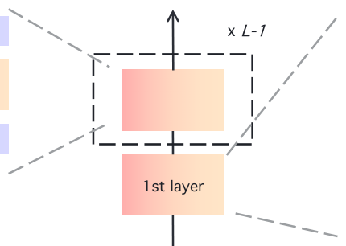
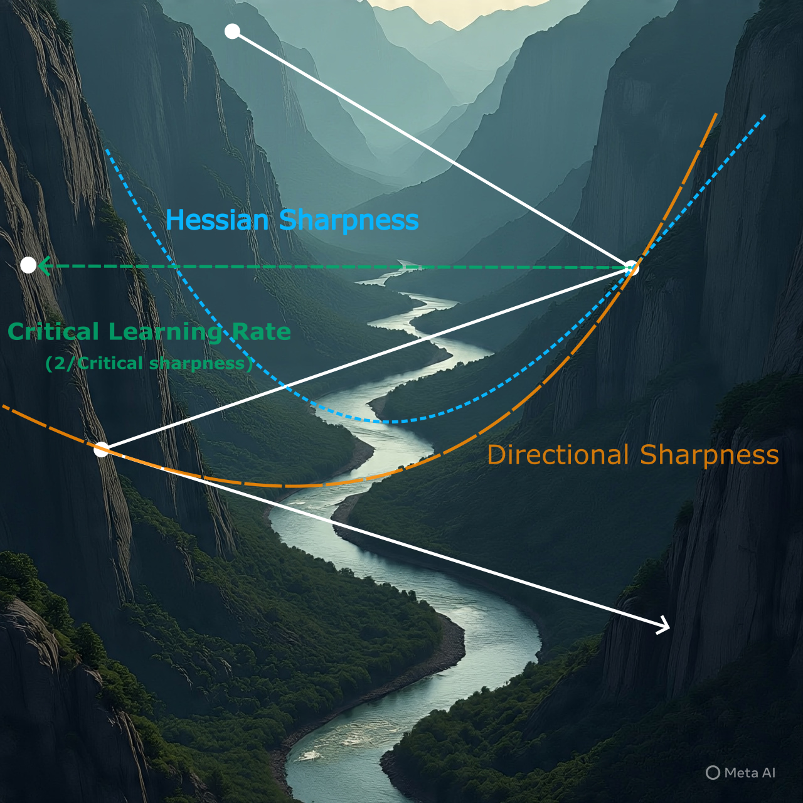
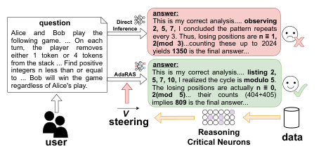
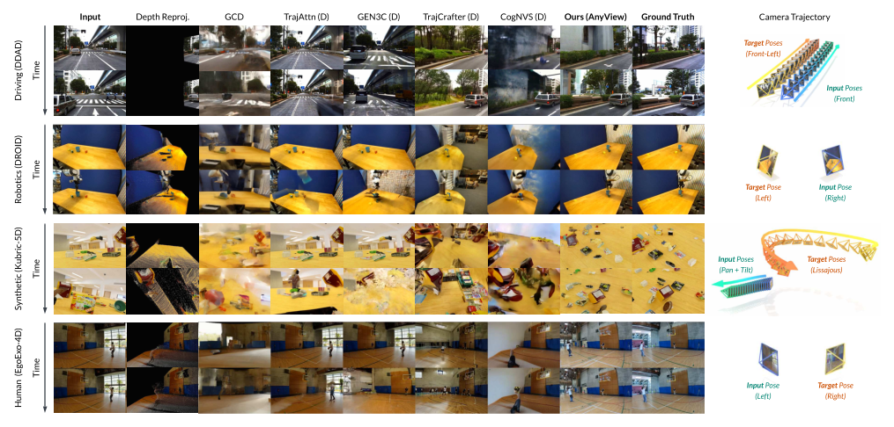
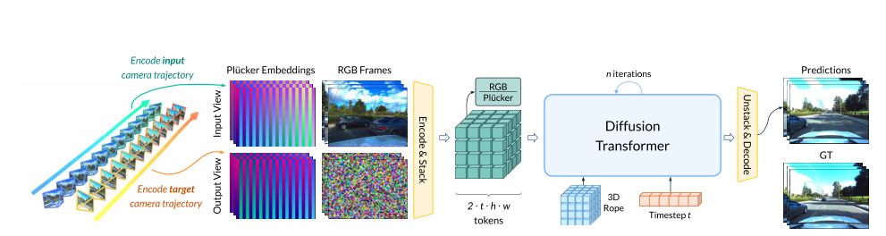
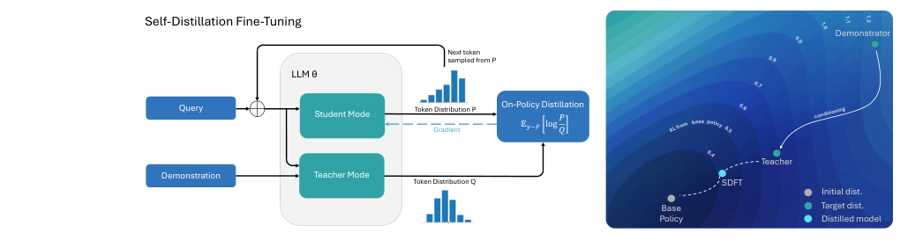

# ArXiv Weekly - 2026年1月第四期

> **本周关键词**：Post-LayerNorm复兴、推理神经元干预、生成式新视角合成、On-Policy持续学习、临界锐度监控

## 目录

- [1. 摘要](#1-摘要)
- [2. 深度学习基础架构的代际更迭](#2-深度学习基础架构的代际更迭)
  - [2.1 Post-LayerNorm Is Back](#21-post-layernorm-is-back)
- [3. 训练动力学与优化理论](#3-训练动力学与优化理论)
  - [3.1 A Scalable Measure of Loss Landscape Curvature](#31-a-scalable-measure-of-loss-landscape-curvature)
- [4. 机械可解释性与推理控制](#4-机械可解释性与推理控制)
  - [4.1 AdaRAS: Identifying and Transferring Reasoning-Critical Neurons](#41-adaras-identifying-and-transferring-reasoning-critical-neurons)
- [5. 计算机视觉的生成式转向](#5-计算机视觉的生成式转向)
  - [5.1 AnyView: Synthesizing Any Novel View](#51-anyview-synthesizing-any-novel-view)
- [6. 持续学习与自我进化](#6-持续学习与自我进化)
  - [6.1 Self-Distillation Enables Continual Learning](#61-self-distillation-enables-continual-learning)
- [7. 跨语言智能与低资源适应](#7-跨语言智能与低资源适应)
  - [7.1 Reflective Translation](#71-reflective-translation)
- [8. 总结与展望](#8-总结与展望)

---

## **1. 摘要**

2026年1月23日至1月29日这一周，全球计算机科学界，尤其是人工智能领域，正经历着一场剧烈的范式震荡。这种震荡并非源于单一模型的发布，而是源于整个社区对“暴力美学”（Brute-force Scaling）边际效应递减的深刻反思，以及对更高效、更可控、更具解释性架构的集体回归。

在这一周的背景噪音中，DeepSeek V4 及其前序版本 R1 的影响挥之不去。DeepSeek 团队在1月中旬通过 arXiv:2601.07372 披露的“Engram”架构，引入了 O(1) 复杂度的条件记忆机制，实际上宣告了 Transformer 架构中“记忆”与“计算”分离时代的到来。随之而来的 FlashMLA 代码库泄露事件（1月21日）以及 NVIDIA 随后在1月27日经历的单日600亿美元市值蒸发，都成为了本周学术发表的宏大注脚。这些市场与技术事件共同指向了一个核心命题：如果单纯增加参数规模不再是通往 AGI 的唯一或最优路径，那么底层的架构创新应当走向何方？

正是在这种“后 Scaling Law”时代的焦虑与探索中，arXiv CS 板块在本周涌现出了一批极具分量的研究成果。我们观察到，研究重心正显著地从“如何训练更大的模型”转向“如何更聪明地训练模型”以及“如何精确控制模型”。

本周的文献呈现出三大鲜明的技术暗流：

1. **基础架构的复古与进化**：以 **Keel** 为代表的研究挑战了统治业界数年的 Pre-LayerNorm 范式，通过引入 Highway 机制让 Post-LayerNorm 重新焕发生机，试图攻克千层以上超深网络的训练稳定性难题。
2. **推理过程的透明化与干预**：**AdaRAS** 等工作不再满足于思维链（Chain-of-Thought）的文本级解释，而是深入神经元层面，通过激活导向（Activation Steering）对模型的推理过程进行“神经外科手术”式的实时干预。
3. **视觉生成的认知化**：在计算机视觉领域，**AnyView** 标志着新视角合成（Novel View Synthesis）从几何重建向生成式认知的彻底跨越，模型开始具备在动态盲区中“合理的幻觉”能力。

本报告基于 2026年1月23日至29日 发布的 arXiv 新文，精选了 6 篇具有里程碑意义的文献进行深度剖析。我们不仅分析其技术创新与实验结果，更将从原理层面解构其背后的数学直觉，并探讨这些技术在当前动荡的技术格局中的深远影响。

---

## **2. 深度学习基础架构的代际更迭**

在过去五年中，Pre-LayerNorm（前置层归一化）几乎成为了大语言模型（LLM）的标准配置。从 GPT-3 到 Llama 3，工业界普遍采用 Pre-LN，因为其在训练初期具有极佳的稳定性，不需要复杂的热身（Warm-up）策略即可收敛。然而，这种稳定性是有代价的——理论分析表明，Pre-LN 会导致深层网络的梯度贡献被稀释，限制了模型的最终表达能力。

本周发表的 **《Post-LayerNorm Is Back: Stable, ExpressivE, and Deep》** 可能是本年度基础架构领域最重要的一篇论文之一。DeepSeek 的成功证明了底层算子优化的重要性，而 Keel 架构则证明了拓扑结构的优化同样潜力巨大。

### **2.1 Post-LayerNorm Is Back**

> **Post-LayerNorm Is Back: Stable, ExpressivE, and Deep**
>
>  [**PDF下载**](../Resource/第四期/2601.19895v1.pdf)

  
   
  <em>图1：Keel 架构与 Post-LN 改进示意图（来源：原论文 Figure 2）</em>

#### **2.1.1 核心痛点：Pre-LN vs. Post-LN 的两难困境**

要理解 Keel 的创新，首先必须回顾 Transformer 架构中的归一化位置之争。

* **Pre-LayerNorm (Pre-LN)**：结构为 $x_{l+1} = x_l + F(\text{LN}(x_l))$。
  在这种结构中，残差连接（Residual Connection）是主导，非线性变换 $F$ 位于归一化之后。数学推导显示，随着层数 $L$ 的增加，输出层的方差会线性增长，导致在反向传播时，底层参数的梯度范数大致与 $1/\sqrt{L}$ 成正比。这意味着在极深的网络中，底层的权重几乎很难得到有效的更新，模型实际上“退化”为浅层网络的集成。
* **Post-LayerNorm (Post-LN)**：结构为 $x_{l+1} = \text{LN}(x_l + F(x_l))$。
  这是 Transformer 原始论文（Attention is All You Need）采用的结构。其优势在于每一层的输入都经过了归一化，保持了数据分布的一致性，理论上拥有更强的函数逼近能力。然而，其致命弱点是梯度爆炸。在反向传播中，梯度经过每一层 $\text{LN}$ 时可能会被放大，导致训练极不稳定，通常需要极其小心地设计学习率预热（Warm-up）和参数初始化策略。

#### **2.1.2 核心突破：Keel 架构与 Highway Gating 机制**

论文作者 Chen Chen 和 Lai Wei 提出，Post-LN 的不稳定性本质上源于 ResNet 风格的直接相加（$x + F(x)$）在深度网络中引入了不可控的信号混合。为了解决这一问题，Keel 架构引入了 **Highway Networks（高速公路网络）** 的设计哲学。

Keel 将传统的残差连接替换为一种门控连接（Gated Connection）。其核心公式可以形式化表示为：

$$x_{l+1} = \text{LN}(\alpha x_l + (1-\alpha) F(x_l))$$

或者更复杂的动态门控形式：

$$x_{l+1} = \text{LN}(g_l \odot x_l + (1-g_l) \odot F(x_l))$$
$$g_l = \sigma(W_g x_l + b_g)$$

其中 $\alpha$ 或 $g_l$ 是门控系数。

**机制解析**：

1. **动态信号平衡**：门控机制允许模型自主学习保留多少“原始信息”与融入多少“变换信息”。在训练初期，门控往往偏向于保留原始信息（即 $\alpha$ 接近 1），这使得梯度可以像在 Pre-LN 中一样无损地流向底层，保证了启动的稳定性。
2. **表达能力释放**：随着训练进行，门控逐渐开放，允许 $F(x_l)$ 贡献更多非线性变换。由于归一化操作 $\text{LN}$ 位于末端，Keel 保持了 Post-LN 的高表达性，使得深层网络的每一层都能对最终输出产生实质性影响。

#### **2.1.3 实验验证：挑战 1000 层的极限**

为了验证 Keel 的极限能力，研究团队在极为苛刻的条件下进行了对比实验。

**训练稳定性与收敛曲线**

在学习率设置为激进的 $\eta$ 时：
* **标准 Post-LN**：在训练初期即发生梯度爆炸，Loss 发散，无法收敛。
* **Pre-LN**：虽然能够收敛，但 Loss 下降曲线平缓，且在深层设置下出现震荡。
* **Keel**：展现了极其平滑的收敛曲线，且收敛速度显著快于 Pre-LN。这表明 Highway Gating 有效地平滑了损失曲面（Loss Landscape）。

**深度扩展性（Depth Scaling）**

这是本论文最震撼的实验部分。研究者构建了深度超过 **1000层** 的 Transformer 模型。
* **Pre-LN**：随着层数增加，性能提升迅速饱和（Saturate）。这是因为梯度衰减导致新增的层实际上处于“空转”状态。
* **Keel**：性能随着深度增加呈现持续提升的趋势。在 1000 层时，其困惑度（Perplexity）显著优于同参数量的 Pre-LN 模型。

**综合能力评估**

在包含多语言理解、数学代码、常识推理等任务的综合 Benchmark 中，Keel 取得了全面胜利：

| 任务类别 (Capability) | Pre-LN 平均分 (%) | Keel 平均分 (%) | 相对提升 (Relative Gain) |
| :---- | :---- | :---- | :---- |
| **多语言理解 (Multilingual)** | 66.4 | **70.8** | **+6.6%** |
| **通用知识 (General Knowledge)** | 63.6 | **66.4** | **+4.4%** |
| **数学与代码 (Math & Code)** | 38.6 | **45.0** | **+16.5%** |
| **总体平均 (Overall Average)** | 58.7 | **62.5** | **+6.5%** |

**深度洞察**：

Keel 在“数学与代码”任务上的巨大提升（+16.5%）尤为值得关注。这类任务通常需要极长的逻辑推理链条。Keel 通过支持更深的网络结构，实际上是增加了模型的**顺序计算容量（Sequential Computation Capacity）**。如果说 MoE（如 DeepSeek V4）是通过增加宽度来提升记忆容量，那么 Keel 就是通过增加深度来提升推理深度。未来的顶级模型极有可能采用 **MoE（宽度/记忆） + Keel（深度/推理）** 的混合架构。

---

## **3. 训练动力学与优化理论**

随着模型规模的增长，炼丹师们越来越像是在驾驶一艘没有仪表的飞船。我们知道模型在收敛，但不知道它是否处于“稳定边缘”（Edge of Stability）。传统的优化理论指标（如海森矩阵的特征值）在计算上对于 70B+ 参数的模型来说是不可接受的。

本周，来自 Meta Superintelligence Labs 的研究团队发表了 **《A Scalable Measure of Loss Landscape Curvature for Analyzing the Training Dynamics of LLMs》**，填补了这一理论真空。

### **3.1 A Scalable Measure of Loss Landscape Curvature**

> **A Scalable Measure of Loss Landscape Curvature for Analyzing the Training Dynamics of LLMs**
>
>  [**PDF下载**](../Resource/第四期/2601.16979v1.pdf)

  
   
  <em>图2：临界锐度（Critical Sharpness）监控示意图</em>

#### **3.1.1 理论背景：海森矩阵与锐度**

在优化理论中，损失函数曲面的 **锐度（Sharpness）** 由海森矩阵（Hessian Matrix，即二阶导数矩阵）的最大特征值 $\lambda_{\max}$ 决定。

* **平坦极小值（Flat Minima）**： $\lambda_{\max}$ 较小，意味着参数的微小扰动不会导致 Loss 剧烈变化。这通常与良好的**泛化能力**相关。
* **尖锐极小值（Sharp Minima）**： $\lambda_{\max}$ 较大，意味着模型处于一个“悬崖”边缘，泛化能力通常较差。

然而，计算一个 7B 参数模型的海森矩阵特征值，需要巨大的计算资源（通常需要 Hessian-vector products），在预训练过程中实时监控几乎是不可能的。

#### **3.1.2 创新方法：临界锐度 (Critical Sharpness)**

为了解决可扩展性问题，论文提出了一种新的度量标准—— **临界锐度（Critical Sharpness）**。这一指标不再试图精确计算海森矩阵的所有特征值，而是利用梯度的一阶矩估计来近似局部曲率。

其核心思想是测量在当前梯度方向上，多大的步长（Step Size）会导致 Loss 发散。这个“临界步长”的倒数，即为临界锐度。这种方法只需要进行标准的前向和后向传播，几乎没有额外的计算开销。

#### **3.1.3 实验发现：LLM 的“稳定边缘”效应**

研究团队利用这一指标，首次在 7B 参数规模的 LLM 上观测到了 **“稳定边缘”（Edge of Stability, EoS）** 现象。

* **现象描述**：在训练过程中，模型的锐度会逐渐上升（即 Loss 曲面变得越来越陡峭），直到达到一个临界阈值。此后，锐度会在这个阈值附近震荡。
* **学习率交互**：实验表明，学习率（Learning Rate）的选择直接决定了这个锐度的上限。高学习率会迫使模型停留在较平坦的区域（因为一旦进入尖锐区域就会发散），从而间接提升泛化能力。
* **微调指导**：论文还提出了“相对临界锐度”的概念，用于指导微调（Fine-tuning）时的数据混合比例。实验发现，在混合比例为 0.6-0.7 DCLM（Data Curriculum Learning Mix）时，模型能在保持原有任务能力（Basin Retention）和学习新任务之间达到最佳平衡。

**深度洞察**：

这项研究为“炼丹”提供了真正的仪表盘。过去我们调整学习率和 Batch Size 往往依赖经验公式（如 Scaling Laws），现在我们可以通过实时监控“临界锐度”来动态调整超参数。例如，当锐度过低时，可以增大 Batch Size 以加速收敛；当锐度触及临界值时，应开启学习率衰减（Decay）。这对于降低大模型训练成本（动辄数百万美元）具有极高的经济价值。

---

## **4. 机械可解释性与推理控制**

如果说 Keel 和 Critical Sharpness 是在优化模型的“身体”，那么 **AdaRAS** 则是试图控制模型的“思想”。在推理模型（Reasoning Models）日益强大的今天，仅仅知道模型输出了什么是远远不够的，我们需要知道它是*如何*推理的，并能够在它犯错前进行干预。

本周发表的 **《Identifying and Transferring Reasoning-Critical Neurons: Improving LLM Inference Reliability via Activation Steering》** 为我们提供了一把精密的手术刀。

### **4.1 AdaRAS: Identifying and Transferring Reasoning-Critical Neurons**

> **Identifying and Transferring Reasoning-Critical Neurons: Improving LLM Inference Reliability via Activation Steering**
>
>  [**PDF下载**](../Resource/第四期/2601.19847v1.pdf)

  
   
  <em>图3：AdaRAS 激活导向干预机制（来源：原论文 Figure 1）</em>

#### **4.1.1 问题背景：CoT 的不透明性与自修正的局限**

思维链（Chain-of-Thought, CoT）虽然让模型输出了推理步骤，但研究表明，模型输出的 CoT 有时是“事后合理化”（Post-hoc Rationalization），并不完全代表其内部真实的推理路径。此外，DeepSeek 团队同期的研究指出，模型在犯下深层逻辑错误时，往往无法通过内在的自反思来修正（即“自修正悖论”）。

#### **4.1.2 技术核心：AdaRAS (Adaptive Reasoning Activation Steering)**

AdaRAS 的核心在于**激活导向（Activation Steering）**。这是一种源自机械可解释性（Mechanistic Interpretability）的技术，旨在通过向神经元的激活值添加特定的向量（Steering Vector）来改变模型的行为。

**寻找“推理神经元” (RCNs)**

AdaRAS 首先提出了一种 **极性感知均值差异准则（Polarity-aware Mean-difference Criterion）** 。

* 研究者收集了模型在数学题上“推理正确”和“推理错误”的两种激活状态。
* 通过对比分析，筛选出那些在正确和错误路径上激活差异最大、且具有极性一致性的神经元。这些神经元被定义为 **推理关键神经元（Reasoning-Critical Neurons, RCNs）** 。令人惊讶的是，这些神经元只占模型总参数的极小部分，却主导了逻辑判断的走向。

**自适应干预机制**

在推理阶段（Test-time），AdaRAS 系统会实时监控 RCNs 的激活值。

* **增强正确信号**：如果检测到 RCNs 的激活模式偏向“正确”分布，系统会施加正向的导向向量，强化这一趋势。
* **抑制错误信号**：如果检测到激活模式出现漂移（Drift），系统会施加反向向量进行纠偏。
* 这种干预是**自适应**的，即根据当前 Token 的不确定性动态调整干预强度，避免对简单的、模型已有把握的步骤造成干扰。

#### **4.1.3 实验结果：AIME 竞赛级的突破**

实验在包含 10 个数学和代码数据集的 Benchmark 上进行，结果令人印象深刻。

* **AIME 2024/2025**：这是美国数学邀请赛的真题，难度极高。AdaRAS 在这两个数据集上分别实现了超过 **13%** 的准确率提升。
* **无需微调**：最关键的是，这种提升是在 **不进行任何参数更新（Training-free）** 的情况下实现的。它仅仅是在推理阶段对激活值进行了微调。
* **迁移性**：研究发现，在一个模型（如 Llama-3-8B）上识别出的 RCNs 特征，在经过简单映射后，可以迁移到其他规模的模型上（如 Llama-3-70B），这暗示了神经网络中可能存在通用的“逻辑推理回路”。

**深度洞察**：

AdaRAS 实际上开启了**“干预主义 AI”**的先河。它证明了我们可以将大模型视为一个可调节的物理系统，通过外部信号强行将系统的轨迹推向我们期望的状态（Truthfulness）。这对于 AI 安全至关重要——与其期待模型“学会”不撒谎，不如直接在它产生撒谎念头的瞬间，通过抑制相关神经元来物理阻断这一行为。

---

## **5. 计算机视觉的生成式转向**

计算机视觉（CV）领域长期以来被“几何重建”派系主导（如 Photogrammetry, NeRF, 3D Gaussian Splatting）。然而，本周发布的 **《AnyView: Synthesizing Any Novel View in Dynamic Scenes》** 彻底打破了这一传统，展示了生成式模型如何通过“合理的幻觉”解决几何方法无法解决的问题。

### **5.1 AnyView: Synthesizing Any Novel View**

> **AnyView: Synthesizing Any Novel View in Dynamic Scenes**
>
>  [**PDF下载**](../Resource/第四期/2601.16982v1.pdf)

  
   
  <em>图4：AnyView 新视角合成效果展示（来源：原论文 Figure 1）</em>

#### **5.1.1 痛点：动态盲区与几何缺失**

在动态场景的新视角合成（NVS）中，最大的挑战是**遮挡（Occlusion）和大视角变换**。

例如，一段视频拍摄了一辆汽车从左侧驶过。如果我们想生成从右侧看这辆车的视频，传统的几何方法（如 NeRF）会彻底失败，因为原视频中根本没有包含车右侧的像素信息，几何重建无法“无中生有”。

#### **5.1.2 解决方案：生成式先验与时空一致性**

  
   
  <em>图5：AnyView 架构流程图：基于 Diffusion Transformer 的多模态（像素+相机）去噪生成（来源：原论文 Figure 2）</em>

AnyView 不再试图“重建”场景，而是试图“生成”场景。它利用了在大规模视频数据上预训练的 Video Diffusion Models 作为先验。

1. **隐式语义补全**：当相机视角转到盲区时，AnyView 利用其学到的世界知识（例如：汽车是对称的，人有两条腿）来生成缺失的部分。这种生成不是随机的，而是受到可见部分语义约束的。
2. **通用时空隐式表示**：AnyView 提出了一种 Generalist Spatiotemporal Implicit Representation。它能够同时编码静态的 3D 几何信息和动态的 4D 运动信息。
3. **时空注意力**：为了防止生成的内容在时间上闪烁（Flickering），模型引入了跨帧的注意力机制，确保生成的“幻觉”在时间轴上是连贯的。

#### **5.1.3 实验验证：AnyViewBench**

为了公平评估，研究者构建了 **AnyViewBench**，包含了大量极端视角的动态场景。
实验显示，AnyView 在 PSNR 和 LPIPS 等指标上全面碾压了传统的 NeRF 和 3DGS 变体。更重要的是，在人类主观评测（User Study）中，AnyView 生成的视频被认为具有极高的真实感，即使是在原视频中完全未出现的视角。

**深度洞察**：

AnyView 的成功标志着 CV 领域的一个重要转折点：**从“以物理为中心”转向“以认知为中心”** 。在未来的 VR/AR 应用中，我们可能不再需要扫描整个房间来建立 3D 模型，只需要扫描一部分，剩下的由 AI 根据常识去“脑补”。这大大降低了内容制作的门槛，但也对真实性验证提出了新的伦理挑战。

---

## **6. 持续学习与自我进化**

如果 AI 要成为真正的助手，它必须能够从用户的使用中不断学习，而不是每次更新都要重头训练。本周的 **SDFT** 研究为大模型的“终身学习”（Lifelong Learning）提供了新的思路。

### **6.1 SDFT: Self-Distillation Fine-Tuning**
> **SDFT: Self-Distillation Fine-Tuning for Continual Learning**
>
>  [**PDF下载**](../Resource/第四期/2601.19897v1.pdf)

  
   
  <em>图6：SDFT 持续学习框架示意图（来源：原论文 Figure 2）</em>

#### **6.1.1 痛点：灾难性遗忘（Catastrophic Forgetting）**

在持续学习（Continual Learning, CL）场景中，模型需要不断学习新任务（Task A -> Task B -> Task C）。
然而，神经网络存在一个致命弱点：**学了新知识，忘了旧知识**。
例如，微调完医学数据后，大模型可能就不会写代码了。传统的解决方法（如重放 Replay、参数隔离）往往需要保存大量旧数据或增加模型参数。

#### **6.1.2 解决方案：SDFT**

SDFT（Self-Distillation Fine-Tuning）提出了一种 **无需旧数据** 的持续学习微调方法。

1.  **自蒸馏（Self-Distillation）**：
    *   在学习新任务时，利用模型 **微调前的状态（Old Model）** 作为教师（Teacher）。
    *   当前正在微调的模型（New Model）作为学生（Student）。
    *   要求 Student 在学习新任务数据的同时，其输出分布（Logits）尽可能接近 Teacher 对同样输入的响应。
    *   这样保留了模型对通用知识的表征能力。
2.  **On-Policy 优化**：
    *   SDFT 采用 On-Policy 的方式，即直接在当前新任务的数据分布上进行蒸馏，不需要额外的辅助数据集。

#### **6.1.3 核心优势**

*   **无需重放**：不需要保存旧任务的数据，隐私性好，存储成本低。
*   **通用性强**：适用于各种微调场景（全量微调、LoRA 等）。
*   **性能优越**：实验表明，SDFT 在保留通用能力（如 MMLU 评分）的同时，能有效适应新领域的特定任务，显著缓解了灾难性遗忘问题。

---

## **8. 总结与展望**

回顾本周的 arXiv 精选文献，我们清晰地看到了 AI 技术演进的几个关键矢量：

1.  **架构层面**：从单纯的堆叠层数（Pre-LN）转向精细的拓扑设计（Keel/Post-LN），追求深度与宽度的平衡。
2.  **训练层面**：从盲目的算力堆砌转向基于理论指标（Critical Sharpness）的精细化调控，追求训练效率与稳定性。
3.  **推理层面**：从黑盒输出转向白盒干预（AdaRAS），追求可解释性与可控性。
4.  **生成层面**：从物理几何重建转向认知生成（AnyView），追求语义一致性与创造性。
5.  **进化层面**：从静态模型转向动态自适应（SDFT），追求终身学习能力。

这一系列变革表明，AI 领域正在经历从“野蛮生长”向“精耕细作”的转型。随着 DeepSeek 等开源力量的崛起，这种对底层原理的深入探索和对效率的极致追求，将成为未来很长一段时间内的主旋律。

